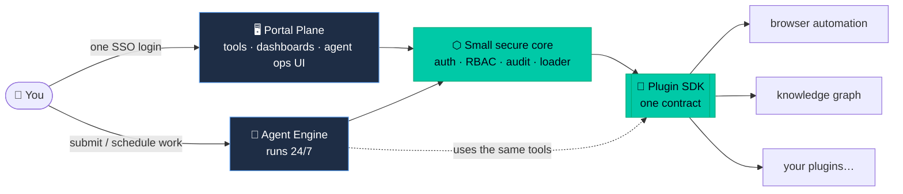
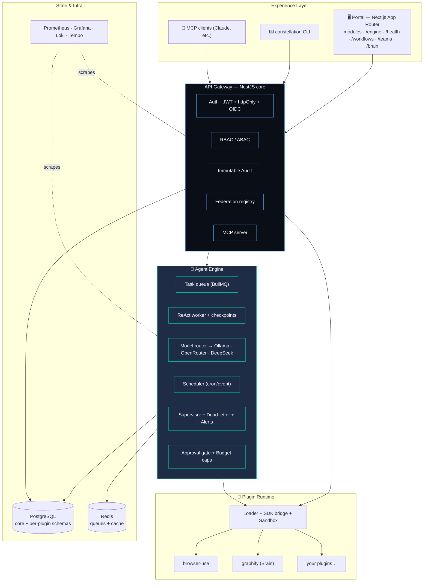

<div align="center">

# ⬡ Constellation

### The self-hosted platform where you log in once, see all your tools, and run AI agents that work 24/7 — with full auth, RBAC, audit, and $0/month local operation.

**A Backstage that actually does the work, not just catalogs it. An agent platform that is a real platform, not a Python notebook.**

[](LICENSE)
[](#project-status--honesty)
[](#project-status--honesty)
[](#quick-start)
[](#prerequisites)
[](#tech-stack)

[**What it is**](#what-is-constellation) · [**Why**](#why-constellation-exists) · [**Features**](#features) · [**Architecture**](#architecture) · [**Quick start**](#quick-start) · [**Docs**](#documentation) · [**Security**](#security) · [**Roadmap**](#roadmap) · [**Contributing**](#contributing)

</div>

---

## What is Constellation?

Constellation is an **enterprise plugin-platform framework** with a **durable, 24/7 AI-agent engine** built in. It gives you two things behind one login:

- 🖥️ **A portal (for humans).** One SSO sign-in, one navigation, one look. Heavyweight tools like Grafana, Keycloak, Langflow and Open WebUI are *federated* as tiles behind a reverse proxy — never rewritten. Your whole toolbox on one page.
- 🤖 **An engine (for agents).** A production-grade runtime where AI agents run real work autonomously — on a schedule or on demand — using the same tools, with a human approval gate on anything consequential, durable state that survives restarts, hard cost caps, and a complete audit trail.

Both are extended the exact same way: **plugins that conform to `@constellation/plugin-sdk`.** A small, secure core provides auth, RBAC, audit, the plugin loader, and the engine. *Everything else is a plugin.* The core is never rewritten to add a feature — you drop a module in, and the platform discovers it.

> **In one sentence:** it's the only platform where you log into one portal, see your tools, and run AI agents 24/7 that use those same tools — with full auth, RBAC, audit, dead-letter recovery, and $0/month local operation.

<div align="center">



</div>

---

## Why Constellation exists

### The problem

Modern teams live in a sprawl of disconnected tools. Grafana for monitoring, Open WebUI for chat, a pile of Python scripts for automation, a separate LangChain project for "AI agents." Each has its own login, its own permissions, its own silo. And when people say "AI agents that do work for me 24/7," what they usually have is a notebook that runs once and forgets everything the moment it finishes.

Three huge, fast-growing markets are converging in 2025–2026, and **no single product occupies the intersection:**

| Market | What the leaders do | What they *can't* do |
|---|---|---|
| **Internal Developer Portals** (Backstage, Port, Cortex) | Catalog your tools and services for humans | **Can't run AI agents** — they're UIs |
| **AI Agent Frameworks** (LangGraph, CrewAI, AutoGen) | Orchestrate agents in Python | **No portal, no auth, no RBAC, no audit, no self-hosted deploy story** — they're libraries |
| **Workflow Orchestration** (Temporal, Prefect) | Durable long-running execution | **No portal, no plugin model, not agent-native** — and heavy to self-host |

- Backstage has a plugin catalog but **can't run agents.**
- LangGraph/CrewAI orchestrate agents but have **no portal, auth, RBAC, audit, or deployment story.**
- Temporal has durable execution but **no UI, no multi-tenant plugin model, no agent-native design.**

### What Constellation solves

Constellation fills that gap — **one self-hosted platform that is a portal *and* a durable agent engine, sharing the same plugin system.** It closes the specific gaps that make the alternatives painful:

- ❌ *Tool sprawl and N logins* → ✅ one SSO portal, federated tiles, one RBAC and audit trail across everything.
- ❌ *"Agents" that are stateless scripts* → ✅ a durable engine: tasks are queued, checkpointed every step, and **resume exactly where they left off after a crash or restart.**
- ❌ *Unbounded, unsupervised autonomy* → ✅ a human-in-the-loop **approval gate**, hard **token/cost budgets**, a **supervisor** that recovers stuck tasks, and a **dead-letter** trail for failures.
- ❌ *Vendor lock-in to one model* → ✅ a **provider-agnostic model router** (local Ollama by default, cloud on demand) with automatic fallback and per-model cost accounting.
- ❌ *Add a feature = rewrite the core* → ✅ a strict **plugin contract**; the core never changes to gain a capability.
- ❌ *$$$ SaaS or a data-center to run it* → ✅ **runs on a laptop, $0/month**, with real monitoring, and deploys unchanged to a small VPS.

### Who benefits

- **Individual engineers & homelabbers** — a single self-hosted brain for unattended automation (monitor hardware, triage alerts, run scheduled jobs) that costs nothing to run locally.
- **Platform / DevOps teams** — a self-hosted internal developer portal *with* an automation engine, one auth and audit story, and a plugin model your team already understands.
- **Organizations evaluating agentic AI** — a governed way to let AI agents do real work: approval gates, budgets, RBAC, an immutable audit trail, team spaces, and compliance exports (CSV/PDF) — self-hosted, no data leaving your infrastructure.

---

## Features

<table>
<tr><td width="50%" valign="top">

**🖥️ Portal Plane**
- Single sign-on (local JWT + OIDC/Keycloak)
- Federated tool tiles (Grafana, Langflow, Open WebUI, Keycloak) via reverse proxy
- Live `/engine` task console, `/health` dashboard, `/compare` (multi-model A/B), `/ai-controller` ops page
- In-app **Knowledge base** (`/docs`) — 32 end-user articles covering the whole platform, searchable
- Plugin **marketplace** — browse / install / uninstall with **hot-reload**
- Visual **workflow builder** (drag-and-drop, templated steps)
- Notification center + webhook/Slack/Discord/Teams/SMTP channels
- **Team spaces** (Organization → Team → member roles)
- Design-system-driven UI, light + dark themes

</td><td width="50%" valign="top">

**🤖 Agent Engine**
- Durable **BullMQ** task queue; **checkpoint-per-step**, kill-restart resume
- **ReAct loop** (think → act → observe) with real tool calling
- **Human-in-the-loop approval gate** (pause → approve/reject, honour-once)
- **Model router**: Ollama (local, $0) + OpenRouter + DeepSeek, fallback, cost-aware budget
- **Scheduler** (cron + event triggers) — "runs while you sleep"
- **Supervisor** (recovers stuck tasks) + **dead-letter** trail + **alerting**
- **Crews** — agent-to-agent delegation with budget flow-down + result merging
- **MCP** server *and* client (interop with Claude, external tools)
- **Agentic AI Controller** — live stability score (0–100) + findings that name the problem, whitelisted one-click recovery actions, and an **autonomous watch** that scores the platform on a cadence and heals it by itself (every action audited)

</td></tr>
<tr><td width="50%" valign="top">

**🧩 Platform Core**
- `@constellation/plugin-sdk` — Zod manifest, lifecycle, tools, memory, permissions
- Filesystem plugin loader (topological deps, cycle detection, failure isolation)
- Per-plugin Postgres schemas (isolation + independent migrations)
- RBAC/ABAC (colon-scoped, wildcard) + immutable audit incl. denials
- Optional **plugin sandboxing** (process isolation, resource caps)
- Optional **separate worker process** (API stays responsive, scale independently)

</td><td width="50%" valign="top">

**🔭 Observability & Ops**
- Prometheus `/api/metrics` + provisioned 19-panel Grafana dashboard
- OpenTelemetry tracing (no-op unless enabled) → Tempo
- The **Brain**: a Graphify knowledge graph over the codebase + a vault, with **semantic (RAG) retrieval**
- Compliance exports (audit trail → **CSV / PDF**)
- `constellation ops` CLI (health, tasks, schedules, dead-letters, plugins)
- Full Docker Compose stack; Coolify/VPS-ready

</td></tr>
</table>

### Example use cases

- 🔔 **Autonomous incident response** — a Prometheus/Alertmanager alert fires a webhook → an event-triggered *workflow* spawns a remediation agent, all logged and reviewable.
- 🌙 **"Runs while you sleep"** — a cron schedule enqueues a nightly agent that queries your knowledge graph, drafts a digest, and delivers it via email/Slack.
- 👥 **Agent crews** — an orchestrator task delegates sub-tasks to child agents (each inheriting a token budget), then merges their results.
- 🧑‍⚖️ **Governed automation** — every consequential tool call pauses for human approval; every action lands in an immutable, exportable audit trail.

---

## Architecture

Constellation is a **pnpm + Turborepo monorepo** with two cooperating planes over one small core. See **[docs/ARCHITECTURE.md](docs/ARCHITECTURE.md)** for the full treatment (component, sequence, data-flow, and lifecycle diagrams).



### Key design decisions

| # | Decision | Why |
|---|---|---|
| **Small core, everything-else-a-plugin** | The core provides only auth, RBAC, audit, loader, and the engine | 10-year horizon: never rewrite the core to add a feature |
| **The Plugin SDK is the load-bearing contract** | A Zod-validated manifest + lifecycle + capability context | Data declares, context grants capabilities, lifecycle drives — strict, versioned, additive |
| **Two planes, one plugin model** | Portal (federate heavyweight tools) + Agent (capabilities as tools) | Don't cram standalone platforms into the core — federate and orchestrate them |
| **Degrade, never crash** | Every service boots with no DB / no Redis / no brain and reports honestly | A missing dependency is a clean degraded state, never a 500 |
| **Local-first, $0 by default** | Ollama is the default model; cloud providers are opt-in per task | Self-hosted differentiator; no SaaS dependency to run |
| **Durable by construction** | BullMQ queue + per-step checkpoints in Postgres | A task survives an API restart and resumes — the difference between a script and a platform |

---

## Quick start

### Prerequisites

- **Node.js 22+** and **[pnpm](https://pnpm.io)** (via `corepack enable`)
- **Docker + Docker Compose** (for the full stack with Postgres + Redis)
- *(Optional, for local $0 AI)* **[Ollama](https://ollama.ai)** with a model, e.g. `ollama pull qwen2.5-coder:7b`

### Run it locally

```bash
git clone https://github.com/Mohamed-Syed/constellation.git
cd constellation
corepack enable
pnpm install
pnpm build
```

Then either run the apps directly for development…

```bash
pnpm --filter @constellation/api dev     # core API  → http://localhost:4000/api
pnpm --filter @constellation/web dev     # portal    → http://localhost:3000
```

…or bring up the **full stack** (real PostgreSQL 16 + Redis 7 + API + portal) with Docker:

```bash
docker compose up -d --build     # or: make up
curl http://localhost:4000/api/health
```

| Service | URL |
|---|---|
| Portal (Next.js) | http://localhost:3000 |
| Core API (NestJS) | http://localhost:4000/api · health `/api/health` · OpenAPI `/api/docs` |
| PostgreSQL 16 | `localhost:5432` |
| Redis 7 | `localhost:6379` |

Everything is `.env`-driven with working defaults — a fresh clone needs no `.env` at all. Copy `.env.example` to `.env` to override (it's git-ignored; **never commit secrets**).

➡️ Full guides: **[docs/DEPLOYMENT.md](docs/DEPLOYMENT.md)** (local, Docker, federation with SSO, and production/VPS).

---

## Documentation

| Document | What's inside |
|---|---|
| 📐 **[docs/ARCHITECTURE.md](docs/ARCHITECTURE.md)** | Full architecture — components, sequence, data-flow, plugin lifecycle, the engine internals, all with diagrams |
| 🚀 **[docs/DEPLOYMENT.md](docs/DEPLOYMENT.md)** | Installation, configuration reference, Docker, federation/SSO, production deployment |
| 🧩 **[docs/PLUGIN_SDK.md](docs/PLUGIN_SDK.md)** | Build a plugin from scratch — manifest, lifecycle, context, permissions, the loader |
| 🧠 **[docs/BRAIN.md](docs/BRAIN.md)** | The knowledge-graph "Brain" (Graphify + vault + RAG) |
| 🔒 **[SECURITY.md](SECURITY.md)** | Security architecture, threat model, hardening checklist, responsible disclosure |
| 🗺️ **[docs/ROADMAP.md](docs/ROADMAP.md)** | Roadmap, future enhancements, and **known limitations** (stated plainly) |
| 🤝 **[CONTRIBUTING.md](CONTRIBUTING.md)** | Dev workflow, coding standards, the verification discipline, commit conventions |
| 🎨 **[docs/DESIGN_SKILL.md](docs/DESIGN_SKILL.md)** | The portal's design language |

---

## Security

Security is a first-class concern, not an afterthought. Highlights (full detail in **[SECURITY.md](SECURITY.md)**):

- **Authentication** — local JWT + **httpOnly, SameSite cookies** (XSS-resistant) + OIDC/Keycloak (RS256, `iss`/`aud`/`exp` enforced, tampered tokens rejected).
- **Authorization** — RBAC/ABAC with colon-scoped, wildcard-matched permissions; seeded `admin` and `viewer` roles; least-privilege by default.
- **Audit** — every action, **including denials**, recorded; exportable to CSV/PDF; args/results never logged.
- **Agent guardrails** — human approval gate for consequential tool calls, hard per-task token/cost budgets, a supervisor + kill semantics.
- **Plugin isolation** — optional process-mode sandbox with timeout/heap/result caps and crash containment.
- **Secrets hygiene** — `.env` is git-ignored; the repo ships **zero** real keys; a pre-publish PII/secret sweep is part of the workflow.

> ⚠️ **Honest posture:** Constellation is production-*grade* in design and hardened for local/single-node use, but a single Docker Compose host is **not** high availability. See SECURITY.md and [Known limitations](docs/ROADMAP.md#known-limitations) before exposing it to the public internet.

---

## Roadmap

Constellation has shipped its foundation, its full agent engine (v0 → v0.6), a production-foundation phase (migrations, metrics, tracing, SSO, sandboxing), a complete product surface (engine UI, marketplace, workflow builder, notifications, teams), and most of an "agentic OS" phase (crews, MCP, skills, semantic retrieval, compliance). What's next and what's *not* done is stated plainly in **[docs/ROADMAP.md](docs/ROADMAP.md)** — including federated agent mesh, a portal-wide delegation view, and the known limitations.

---

## Project status & honesty

This project holds itself to an unusual standard: **live proof over green tests.** A feature is not "done" because the test suite passes — it's done when it's been exercised against real infrastructure and the literal evidence is recorded.

- ✅ **728 tests** passing (api 604 · browser-use 47 · graphify 40 · sdk 21 · cli 16)
- ✅ **20/20** monorepo gate tasks green (lint · build · typecheck · test)
- ✅ Every major feature was exercised against real infrastructure before it shipped
- 💵 Built and proven entirely **local, ≈$0** — no cloud provisioned

### How this was built

Constellation was built **with AI assistance** — a small team of AI coding agents (a lead orchestrator plus focused implementers, working in disjoint lanes under a maker/checker discipline) drove the architecture, the engine, and the hardening, under a human product owner whose day job is network engineering. Every feature was held to a "live proof over green tests" bar: it shipped only after being exercised against real infrastructure, not merely passing the test suite.

---

## Tech stack

**TypeScript** (strict) · **NestJS** · **Next.js** (App Router) · **Prisma 7** (PostgreSQL) · **BullMQ** + **Redis** · **Zod** · **TailwindCSS** · **pnpm** + **Turborepo** · **Vitest** · **Ollama / OpenRouter / DeepSeek** · **Graphify** (knowledge graph) · **Prometheus / Grafana / Loki / Tempo** · **Keycloak / Caddy** (federation) · **Docker Compose** / Coolify.

---

## Contributing

Contributions are welcome! Please read **[CONTRIBUTING.md](CONTRIBUTING.md)** for the development workflow, coding standards, the verification discipline, and commit conventions, and **[CODE_OF_CONDUCT.md](CODE_OF_CONDUCT.md)**. The fastest way to extend Constellation is to **build a plugin** — see [docs/PLUGIN_SDK.md](docs/PLUGIN_SDK.md).

---

## License

Licensed under the **[Apache License 2.0](LICENSE)**. You may use, modify, and distribute it freely, including commercially, subject to the license terms (which include an explicit patent grant).

## Acknowledgements

Constellation stands on the shoulders of excellent open-source projects: **NestJS**, **Next.js**, **Prisma**, **BullMQ**, **Ollama**, **[Graphify](https://github.com/Graphify-Labs/graphify)** (the knowledge-graph brain), **OpenRouter**, **Keycloak**, **Grafana**, **Prometheus**, **Caddy**, and the **[Model Context Protocol](https://modelcontextprotocol.io)**. Design language distilled from the open-source "design taste" skills by Emil Kowalski, Paul Bakaus, and Leonxlnx. The portal federates (rather than reinvents) heavyweight tools by design.

<div align="center">

---

*Constellation — a portal for humans, an engine for agents, one plugin model for both.*

</div>
