# Constellation — Architecture

> A complete tour of how Constellation is built: the monorepo, the two planes, the small
> core, the plugin system, and — in depth — the agent engine that makes it a 24/7 platform.
> Every major flow has a diagram. For the plugin authoring surface see
> [PLUGIN_SDK.md](PLUGIN_SDK.md); for deployment see [DEPLOYMENT.md](DEPLOYMENT.md).

## Table of contents

1. [Design philosophy](#1-design-philosophy)
2. [Monorepo layout](#2-monorepo-layout)
3. [The two planes](#3-the-two-planes)
4. [Component architecture](#4-component-architecture)
5. [The plugin system](#5-the-plugin-system)
6. [The agent engine](#6-the-agent-engine)
7. [Request & task sequence flows](#7-request--task-sequence-flows)
8. [Data model & data flow](#8-data-model--data-flow)
9. [The model router](#9-the-model-router)
10. [The Brain (memory & knowledge graph)](#10-the-brain-memory--knowledge-graph)
11. [Observability](#11-observability)
12. [Deployment topology](#12-deployment-topology)
13. [Locked architectural decisions](#13-locked-architectural-decisions)

---

## 1. Design philosophy

Five principles shape every part of the system:

- **Small core, everything-else-a-plugin.** The core provides only cross-cutting platform
  services (auth, RBAC, audit, settings, events, the plugin loader, and the engine). Every
  capability arrives as a plugin. The core is never rewritten to add a feature.
- **The contract is load-bearing.** `@constellation/plugin-sdk` is a strict, Zod-validated,
  versioned manifest + lifecycle + capability context. It evolves *additively* — a v1 manifest
  keeps working when v2 adds an optional field.
- **Degrade, never crash.** Every service must boot with no database, no Redis, and no
  knowledge graph, and report its degraded state honestly. A missing dependency is a clean
  `available: false`, never a 500 or a crash loop.
- **Durable by construction.** Agent work is queued and checkpointed per step in Postgres, so a
  task survives an API restart and resumes exactly where it left off.
- **Local-first, $0 by default.** Ollama is the default model provider; cloud is opt-in per
  task. Nothing has to leave your machine, and nothing costs money to run.

---

## 2. Monorepo layout

Constellation is a **pnpm workspaces + Turborepo** monorepo.

```
constellation/
├── apps/
│   ├── api/                 # NestJS core: auth, RBAC, audit, plugin loader, THE ENGINE
│   │   ├── prisma/          # schema.prisma (core schema) + committed migrations
│   │   └── src/core/        # {auth, rbac, audit, database, settings, events, logging,
│   │                        #  plugins, federation, memory, engine, notifications,
│   │                        #  workflows, teams, skills, observability, health,
│   │                        #  ai-controller (score + actions + autonomous watch)}
│   └── web/                 # Next.js App Router portal (the single pane of glass)
│                            # incl. the in-app Knowledge base (/docs — content-driven
│                            # from src/content/docs/**/*.md, imported as raw strings)
├── packages/
│   ├── plugin-sdk/          # @constellation/plugin-sdk — THE contract
│   └── cli/                 # @constellation/cli — generate-plugin + `ops` subcommands
├── plugins/                 # in-repo capability plugins
│   ├── hello-world/         # reference plugin
│   ├── browser-use/         # browser automation (tools: browser.navigate/act/extract)
│   └── graphify/            # knowledge-graph tools (graph.query/related/ingest, over MCP)
├── plugins-catalog/         # marketplace shelf (installable-but-not-installed plugins)
├── config/modules.yaml      # federated tool registry (data, not code)
├── infra/                   # Caddy, Keycloak, Prometheus, Grafana, Loki, Tempo, Graphify
├── docker-compose.yml       # base stack (postgres, redis, api, web)
├── docker-compose.federation.yml  # opt-in federation overlay (SSO + observability tools)
└── docs/                    # this documentation
```

Turborepo caches and orders the `lint / build / typecheck / test` tasks across the seven
packages. The single source of truth for "what builds" is `turbo.json` + each package's
`package.json` scripts.

---

## 3. The two planes

Constellation deliberately separates two concerns that other products conflate.

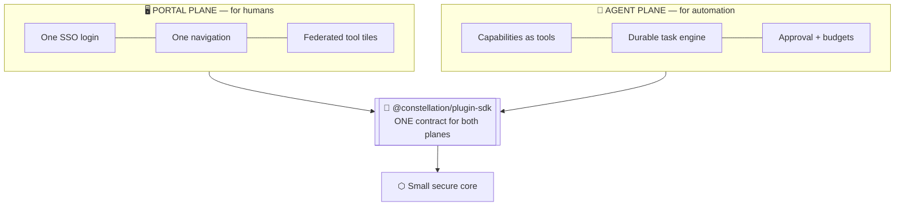

- **Portal plane.** Heavyweight, standalone tools (Grafana, Keycloak, Langflow, Open WebUI) are
  *federated* — they run as their own containers behind a reverse proxy and appear in the portal
  as tiles under one identity. Constellation never reimplements them. The registry that drives
  this is `config/modules.yaml` (data), served at `GET /api/federation/modules`.
- **Agent plane.** Capabilities (browser automation, knowledge-graph queries, your own tools)
  are exposed as permission-checked, callable **tools**. The engine invokes them on the user's
  behalf, autonomously.

Both planes are extended by the same plugin contract, so a plugin can contribute a portal
navigation entry *and* agent-callable tools from one manifest.

---

## 4. Component architecture

```mermaid
flowchart TB
  subgraph CLIENTS["Clients"]
    WEB["Next.js Portal"]
    CLI["constellation CLI"]
    MCPC["External MCP clients"]
    EXT["Alertmanager / webhooks"]
  end

  subgraph API["apps/api — NestJS Core (the API Gateway)"]
    direction TB
    GUARD["JwtAuthGuard (global)<br/>+ PermissionsGuard"]
    subgraph CORESVС["Core services"]
      AUTHM["Auth (JWT · cookie · OIDC composite verifier)"]
      RBACM["RBAC / ABAC"]
      AUDITM["Audit (immutable, incl. denials)"]
      FEDM["Federation registry"]
      MCPSVR["MCP server (/api/mcp)"]
      NOTIF["Notifications + channels"]
      TEAMS["Team spaces"]
      CTRL["AI Controller (score + whitelisted<br/>actions + autonomous watch)"]
    end
    subgraph ENGINEM["Engine module"]
      TASK["TaskService"]
      QUEUE["TaskQueueService (BullMQ)"]
      WORKER["AgentWorkerService (ReAct)"]
      ROUTER["ModelRouterService"]
      SCHED["SchedulerEngineService"]
      SUPER["SupervisorService"]
      ALERTS["EngineAlertService"]
      DELEG["DelegationService"]
      MCPCLI["McpClientService"]
    end
    subgraph PLUGM["Plugin subsystem"]
      LOADER["PluginLoaderService"]
      REG["PluginRegistryService"]
      TOOLSVC["PluginToolService (+ optional sandbox)"]
      CTXF["PluginContextFactory"]
    end
    subgraph MEMM["Memory / Brain"]
      BRAIN["BrainService + GraphifyAdapter"]
    end
    OBS["Observability (metrics + OTel tracing)"]
  end

  subgraph PLUGINS["plugins/*"]
    BU["browser-use"]
    GF["graphify"]
    UP["user plugins"]
  end

  subgraph INFRA["Infrastructure"]
    PG[("PostgreSQL")]
    RD[("Redis")]
    OLL["Ollama / OpenRouter / DeepSeek"]
    GXS["Graphify sidecar (MCP)"]
    PROM["Prometheus / Grafana / Loki / Tempo"]
  end

  WEB & CLI & MCPC --> GUARD
  EXT --> NOTIF
  GUARD --> CORESVС & ENGINEM & PLUGM & MEMM
  WORKER --> ROUTER --> OLL
  WORKER --> TOOLSVC --> LOADER
  LOADER --> REG
  TOOLSVC --> BU & GF & UP
  GF -.MCP.-> GXS
  QUEUE & WORKER --> RD
  TASK & AUDITM & CORESVС --> PG
  BRAIN --> GXS
  OBS -.exports.-> PROM
```

Every core service follows the same **injectable + optional-dependency** pattern: services
inject `PrismaService`, `EventBusService`, `MetricsService`, `TracingService` etc. as
`@Optional()`, so offline unit tests construct them with `new` and the app degrades cleanly
when a backend is absent.

---

## 5. The plugin system

A plugin is a directory dropped into `plugins/` containing a **`plugin.manifest.json`** (data,
validated by Zod) and a built ESM entry module (code) that exports an object implementing the
`Plugin` lifecycle. The core discovers, validates, orders, loads, and drives it — with **zero
core code changes.**

### Plugin lifecycle state machine

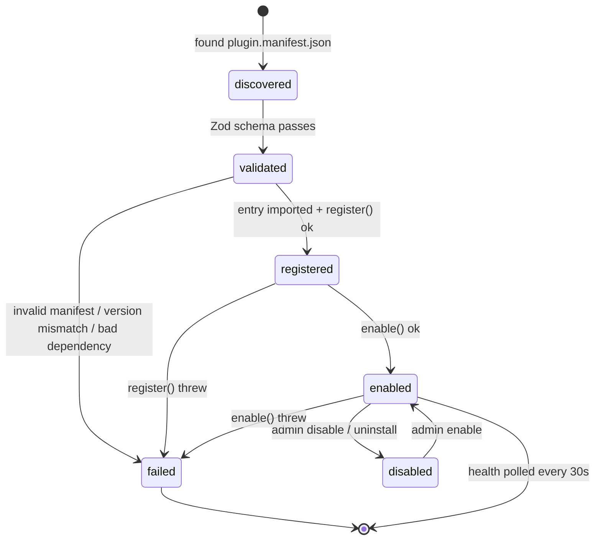

Key properties:

- **Isolation by construction.** Every lifecycle hook call is wrapped; a throw marks *that*
  plugin `failed` (with the exact error) and never affects the core or other plugins.
- **Topological load order.** Plugins are sorted by declared `dependencies` (DFS). A missing
  dependency, a cycle, or a dependency that itself failed cascades a clear `failed` reason.
- **Per-plugin Postgres schema.** A plugin owns its own schema (`databaseSchema`, defaults to
  its `id`); the core bootstraps it (`CREATE SCHEMA IF NOT EXISTS`) and never reads it directly.
- **The capability context.** A plugin talks to the platform through exactly one object,
  `PluginContext` (logger, config, events, scoped db, memory, principal) — it never imports core
  internals.

### Agent-plane tools & two-layer authorization

A plugin declares **tools** in its manifest (`name`, `description`, `inputSchema`, `permission`,
`requiresApproval`). When the engine (or a user) invokes one, `PluginToolService` applies two
independent authorization layers before any plugin code runs:

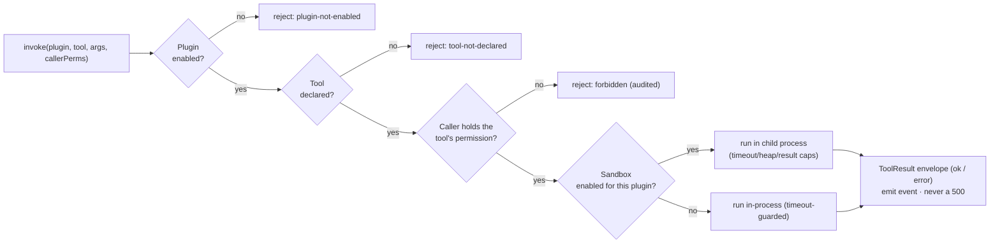

The result is always a `ToolResult` envelope — even a thrown or timed-out tool becomes a clean
`{ ok: false, error }`, never an HTTP 500 and never a wedged request.

---

## 6. The agent engine

The engine is what turns Constellation from a control panel into a 24/7 platform. It is a set of
NestJS services in `apps/api/src/core/engine`, backed by a **BullMQ** queue on Redis and durable
state in Postgres.

```mermaid
flowchart TB
  SUBMIT["POST /api/engine/tasks<br/>or scheduler / MCP / delegation"] --> AVAIL{Engine available?<br/>(Redis reachable)}
  AVAIL -->|no| E503["503 — honest 'engine unavailable'<br/>(no DB row created)"]
  AVAIL -->|yes| ROW["AgentTask row (queued)"]
  ROW --> Q[["BullMQ queue"]]
  Q --> W["AgentWorkerService picks up job"]
  W --> LOOP

  subgraph LOOP["ReAct loop (per step)"]
    direction TB
    CP0["Load checkpoint (resume?)"] --> MODEL["Model router → chat()"]
    MODEL --> PARSE["Parse ONE JSON action"]
    PARSE --> KIND{action type}
    KIND -->|thought| STEP1["record step → continue"]
    KIND -->|tool_call| APPR{requiresApproval<br/>or supervised?}
    APPR -->|yes| PAUSE["pause: pending_approval<br/>checkpoint · release job"]
    APPR -->|no| INVOKE["PluginToolService.invoke()"]
    INVOKE --> TRES["record tool_result"]
    KIND -->|done| DONE["markCompleted"]
    STEP1 & TRES --> BUDGET{maxSteps / token<br/>budget exceeded?}
    BUDGET -->|yes| FAIL["markFailed (classified)"]
    BUDGET -->|no| CKPT["saveCheckpoint (messages, stepIndex)"]
    CKPT --> CP0
  end

  PAUSE --> WAIT(["waits for<br/>POST /approve or /reject"])
  WAIT -->|approve| Q
  WAIT -->|reject| FAILR["markFailed: 'Rejected by …'"]

  SUP["SupervisorService (poll loop)"] -.detects stuck 'running' tasks.-> W
  SUP -.re-stale.-> DLQ["dead-letter (classified: stalled)"]
  FAIL & FAILR --> ALERT["EngineAlertService → events + notifications"]
```

### Durability: checkpoint & resume

The single most important property is that **a task survives an API restart.** After every step
the worker writes a `TaskCheckpoint` (the full message history + step index) to Postgres. If the
API is killed mid-task, the BullMQ job is stalled but not lost; on restart the worker reloads the
checkpoint and continues from the exact step — the already-completed tool call is *not* re-run.
This was proven live during development (kill the API at step N, query Postgres to
see the frozen state, restart, watch it resume).

### The reliability layer (v0.5)

- **Supervisor** — a poll loop that finds tasks stuck in `running` past a threshold, with a race
  guard (never double-runs an actively-processing task), a resume-once policy, and a re-stale →
  `stalled` dead-letter (no infinite spin).
- **Dead-letter trail** — failures are classified (`terminal | transient_exhausted | stalled |
  rejected`) and surfaced at `GET /api/engine/deadletters`.
- **Alerting** — `engine.task.failed / stale / recovered / completed / paused` events feed a ring
  buffer (`GET /api/engine/alerts`), the notification center, and any configured channels.

### The scheduler (v0.4) — "runs while you sleep"

A zero-dependency 5-field cron parser drives `SchedulerEngineService`, which polls for due cron
schedules and listens on the event bus for event-triggered ones, auto-enqueuing a task (or
running a **workflow**) with no human in the loop. This is what makes autonomous, recurring, and
incident-triggered work possible.

### Guardrails

- **Human-in-the-loop approval gate** — tools flagged `requiresApproval` (or *all* tools, under
  `ENGINE_REQUIRE_APPROVAL_ALL`) pause the task; a human approves or rejects; approval is
  honoured exactly once. The agent runs under a named, scoped permission set, not raw admin.
- **Budget caps** — a per-task token ceiling (`maxTokens ?? ENGINE_MAX_TOKENS_PER_TASK`) fails
  the task before unbounded spend; cost accounting flows through from cloud providers.

---

## 7. Request & task sequence flows

### An authenticated portal request

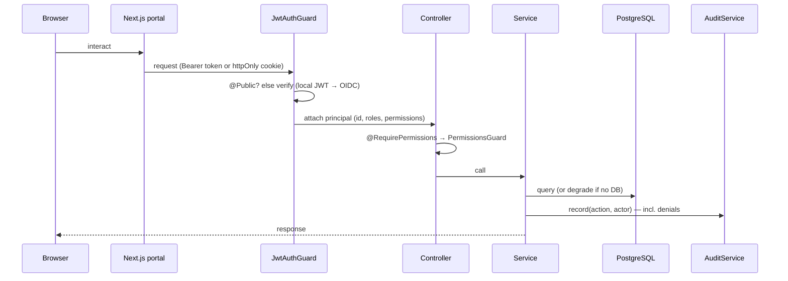

### A tool-calling agent task (the ReAct loop, live)

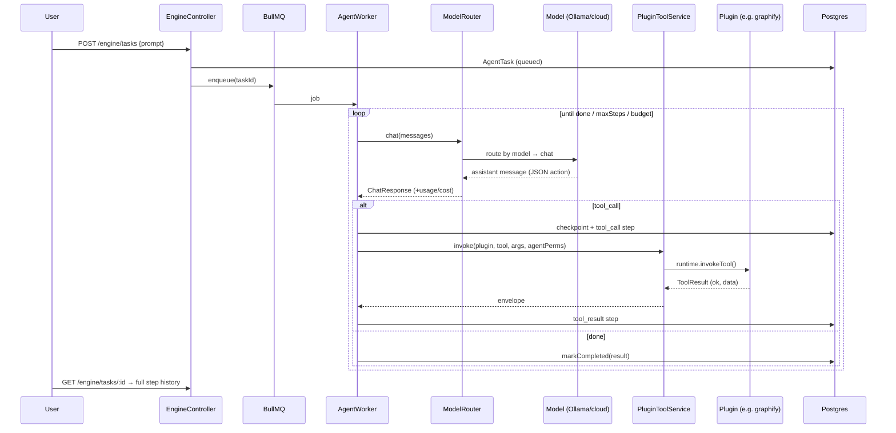

### The kill-restart durability guarantee

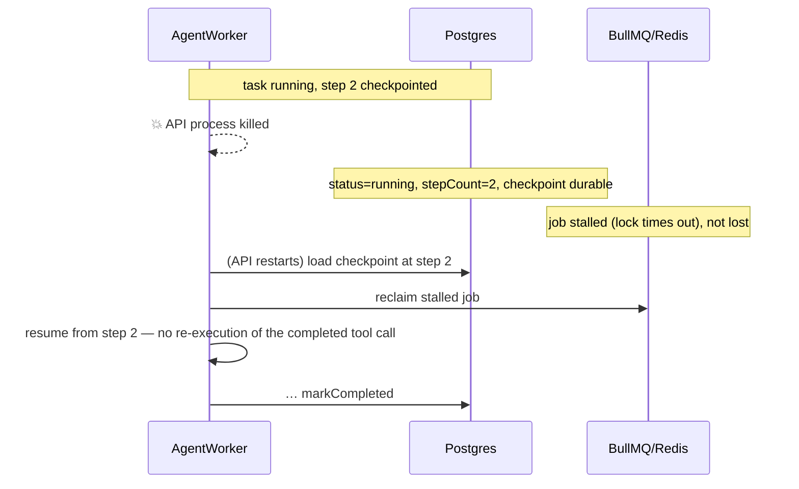

---

## 8. Data model & data flow

The `core` Postgres schema holds only platform tables; each plugin owns its own schema.

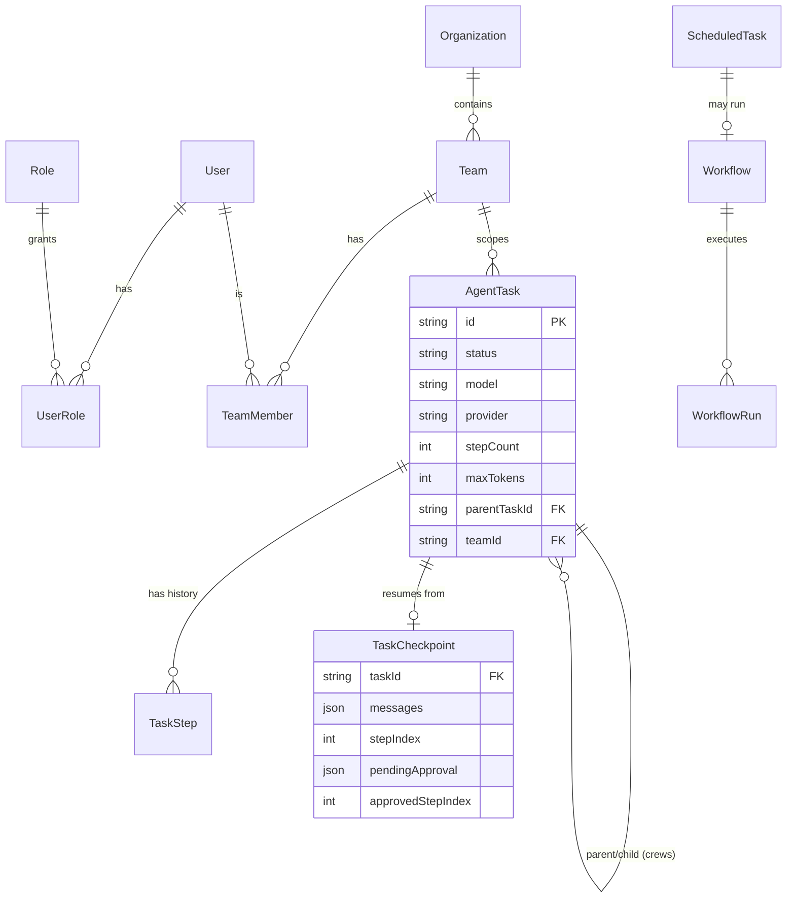

Other core tables: `PluginInstallation`, `Setting`, `FeatureFlag`, `AuditLog`, `Notification`,
`NotificationChannel` (settings-backed), and the migration history under `apps/api/prisma/migrations`.

### Data-flow: an autonomous incident-response loop

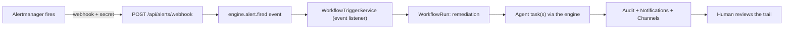

---

## 9. The model router

`ModelRouterService` is an honest **selector over a list of `ModelProvider` implementations** —
not an Ollama client wearing a router's name. Adding a provider means registering it in
`MODEL_PROVIDERS`; callers (`AgentWorkerService`, `EngineController`) never change.

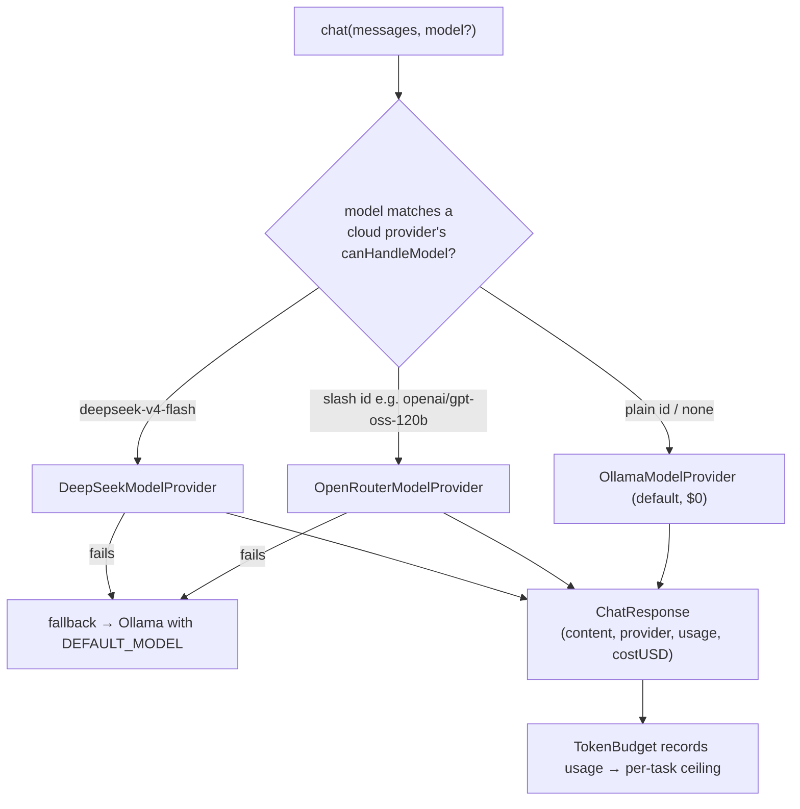

- **Local by default.** With no cloud key set, every provider except Ollama reports `reachable:
  false` honestly, and every task completes on Ollama — the `$0`/local invariant.
- **Cost-aware.** `ModelUsage.costUSD` carries real pricing; the budget cap is a real dollar
  seam, not just a step counter.

---

## 10. The Brain (memory & knowledge graph)

The Brain gives the platform and its agents persistent, queryable memory. The engine is
**[Graphify](https://github.com/Graphify-Labs/graphify)** — a deterministic knowledge graph
(tree-sitter AST + docs) served over **MCP**, plus a markdown **vault** that agents append to.

```mermaid
flowchart LR
  subgraph CORPUS["Corpus"]
    VAULT["brain/ vault (agent-written .md)"]
    CODE["repo code + docs"]
  end
  GX["Graphify sidecar<br/>watch → graph.json → MCP server"]
  MEM["core/memory: BrainService + GraphifyAdapter"]
  VAULT & CODE --> GX
  GX -->|graph.json + MCP| MEM
  MEM -->|/api/brain/query · graph · stats| PORTAL["Portal Brain view"]
  MEM -->|/api/brain/search (RAG)| AGENTS["Agents (semantic recall)"]
  AGENTS -->|remember()| VAULT
```

The **RAG loop is closed**: an agent calls `remember()` → the note lands in the vault → it's
embedded (via local Ollama `nomic-embed-text`) → a later semantic `search()` finds it. Like every
other service, the Brain degrades honestly to "brain not built yet" when the graph is absent.

---

## 11. Observability

- **Metrics** — a zero-dependency Prometheus registry exposes `/api/metrics` (task lifecycle,
  queue depth, model calls/latency/tokens/cost, tool invocations, HTTP latency, auth, scheduler,
  supervisor). A provisioned 19-panel Grafana dashboard renders it.
- **Tracing** — an additive OpenTelemetry tracer that is a **no-op unless
  `OTEL_EXPORTER_OTLP_ENDPOINT` is set**; enabled, it exports a parented span tree
  (`engine.task.run → engine.task.step → model.call`, plus `plugin.tool.invoke` and
  `http.request`) to **Tempo**. Tool arguments are never attributed.
- **Health** — `GET /api/engine/health` returns the engine, queue, model providers, scheduler,
  supervisor, and alert trail; the portal `/health` page renders it live.

---

## 12. Deployment topology

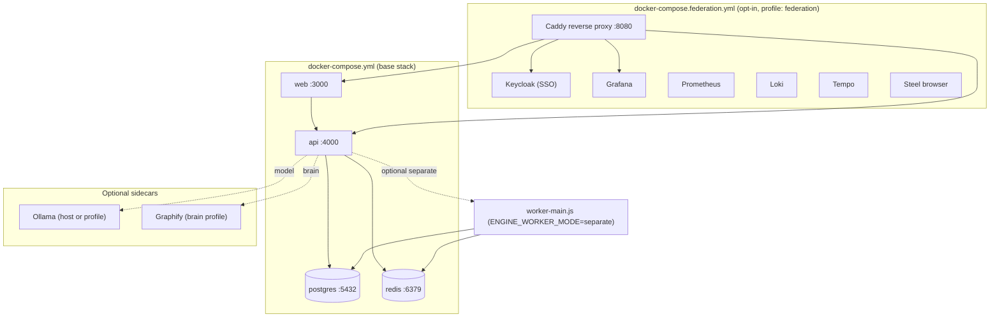

- The **base stack** is what Coolify or a small VPS consumes directly — what runs locally is
  what ships.
- The **federation overlay** is heavy (SSO + full observability) and strictly opt-in behind a
  profile.
- The **worker** can run embedded (default) or as a **separate process** so the API stays
  responsive and workers scale independently.

See [DEPLOYMENT.md](DEPLOYMENT.md) for the step-by-step guides.

---

## 13. Locked architectural decisions

These decisions (C1–C10) are stable and underpin everything above:

| # | Decision |
|---|---|
| C1 | Built from scratch on **NestJS + Next.js**, enterprise-grade |
| C2 | **pnpm workspaces + Turborepo** monorepo |
| C3 | **`@constellation/plugin-sdk`** (Zod manifest + lifecycle + context) is the load-bearing contract |
| C4 | Core = auth/RBAC/nav/settings/loader/**engine**; everything else is a plugin |
| C5 | **Two planes** — federate heavyweight tools (portal) + capabilities-as-tools (agent) |
| C6 | 24/7 host = a cheap always-on VPS (Coolify-managed); **not provisioned** until approved |
| C7 | Federate overlapping tools rather than pick one (Open WebUI *and* an in-house path) |
| C8 | **Each plugin owns its own Postgres schema** — isolation + independent migrations |
| C9 | **Prisma** as the ORM (multi-schema) |
| C10 | Codename **`constellation`** |

> The one extension the project's own architecture review recommended to C4 — *the core needs an
> agent runtime, it is not just a plugin* — has since been fully built (the engine described in
> §6).
