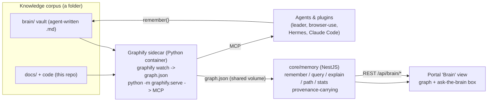

# Constellation — The Brain (Memory & Knowledge Graph)

> Gives the platform (and its agents) a persistent, queryable memory instead of a
> stateless chat box. Engine = **Graphify** (knowledge graph over MCP). Native to
> Constellation, not a bolt-on. $0/local by default.
>
> **Status:** DESIGN (2026-08-02). Not built yet. Owner split in §6.

## 1. Honest scope (what we adopt from the "Agentic OS" article, and what we skip)
| Article piece | Verdict | Why |
|---|---|---|
| **Graphify** | **ADOPT** — this is the brain | Real graph (tree-sitter AST, no vector store), local, no keys for code, Apache-2.0/MIT, MCP server built in. Python `graphifyy`. |
| **Obsidian** | Optional data source only | Graphify ingests any markdown/code folder. We use a repo `brain/` vault + our docs/code. Graphify can export to Obsidian if wanted. |
| **PAUL + SEED** | Skip (for now) | A Claude Code *build* methodology, not runtime memory. We already run spec→build→verify via a managed-subagent workflow. Don't conflate build tool with brain. |
| **Railway** | Defer | A host, same slot as our chosen VPS + Coolify (already deferred). Decide at ship time. |

## 2. Graphify facts (verified 2026-08-02)
- Install: `uv tool install graphifyy` (or `pipx`/`pip install graphifyy`). Python 3.10+.
- Build a graph: `graphify .` (or a path) → writes `graphify-out/{graph.json, graph.html, GRAPH_REPORT.md}`.
- Incremental: `graphify --update`; live: `graphify watch .` (AST rebuilds need NO LLM).
- Code parsed locally, deterministic, offline. Docs/PDFs need a model backend
  (`--backend ollama` = fully offline/$0, or anthropic/openai/gemini via keys).
- Query: CLI (`graphify query "..."`, `path`, `explain`) OR **MCP server**:
  `python -m graphify.serve graphify-out/graph.json` → tools `query_graph`, `get_node`,
  `shortest_path`, `explain`, … (~10). Also exports Neo4j/GraphML/FalkorDB/Obsidian.
- License Apache-2.0 + MIT. Repo: github.com/Graphify-Labs/graphify.

## 3. Architecture


**Memory loop (the point):** agents `remember(fact)` → appended as markdown to `brain/` →
`graphify watch` rebuilds the graph → agents/portal `query()` the graph (grounded, with
provenance, honest-abstain). Persists across sessions and restarts. This is the Obsidian+Graphify
pattern with the vault living inside the platform, not a desktop app.

## 4. `core/memory` interface (NestJS)
```ts
interface BrainService {
  remember(note: { title: string; body: string; tags?: string[]; source?: string }): Promise<void>; // append md to brain/
  query(question: string): Promise<{ answer: string; provenance: GraphRef[] }>;   // via graphify query_graph
  explain(nodeId: string): Promise<NodeExplanation>;
  path(from: string, to: string): Promise<GraphRef[]>;
  stats(): Promise<{ nodes: number; edges: number; lastBuiltAt: string }>;
  graph(): Promise<GraphJson>;   // read graphify-out/graph.json for the portal view
}
```
Backend: a `GraphifyAdapter` that talks to the sidecar — preferred path is the **MCP client**
(query_graph/shortest_path/explain); simplest first cut is reading `graph.json` + shelling
`graphify query`. Degrade gracefully when the sidecar/graph is absent (empty stats, clear
"brain not built yet" — same "never crash" discipline as PrismaService).

## 5. REST + MCP surface
- `POST /api/brain/remember` (auth; `core:brain:write`) — write a memory.
- `POST /api/brain/query` (auth; `core:brain:read`) — grounded answer + provenance.
- `GET /api/brain/graph` (auth) — graph.json for the portal visualization.
- `GET /api/brain/stats` (auth) — node/edge counts + last build time.
- **MCP:** the Graphify sidecar's MCP server is the agent-facing surface (external Claude
  Code/Hermes point at it). Optionally re-expose selected tools through the platform later.

## 6. Build split
- **Infra:** add a `graphify` service to `docker-compose.yml` (python image, `pip install
  graphifyy`, `graphify watch /corpus`, `python -m graphify.serve` on an MCP port), mount the
  corpus (repo `docs/` + `brain/`), shared `graphify-out` volume. Local-run `make brain` target.
- **Core + agent:** `apps/api/src/core/memory` `BrainService` + `GraphifyAdapter` + REST
  routes (§5, guarded via the P2 RBAC guards) + new `core:brain:read|write` permissions in the
  SDK; a `memory` capability so plugins can `remember/query`. Seed `brain/README.md`.
- **Portal:** a "Brain" nav item + page — render `graph.json` (force-directed) and an
  "ask the brain" box calling `POST /api/brain/query`, showing the grounded answer + provenance.

## 7. Verify (bar)
`graphify .` produces a graph over this repo; sidecar serves MCP; `POST /api/brain/query "what
connects the plugin loader to the SDK?"` returns a grounded answer with provenance; the portal
renders the graph; `remember()` → note appears in `brain/` → shows up in the graph after a
rebuild. All $0/local (Ollama backend or code-only). Nothing pushed/provisioned without go-ahead.
