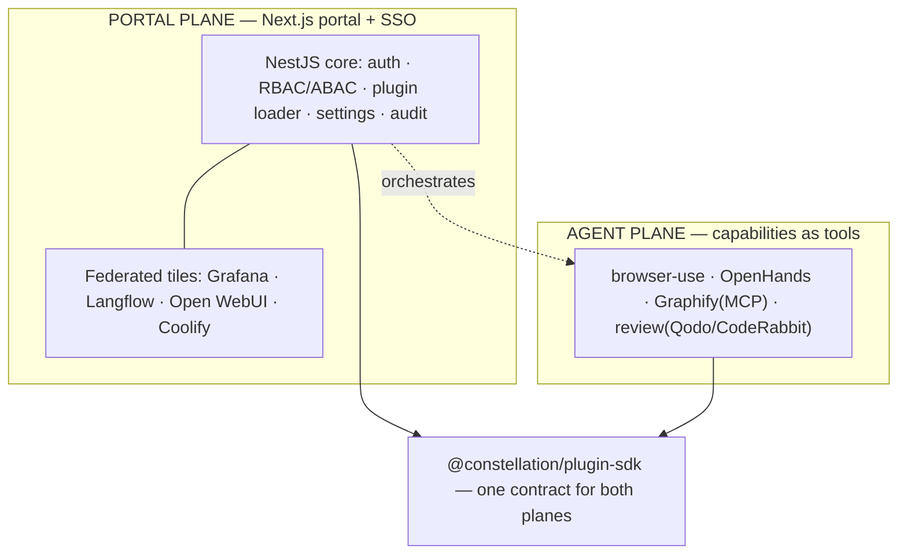

# Constellation — Master Plan & Session Summary

> **Single source of truth.** Read this in full to resume. It holds the vision,
> locked decisions, architecture, roadmap, and the live task split across the
> three helper agents (Atlas, Nova, Orion). Update it **every session**.
>
> **Codename:** `constellation` (placeholder — user may rename).
> **Status:** Foundation **built and verified end-to-end** (monorepo + Plugin SDK + NestJS core with a working plugin loader + Next.js portal + example plugin). See §9.
> **Relationship to Looper:** SEPARATE project. Looper (`../loop-engineering`) is untouched.
> **Last updated:** 2026-08-01

---

## 0. How to resume
Paste: _"Read `constellation/docs/MASTER_PLAN.md` as full project context, confirm where we
left off, then continue from §7 Roadmap / §8 Task split. Do not rewrite the Plugin SDK contract
without calling it out. Nothing is committed/pushed or cloud-provisioned without my explicit
go-ahead + confirmed cost."_

Ground rules across sessions:
- The **Plugin SDK contract** (`packages/plugin-sdk`) is the load-bearing decision — evolve it
  deliberately, versioned (`manifestVersion`), never casually.
- **$0 / local** until the user approves a host. No cloud provisioning without go-ahead + cost.
- **Nothing committed or pushed** without an explicit in-the-moment go-ahead (carried over from
  the user's standing rule on the Looper project).

---

## 1. Vision
A modular, plug-and-play **enterprise platform framework** (à la Backstage / Azure Portal /
Grafana / Datadog / ServiceNow). Continuously import GitHub repos; each becomes an installable
**module/plugin**. The core never gets rewritten to add features — plugins plug in. End goal:
the best agentic system that works for the user 24/7, assembled from best-of-breed OSS.

## 2. Locked decisions (2026-08-01)
| # | Decision | Choice | Note |
|---|----------|--------|------|
| C1 | Build strategy | **From scratch, NestJS + Next.js**, new repo/folder, enterprise-grade | User overrode the "reuse Looper" recommendation — this is a NEW product. |
| C2 | Monorepo | **pnpm workspaces + Turborepo** | Standard for polyglot TS monorepos; task caching. |
| C3 | Plugin contract | **`@constellation/plugin-sdk`** — Zod manifest + `Plugin` lifecycle + `PluginContext` capability object | The heart. Manifest is data; runtime is code; strict validation, per-plugin isolation. |
| C4 | Core scope | Core = auth, RBAC/ABAC, nav, settings, plugin loader, notifications, jobs, audit, config, feature flags, theme. **Everything else is a plugin.** | Matches the brief. |
| C5 | Two planes | **Portal** (federate heavyweight tools via SSO + reverse proxy) + **Agent** (capabilities as tools) | Don't cram standalone platforms into the core; federate/orchestrate them. |
| C6 | 24/7 host | **Cheap always-on VPS** (Hetzner-class, Coolify-managed) | Chosen by user. NOT provisioned yet — gated on go-ahead + cost. Laptop is build-only. |
| C7 | Overlaps | **Federate both** — keep Open WebUI AND an in-house chat, plus Langflow | User's choice. |
| C8 | DB per plugin | Each plugin **owns its Postgres schema**; no shared tables unless necessary | Isolation + independent migrations. |
| C9 | ORM | **Prisma** (user decision 2026-08-01) | Mature, great DX, migration tooling; per-plugin schema via multi-schema. |
| C10 | Codename | **Keep `constellation`** (user confirmed 2026-08-01) | No rename. |

## 3. Verified repo verdicts (carry-over, 2026-08-01)
- **OpenHands** ✓ heavy agentic coder → agent-plane capability (delegate big repo jobs).
- **browser-use** ✓ LLM browser automation → first/cleanest tool adapter.
- **Graphify** ✓ (Graphify-Labs) codebase/docs→knowledge graph, grounded memory over **MCP** →
  agent memory + "how modules/memory connect" graph. (Earlier "doesn't exist" note was wrong.)
- **CodeRabbit** — SaaS; self-host is **paid Enterprise only**. OSS alt: **Qodo Merge**.
- **Langflow** ✓ visual flow builder → portal tile + published flows callable as tools.
- **Open WebUI** ✓ chat UI → federated tile (kept alongside in-house chat per C7).
- **Grafana** ✓ dashboards over Prometheus/Loki → observability tile.
- **Coolify** ✓ self-hosted PaaS → deploy/keep-alive layer for the whole stack.
- **OpenJarvis** — a local personal-AI runtime + skills standard, **not** a subagent
  orchestrator. Adopt the skills idea, not the whole runtime as "jarvis."

## 4. Architecture (two planes)

## 5. What exists now (foundation — this session)
- **Monorepo**: `package.json`, `pnpm-workspace.yaml`, `turbo.json`, `tsconfig.base.json`, `.gitignore`, `.env.example`.
- **`packages/plugin-sdk`** (the contract): `manifest.ts` (Zod schema covering identity,
  compatibility, permissions, DB schema/version, navigation, routes, feature flags, settings,
  jobs, health, translations), `plugin.ts` (`Plugin` lifecycle + `definePlugin` + `LoadedPlugin`),
  `context.ts` (`PluginContext`: logger/config/events/db/principal capability object),
  `permissions.ts` (colon-scoped RBAC + wildcard matching), unit tests.
- **`apps/api`** (NestJS core): `main.ts` (helmet, CORS, ValidationPipe, Swagger at `/api/docs`),
  `app.module.ts`, `core/plugins/*` (**loader** = filesystem discovery + manifest validation +
  isolated lifecycle; **registry**; read API `GET /api/plugins`), `core/health` (`GET /api/health`).
- **`apps/web`** (Next.js portal): App Router shell that lists loaded modules from the API; Tailwind, dark-mode ready.
- **`plugins/hello-world`**: reference plugin (manifest + `definePlugin` runtime + build).
- **`docs/`**: this plan + README.

**Verification status:** see §9 (updated as install/build/test run).

## 6. Core platform backlog (post-foundation)
Auth (JWT/OAuth2/OIDC, SSO/LDAP/Azure AD ready) · RBAC + ABAC engine · Postgres data layer +
per-plugin schema migrations · Redis cache · RabbitMQ queue + background jobs · scheduler ·
audit log (immutable) · feature flags · notification center · theme engine · admin panel ·
plugin marketplace · `generate-plugin` CLI · OpenTelemetry tracing · Prometheus metrics ·
Docker + compose + K8s manifests · Terraform · CI/CD (GitHub Actions).

## 7. Roadmap
| Phase | Scope | Cost | Gate |
|-------|-------|------|------|
| **P0 (done)** | Monorepo + Plugin SDK + NestJS core loader + Next portal shell + example plugin | FREE | — |
| **P1** | Data layer (Postgres + per-plugin schema/migrations), config service, real `PluginContext` (logger/config/events/db) | FREE local | now |
| **P2** | Auth + RBAC/ABAC + admin panel + audit; `generate-plugin` CLI | FREE local | after P1 |
| **P3** | Portal federation: SSO (Keycloak/Authentik) + reverse proxy + `modules.yaml`; embed Grafana/Langflow/Open WebUI/Coolify | FREE local / host per C6 | after P2 |
| **P4** | Agent-plane capabilities: browser-use, Graphify(MCP), review, OpenHands adapters | FREE (+SaaS keys) | after P1 |
| **P5** | Deploy to the VPS via Coolify; observability (Prometheus/Grafana/Loki/OTel); harden + docs | host cost per C6 | after user go-ahead |

## 8. TASK SPLIT — the three friends (each appends results here; orchestrator verifies)
Helper agents: **Atlas** (platform/infra), **Nova** (Plugin SDK + agent capabilities), **Orion**
(portal UX + knowledge/chat + DX). All work **$0/local**; **nothing committed/pushed/provisioned**
without explicit go-ahead. Maker/checker: no agent approves its own work — the orchestrator
re-tests before "done."

**DISPATCHED 2026-08-01 (round 1).** Each friend runs in an **isolated git worktree** (so
concurrent `pnpm install`s can't corrupt each other's lockfile/store) on a base commit of the
verified foundation. They own **disjoint directories** (below) and report back to the
orchestrator, who merges + runs a full clean install/build/test pass before ticking boxes here.
File ownership: **Atlas** = `apps/api/src/core/{database,settings,logging,events}` + `apps/api/prisma`
+ `app.module.ts` + infra; **Nova** = `packages/**` + `apps/api/src/core/plugins/**` + `plugins/**`;
**Orion** = `apps/web/**` + `docs/*` (except this file). Round-1 focus: Atlas A1+A2, Nova N1+N2, Orion O1+O4.

### 🏛️ Atlas — Core services & infra
- [ ] A1. **Data layer**: pick ORM (recommend Prisma or Drizzle — decide + justify), Postgres
  connection module, and the **per-plugin schema + migration** mechanism (each plugin owns a schema).
- [ ] A2. Real `PluginContext` backends: structured logger (pino/Nest), config service (settings +
  feature flags from DB), scoped event bus.
- [ ] A3. Dockerize: `docker-compose.yml` (api + web + postgres + redis) for local; Dockerfiles.
- [ ] A4. CI: GitHub Actions (install, build, typecheck, test) — design only until repo is created.
- _Status:_ **not started.**

### ⭐ Nova — Plugin SDK maturation & agent capabilities
- [ ] N1. Harden the SDK: dependency-order resolution in the loader (topological by
  `dependencies`), enable/disable transitions, health polling loop, versioned manifest migration.
- [ ] N2. `generate-plugin <Name>` scaffolder CLI (manifest + runtime + test + tsconfig).
- [ ] N3. First agent capability plugin: **browser-use** adapter (verbs: navigate/act/extract), mocked test.
- [ ] N4. Design the OpenHands + review (Qodo Merge / CodeRabbit CLI) capability plugins.
- _Status:_ **not started.**

### 🌌 Orion — Portal UX, knowledge/chat, DX
- [ ] O1. Portal shell v1: sidebar driven by plugin `navigation`, auth-gated routes, dark/light
  theme toggle, command palette; wire shadcn/ui.
- [ ] O2. **Graphify** integration design (MCP) as the knowledge-graph/memory module + a graph view.
- [ ] O3. Chat federation (C7): embed Open WebUI as a tile AND spec the in-house chat module; Langflow tile.
- [ ] O4. Docs: `docs/PLUGIN_SDK.md` authoring guide + the hello-world walkthrough.
- _Status:_ **not started.**

## 9. Verification log
- **2026-08-01 — Foundation built and verified end-to-end (local, $0):**
  - `pnpm install` → 605 packages, clean.
  - `plugin-sdk`: builds ESM+CJS+d.ts (tsup); **7/7 unit tests pass** (manifest validation + permission matching).
  - `plugin-hello-world`: builds (tsc). _(Fixed: `declarationMap` needs `declaration` — set both off in plugin tsconfig.)_
  - `api` (NestJS): builds (nest build) and **boots live**; plugin loader discovered `hello-world`, validated its manifest, imported the ESM runtime, ran `register()`, registry state = `registered`. `GET /api/health` → `status: ok, plugins {total:1, failed:0}`; `GET /api/plugins` + `/api/plugins/:id` return the validated manifest.
  - `web` (Next.js): `next build` clean (4 routes).
  - **Two real bugs found + fixed during live verification** (recorded so friends don't reintroduce them):
    1. **Windows file URL**: dynamic import needs `pathToFileURL()` (`file:///C:/…`), not string-concatenated `file://C:/…`.
    2. **CJS downleveling**: under `module: CommonJS`, tsc rewrites `import()` → `require()`, which can't load an ESM plugin. Fixed with an un-transpiled `esmImport = new Function("s","return import(s)")` in `plugin-loader.service.ts`. **Any future dynamic import of ESM from the CJS core must use this pattern.**
  - Env note: local port **4000 was already occupied** by a LiteLLM-style service (leftover Looper gateway, PID varies) — used 4001 for the smoke test. Default in `.env.example` stays 4000.

## 10. Open questions for the user
- ~~Rename the codename?~~ **Resolved: keep `constellation`.**
- ~~ORM preference?~~ **Resolved: Prisma (C9).**
- Still open — when ready for the VPS: provider (Hetzner?) + monthly budget, so P5 can be costed.
