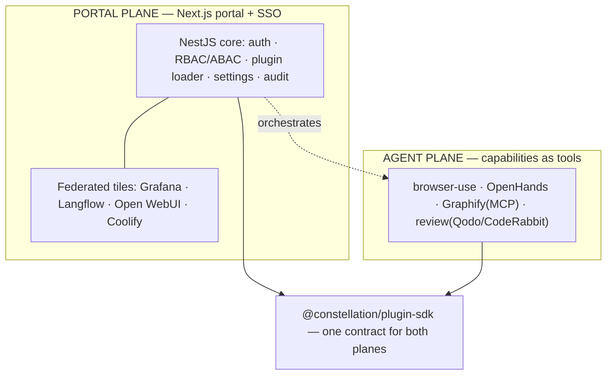

# Constellation — Master Plan & Session Summary

> **Single source of truth.** Read this in full to resume. It holds the vision,
> locked decisions, architecture, roadmap, and the live task split across the
> three helper agents (Atlas, Nova, Orion). Update it **every session**.
>
> **Codename:** `constellation` (placeholder — user may rename).
> **Driver / lead orchestrator:** **Polaris.** New driver taking over → read `docs/ORCHESTRATOR.md` first (Polaris's full operating manual + onboarding).
> **Status:** Platform layer strong + **the agentic engine is real and live-proven** through **Engine v0.2** (git `5115919`, local only — never pushed). Durable BullMQ task runtime, Ollama model runtime via an honest `ModelProvider` interface, ReAct loop with checkpoint/resume (kill-restart proven live, incl. across a real tool call), **human-in-the-loop approval gate** (pause→approve/reject, honour-once, audited), per-task token budget cap, `/engine` portal (browser-verified). An agent task has called a real tool against the live Brain graph, gotten real data, and completed on it. **376 tests green** (api 259, browser-use 47, graphify 40, sdk 21, cli 9). See §9. **Next: Engine v0.3 — Real Model Providers** (OpenRouter first; user has API keys; Ollama stays the $0 default). Then a scheduler. VPS deferred (prove locally first).
> **Relationship to Looper:** SEPARATE project. Looper (`../loop-engineering`) is untouched.
> **Last updated:** 2026-08-03 (Polaris — added `docs/ORCHESTRATOR.md` driver handbook; refreshed status through Engine v0.2)

---

## 0. How to resume
Paste: _"Read `constellation/docs/ORCHESTRATOR.md` (the driver's handbook) and
`constellation/docs/MASTER_PLAN.md` as full project context, confirm where we left off, then
continue from §7 Roadmap / §8 Task split. Do not rewrite the Plugin SDK contract without calling
it out. Nothing is committed/pushed or cloud-provisioned without my explicit go-ahead + confirmed
cost."_

**New AI taking over as lead/driver:** start with `docs/ORCHESTRATOR.md` — it is the complete
operating manual for the Polaris role (mission, method, team, roadmap, required skills, and the
literal step-by-step onboarding to take the wheel).

Ground rules across sessions:
- The **Plugin SDK contract** (`packages/plugin-sdk`) is the load-bearing decision — evolve it
  deliberately, versioned (`manifestVersion`), never casually.
- **$0 / local** until the user approves a host. No cloud provisioning without go-ahead + cost.
- **Nothing committed or pushed** without an explicit in-the-moment go-ahead (carried over from
  the user's standing rule on the Looper project).

---

## 1. Vision
A modular, plug-and-play **enterprise platform framework** (à la Backstage / Azure Portal /
Grafana / Datadog / ServiceNow). Continuously import GitHub repos; each becomes an installable
**module/plugin**. The core never gets rewritten to add features — plugins plug in. End goal:
the best agentic system that works for the user 24/7, assembled from best-of-breed OSS.

## 2. Locked decisions (2026-08-01)
| # | Decision | Choice | Note |
|---|----------|--------|------|
| C1 | Build strategy | **From scratch, NestJS + Next.js**, new repo/folder, enterprise-grade | User overrode the "reuse Looper" recommendation — this is a NEW product. |
| C2 | Monorepo | **pnpm workspaces + Turborepo** | Standard for polyglot TS monorepos; task caching. |
| C3 | Plugin contract | **`@constellation/plugin-sdk`** — Zod manifest + `Plugin` lifecycle + `PluginContext` capability object | The heart. Manifest is data; runtime is code; strict validation, per-plugin isolation. |
| C4 | Core scope | Core = auth, RBAC/ABAC, nav, settings, plugin loader, notifications, jobs, audit, config, feature flags, theme. **Everything else is a plugin.** | Matches the brief. |
| C5 | Two planes | **Portal** (federate heavyweight tools via SSO + reverse proxy) + **Agent** (capabilities as tools) | Don't cram standalone platforms into the core; federate/orchestrate them. |
| C6 | 24/7 host | **Cheap always-on VPS** (Hetzner-class, Coolify-managed) | Chosen by user. NOT provisioned yet — gated on go-ahead + cost. Laptop is build-only. |
| C7 | Overlaps | **Federate both** — keep Open WebUI AND an in-house chat, plus Langflow | User's choice. |
| C8 | DB per plugin | Each plugin **owns its Postgres schema**; no shared tables unless necessary | Isolation + independent migrations. |
| C9 | ORM | **Prisma** (user decision 2026-08-01) | Mature, great DX, migration tooling; per-plugin schema via multi-schema. |
| C10 | Codename | **Keep `constellation`** (user confirmed 2026-08-01) | No rename. |

## 3. Verified repo verdicts (carry-over, 2026-08-01)
- **OpenHands** ✓ heavy agentic coder → agent-plane capability (delegate big repo jobs).
- **browser-use** ✓ LLM browser automation → first/cleanest tool adapter.
- **Graphify** ✓ (Graphify-Labs) codebase/docs→knowledge graph, grounded memory over **MCP** →
  agent memory + "how modules/memory connect" graph. (Earlier "doesn't exist" note was wrong.)
- **CodeRabbit** — SaaS; self-host is **paid Enterprise only**. OSS alt: **Qodo Merge**.
- **Langflow** ✓ visual flow builder → portal tile + published flows callable as tools.
- **Open WebUI** ✓ chat UI → federated tile (kept alongside in-house chat per C7).
- **Grafana** ✓ dashboards over Prometheus/Loki → observability tile.
- **Coolify** ✓ self-hosted PaaS → deploy/keep-alive layer for the whole stack.
- **OpenJarvis** — a local personal-AI runtime + skills standard, **not** a subagent
  orchestrator. Adopt the skills idea, not the whole runtime as "jarvis."

## 4. Architecture (two planes)


## 5. What exists now (foundation — this session)
- **Monorepo**: `package.json`, `pnpm-workspace.yaml`, `turbo.json`, `tsconfig.base.json`, `.gitignore`, `.env.example`.
- **`packages/plugin-sdk`** (the contract): `manifest.ts` (Zod schema covering identity,
  compatibility, permissions, DB schema/version, navigation, routes, feature flags, settings,
  jobs, health, translations), `plugin.ts` (`Plugin` lifecycle + `definePlugin` + `LoadedPlugin`),
  `context.ts` (`PluginContext`: logger/config/events/db/principal capability object),
  `permissions.ts` (colon-scoped RBAC + wildcard matching), unit tests.
- **`apps/api`** (NestJS core): `main.ts` (helmet, CORS, ValidationPipe, Swagger at `/api/docs`),
  `app.module.ts`, `core/plugins/*` (**loader** = filesystem discovery + manifest validation +
  isolated lifecycle; **registry**; read API `GET /api/plugins`), `core/health` (`GET /api/health`).
- **`apps/web`** (Next.js portal): App Router shell that lists loaded modules from the API; Tailwind, dark-mode ready.
- **`plugins/hello-world`**: reference plugin (manifest + `definePlugin` runtime + build).
- **`docs/`**: this plan + README.

**Verification status:** see §9 (updated as install/build/test run).

## 6. Core platform backlog (post-foundation)
Auth (JWT/OAuth2/OIDC, SSO/LDAP/Azure AD ready) · RBAC + ABAC engine · Postgres data layer +
per-plugin schema migrations · Redis cache · RabbitMQ queue + background jobs · scheduler ·
audit log (immutable) · feature flags · notification center · theme engine · admin panel ·
plugin marketplace · `generate-plugin` CLI · OpenTelemetry tracing · Prometheus metrics ·
Docker + compose + K8s manifests · Terraform · CI/CD (GitHub Actions).

## 7. Roadmap
| Phase | Scope | Cost | Gate |
|-------|-------|------|------|
| **P0 (done)** | Monorepo + Plugin SDK + NestJS core loader + Next portal shell + example plugin | FREE | — |
| **P1 (done)** | Data layer (Postgres + Prisma), config service, real `PluginContext` (logger/config/events/db) | FREE local | `ee64bff` |
| **P2 (done)** | Auth + RBAC/ABAC + admin panel + audit; `generate-plugin` CLI | FREE local | `14137d8` |
| **P3 (part)** | Portal federation: `config/modules.yaml` + `/api/federation/*` + `/tools` tiles + OIDC verifier seam **done** (`a07dd25`). **Remaining:** actually run Keycloak + Caddy and prove a real SSO round-trip / embedded tile | FREE local / host per C6 | partial |
| **P4 (part)** | Agent plane: tool-invoke endpoint + `browser-use` + `graphify` **done**. **Remaining:** real service wiring, review + OpenHands adapters | FREE (+SaaS keys) | partial |
| **🧠 BRAIN** | Memory & knowledge graph (Graphify sidecar + `core/memory` + portal Brain view) — **NEXT, top priority** | FREE local | `docs/BRAIN.md` |
| **P5** | Deploy to the VPS via Coolify; observability (Prometheus/Grafana/Loki/OTel); harden + docs | host cost per C6 | after user go-ahead |


## 8. TASK SPLIT — the three friends (each appends results here; orchestrator verifies)
Helper agents: **Atlas** (platform/infra), **Nova** (Plugin SDK + agent capabilities), **Orion**
(portal UX + knowledge/chat + DX). All work **$0/local**; **nothing committed/pushed/provisioned**
without explicit go-ahead. Maker/checker: no agent approves its own work — the orchestrator
re-tests before "done."

**DISPATCHED 2026-08-01 (round 1).** Each friend runs in an **isolated git worktree** (so
concurrent `pnpm install`s can't corrupt each other's lockfile/store) on a base commit of the
verified foundation. They own **disjoint directories** (below) and report back to the
orchestrator, who merges + runs a full clean install/build/test pass before ticking boxes here.
File ownership: **Atlas** = `apps/api/src/core/{database,settings,logging,events}` + `apps/api/prisma`
+ `app.module.ts` + infra; **Nova** = `packages/**` + `apps/api/src/core/plugins/**` + `plugins/**`;
**Orion** = `apps/web/**` + `docs/*` (except this file). Round-1 focus: Atlas A1+A2, Nova N1+N2, Orion O1+O4.

### 🏛️ Atlas — Core services & infra
- [x] A1. **Data layer**: ORM decided (**Prisma**, C9), Postgres connection module, per-plugin
  schema mechanism. — **landed round 1; proven against real Postgres** (round 2 + P2 + P3/P4).
- [x] A2. Real `PluginContext` backends: pino logger, settings/feature-flags service, scoped event
  bus. — **landed round 1**, wired into every plugin hook via `PluginContextFactory` (`ee64bff`).
- [x] A3. Dockerize: `docker-compose.yml` (api + web + postgres + redis) for local; Dockerfiles.
  — **done in round 2, verified running.** See §8 "Atlas — ROUND 2" and §9.
- [x] A4. CI: GitHub Actions (install, build, typecheck, test) — design only until repo is created.
  — **done in round 2** (`.github/workflows/ci.yml`); still unrun against GitHub (no remote yet),
  but `pnpm install --frozen-lockfile` is now proven in CI's exact image (2026-08-02).
- _Status:_ **A1–A4 all complete and committed.** (A1/A2 confirmed by the orchestrator's
  integration passes; per-plugin *schema bootstrap* remains a follow-up — HANDOFF §8 item 4.)

### ⭐ Nova — Plugin SDK maturation & agent capabilities
- [x] N1. Harden the SDK: topological dependency ordering, enable/disable transitions, health
  polling loop. — **landed round 1** (`ee64bff`). *Versioned manifest migration is still TODO.*
- [x] N2. `generate-plugin <Name>` scaffolder CLI. — **landed round 1**, 9 CLI tests.
- [x] N3. First agent capability plugin: **browser-use** (navigate/act/extract), mocked test.
  — **landed round 2**; 25 tests. Still points at no real service (HANDOFF §8 item 5).
- [x] N4. Design + build capability plugins beyond browser-use. — **`graphify` shipped** in the
  P3/P4 round (`a07dd25`, 27 tests). OpenHands + review (Qodo/CodeRabbit) adapters still TODO.
- _Status:_ **N1–N4 complete as committed work**, with the two carve-outs noted above
  (manifest migration; real service wiring for browser-use/graphify + remaining adapters).

### 🌌 Orion — Portal UX, knowledge/chat, DX
- [x] O1. Portal shell v1: manifest-driven sidebar, auth-gated routes, theme toggle, ⌘K palette.
  — **landed round 1**, extended round 2 (detail pages, admin depth, live health) and P2 (login,
  gating, role-aware nav).
- [ ] O2. **Graphify** integration as the knowledge-graph/memory module + a graph view.
  — **the plugin + tools exist** (`plugins/graphify`, `a07dd25`); the **portal graph view is the
  BRAIN round's Orion lane** — see `docs/BRAIN.md` §6. NOT done.
- [ ] O3. Chat federation (C7): Open WebUI tile + in-house chat spec; Langflow tile.
  — **partially done:** both are declared in `config/modules.yaml` and render as `/tools` tiles,
  but nothing is actually stood up or proxied yet, and the in-house chat is unspecced.
- [x] O4. Docs: `docs/PLUGIN_SDK.md` authoring guide + hello-world walkthrough. — **landed round 1.**
- _Status:_ **O1 + O4 done; O2 pending (BRAIN round); O3 tiles-only until the federated stack runs.**


### 🏛️ Atlas — ROUND 2 (containerization + real Postgres/Redis + CI) — ✅ DONE (`ee64bff`)
**Goal:** make the whole platform runnable via Docker Compose with a REAL Postgres + Redis, so
the Prisma data layer actually connects (proving round-1 end-to-end), and add CI. This also lays
the deploy foundation for the 24/7 VPS (Coolify runs Compose).

**Runs side-by-side with the orchestrator's integration pass.** To stay collision-free:
- **File ownership (round 2) — ONLY create/edit:** `docker-compose.yml`, `apps/api/Dockerfile`,
  `apps/web/Dockerfile`, `.dockerignore` (root + `apps/api/` + `apps/web/`), `.github/workflows/ci.yml`,
  a root `Makefile`, and the "Run with Docker" section of `README.md`.
- **Do NOT touch** `apps/api/src/**`, `apps/web/src/**`, `apps/web/next.config.mjs`, `packages/**`,
  `plugins/**`, or `docs/MASTER_PLAN.md` (the orchestrator is actively editing source there).
- **Do NOT run** `pnpm add`/`pnpm install` (orchestrator owns installs this round) and **do NOT run
  any `git` command** (orchestrator commits). Leave changes uncommitted.

**Tasks:**
- [x] R2-1. `docker-compose.yml`: `postgres` (postgres:16 — DB/user/pass from env, named volume, healthcheck),
  `redis` (redis:7, healthcheck), `api` (builds `apps/api`, `depends_on` postgres healthy, `DATABASE_URL`
  + `REDIS_URL` wired, port 4000), `web` (builds `apps/web`, `NEXT_PUBLIC_API_URL`, port 3000). Shared network, `.env`-driven.
- [x] R2-2. `apps/api/Dockerfile`: multi-stage (pnpm fetch/install → `nest build` → slim runtime), **non-root user**,
  entrypoint runs `prisma generate` + `prisma migrate deploy` then `node dist/main.js`. `apps/web/Dockerfile`:
  plain `next build` + `next start` (do NOT require the `standalone` config change — avoids editing web source), non-root.
- [x] R2-3. `.dockerignore`s (node_modules, dist, .next, .git, .env, .turbo).
- [x] R2-4. `.github/workflows/ci.yml`: on push/PR → pnpm + Node 22, `pnpm install --frozen-lockfile`,
  `pnpm build`, `pnpm typecheck`, `pnpm test`; cache the pnpm store.
- [x] R2-5. Root `Makefile` (`up`/`down`/`logs`/`migrate`) + README "Run with Docker" section.
- [x] Verify: `docker compose config` validates; `docker compose build` succeeds (api + web);
  `docker compose up -d` brings postgres+redis+api+web up healthy; `curl http://localhost:4000/api/health` → ok,
  and with Postgres up the api logs a **successful** Prisma connection (no "database layer disabled" warning). Tear down after.
- [x] Report back to the orchestrator. Do not commit.
- _Status:_ **DONE — verified end-to-end 2026-08-01 (Atlas). Nothing committed; no `git`/`pnpm install` run.**

#### Atlas round-2 results

**Files created (8) / edited (1) — all inside the round-2 ownership list:**
`docker-compose.yml` · `apps/api/Dockerfile` · `apps/web/Dockerfile` ·
`.dockerignore` · `apps/api/.dockerignore` · `apps/web/.dockerignore` ·
`.github/workflows/ci.yml` · `Makefile` (all 8 new) · `README.md` (edited —
added the "Run with Docker" section only). **Nothing under `apps/*/src/**`,
`packages/**`, `plugins/**`, or `next.config.mjs` was touched.**

**Verification (real runs, local Docker 29.6.2 / Compose v5.3.1):**
- `docker compose config --quiet` → valid.
- `docker compose build` → **both images build clean** (api + web).
- `docker compose up -d --wait` → **all four containers report `healthy`**
  (postgres, redis, api, web) with Compose gating the api on postgres+redis health.
- `GET /api/health` → `{"status":"ok", plugins:{total:1, failed:0, enabled:1, degradedOrDown:0}}`;
  `GET /api/plugins` returns the validated `hello-world` manifest; portal HTTP 200.
- **Prisma really connects** — api log: `[PrismaService] Connected to Postgres (core schema).`
  Zero occurrences of the "database layer disabled" / "adapter not installed" warning.
  `psql \dt core.*` confirms 4 real tables: `plugin_installations`, `settings`,
  `feature_flags`, `audit_logs`. Redis `PING` → `PONG`.
- Both api and web containers run as **`uid=1000(node)`**, confirmed via `id`.
- Stack torn down afterwards (`docker compose down --volumes`); no containers left running.

**Workspace gates (re-verified from a clean slate, no install run):**
- `turbo run build` → **5/5 tasks successful** (plugin-sdk, cli, api, web, hello-world).
- `turbo run typecheck` → **6/6 successful** (`tsc --noEmit` across every package).
- `turbo run test` → **4/4 successful**; api **15/15** loader tests pass, sdk suite green.
- `pnpm-lock.yaml` md5 verified **byte-identical before and after** — the
  "no `pnpm install`/`pnpm add`" constraint held.
- Full Compose stack was also re-run end-to-end a second time **with fresh
  volumes** (`down --volumes` first), reproducing every result above from zero
  — so none of it depended on warm state.

**⚠️ The `pnpm` bash shim mis-translates paths on this Windows host.**
**(Diagnosis CORRECTED 2026-08-02 — the original claim below was wrong.)**
Originally recorded as "pnpm is broken on this host — use turbo instead."
That was a misdiagnosis. **pnpm 9.12.3 is intact and works fine.** The fault
is purely in the Git-Bash shim at
`~/AppData/Local/hermes/node/pnpm`: it hands a POSIX path
(`/c/Users/.../corepack/dist/pnpm.js`) to a **native Windows `node.exe`**,
which resolves it against the drive root as `C:\c\Users\...` (the doubled
drive segment) → `MODULE_NOT_FOUND`. Nothing executes.

**The real danger is the silent failure mode:** because the process dies
before any compiler runs, a wrapper can report a **false "typecheck passed"**
for a command that never ran. Never trust a green pnpm result that produced
no compiler output.

**Two working invocations — prefer the first, it's the canonical command:**
```bash
# 1. Real pnpm, via native Windows paths (runs the actual package scripts):
'C:\Users\<you>\AppData\Local\hermes\node\node.exe' \
  'C:\Users\<you>\AppData\Local\hermes\node\node_modules\corepack\dist\pnpm.js' \
  run build|typecheck|test

# 2. Bypass pnpm entirely (fine for gates, skips pre/post scripts):
./node_modules/.bin/turbo run build|typecheck|test
```
Local-environment fault only — CI uses `pnpm/action-setup` on Linux and is
unaffected. This also explains the apparent contradiction in §9 (the
orchestrator "could not reproduce" the breakage): whether it fails depends
entirely on **how pnpm is invoked**, not on the machine.

**Three real problems hit and fixed (recorded so nobody reintroduces them):**
1. **Prisma generate must precede `nest build`.** `@prisma/client` is a stub
   until generation, so the api build failed with `TS2305: Module
   '"@prisma/client"' has no exported member 'PrismaClient'`. The builder stage
   now runs `prisma generate` *before* `nest build`.
2. **Prisma 7 removed `--skip-generate` from `db push`** — passing it is a hard
   error that crash-looped the api container. Entrypoint and `make migrate` now
   use plain `prisma db push --accept-data-loss`.
3. **No `prisma/migrations` history exists** (round 1 shipped `schema.prisma`
   but never ran `migrate dev`), so `migrate deploy` has nothing to apply. The
   entrypoint detects this and falls back to `db push`, auto-switching to
   `migrate deploy` the moment a migrations dir is committed.

**Notes / handoffs for the orchestrator:**
- **INTEGRATION_NOTES_ATLAS.md §5 is now resolved** — mid-round the orchestrator
  added `@prisma/adapter-pg` + `pg` to `apps/api/package.json` and the lockfile.
  My image-only workaround was removed; the frozen-lockfile install covers it.
  That §5 text is stale and should be marked done (it's not my file this round).
- **Port 4000 is still occupied locally** by the leftover Looper-style gateway
  (the §9 note), and 4001 was taken too — verification ran on remapped host
  ports (`API_HOST_PORT=4010`, `WEB_HOST_PORT=3010`, pg 55432, redis 63790) via
  env only. Committed defaults remain 4000/3000/5432/6379.
- **`prisma/migrations` should be generated and committed** (`prisma migrate dev
  --name init`) so production uses `migrate deploy` rather than `db push`.
  That's `apps/api/prisma/**` — outside my round-2 ownership, so I left it.
- **CI is unverified against GitHub** (no repo/remote exists yet, and I ran no
  `git`). It's designed-and-committed only, per R2-4. It has two jobs: the
  workspace build/typecheck/test, plus a `docker compose build` job.
- **Web image is fat** (~full node_modules) because avoiding `standalone` output
  meant not editing `next.config.mjs`. Worth switching once web source is free.


### ⭐ Nova — ROUND 2 (first agent-plane capability + lifecycle events) — ✅ DONE (`ee64bff`)
**Goal:** prove the "agent plane" — a plugin that gives the platform a callable tool — and finish
the loader's event story.

- **File ownership (round 2) — ONLY create/edit:** `packages/**`, `apps/api/src/core/plugins/**`,
  and a NEW `plugins/browser-use/**` (generate it with your own `generate-plugin` CLI, then flesh out).
- **Do NOT touch** `apps/api/src/core/{database,settings,logging,events,health}/**`, `apps/api/src/app.module.ts`,
  `apps/web/**`, any Docker/CI files, or `docs/MASTER_PLAN.md`.
- **No `git`.** Only install allowed is inside `plugins/browser-use` if truly unavoidable (prefer ZERO new deps — use global `fetch`). Leave changes uncommitted.
- **Preserve the two verified bugs in §9** (the `pathToFileURL` + `new Function` ESM-import trick). Inject any new core service (e.g. the event bus) `@Optional()`-ly, like the existing `PluginContextFactory`, so the offline hand-wired tests still pass.

**Tasks:**
- [ ] NR2-1. SDK: add an optional **`tools`** array to the manifest (each tool: `name`, `description`,
  `inputSchema`, `permission`) + a runtime `invokeTool(name, args)` seam on `Plugin`. Additive + versioned — flag the contract change explicitly.
- [ ] NR2-2. First capability plugin `plugins/browser-use` (agent-plane): declares tools
  `browser.navigate` / `browser.act` / `browser.extract`; runtime calls a browser-use HTTP service at
  `BROWSER_USE_URL` (env) with a clean "not configured" error when unset. Mocked unit test (no real network). Scaffold via your CLI first.
- [ ] NR2-3. Publish loader lifecycle events per `apps/api/src/core/INTEGRATION_NOTES_ATLAS.md §4`
  (`plugin:registered/enabled/failed/disabled`) via `EventBusService.emitPlatform` (inject it `@Optional()`).
- [ ] NR2-4. Extend `GET /api/plugins/:id` to include declared `tools` (read-only) so the portal can show them.
- [ ] Verify: SDK + api + cli build/typecheck/test green; boot on 4001 and confirm `browser-use` registers and its tools appear on `/api/plugins/browser-use`. Report back; do not commit.
- _Status:_ **DONE — integrated + verified + committed `ee64bff`.** SDK `tools` + `invokeTool` seam,
  `browser-use` plugin, loader lifecycle events, `tools`/`toolCount` on the read API.

### 🌌 Orion — ROUND 2 (plugin detail + admin depth + live health) — ✅ DONE (`ee64bff`)
**Goal:** turn the portal shell into a usable admin console.

- **File ownership (round 2) — ONLY create/edit:** `apps/web/**` and `docs/*` (**NEVER** `docs/MASTER_PLAN.md`).
- **Do NOT touch** `apps/api/**`, `packages/**`, `plugins/**`, any Docker/CI files.
- **No `git`. No `pnpm install`/`pnpm add`. No `shadcn` CLI** (all web deps already installed — hand-write components). Leave changes uncommitted.

**Tasks:**
- [ ] OR2-1. **Plugin detail page** `/modules/[pluginId]`: fetch `GET /api/plugins/:id`, render the full
  manifest — identity, state, **live health** (status + last-checked), permissions, routes, feature flags,
  settings, and declared `tools` when present — in clean cards/tabs. Graceful 404 + loading/error states.
- [ ] OR2-2. **Live health** across the portal: Modules list + dashboard poll `/api/plugins` on an interval
  (or revalidate) and show each plugin's health badge (ok/degraded/down); degrade gracefully when the field is absent.
- [ ] OR2-3. **Admin page** depth: platform summary from `/api/health`, a plugins table with state/health
  filters + search, per-row links to the detail page. Enable/disable buttons may render but wire to
  `POST /api/plugins/:id/enable|disable` — if those 404 today, show a disabled "coming soon" tooltip; **do not invent endpoints.**
- [ ] OR2-4. Polish: keyboard-accessible tabs/menus, focus-visible rings, mobile layout for the new pages; extend ⌘K to jump to any plugin's detail page.
- [ ] Verify: `pnpm --filter @constellation/web build` + `typecheck` clean; live-check the new routes render + degrade with the API down. Report back; do not commit.
- _Status:_ **DONE — integrated + verified + committed `ee64bff`.** Plugin detail page, admin depth,
  live health polling.

### P2 ROUND — Auth + RBAC + audit + protected mutations — ✅ DONE (`14137d8`, managed subagents)
Orchestrator drives Atlas/Nova/Orion as background subagents (assign → verify → next). Deps
pre-installed by orchestrator (`@nestjs/jwt`, `bcryptjs`); **no friend runs installs or git.**
Decoupling rule: **friends do NOT depend on each other's not-yet-written code** — the orchestrator
wires the cross-cutting permission guards onto Nova's endpoints at integration (like the round-1
context factory). Everyone builds to the **shared API contract** below.

**Shared API contract (P2) — all three build to this:**
- `POST /api/auth/login` `{ email, password }` → `{ accessToken, user: { id, email, roles: string[] } }`
- `GET /api/auth/me` (Bearer) → `{ id, email, roles: string[], permissions: string[] }`
- `POST /api/auth/logout` (Bearer) → `{ ok: true }` (stateless; client discards token)
- `POST /api/plugins/:id/enable` · `POST /api/plugins/:id/disable` (Bearer; guarded `core:plugin:manage` at integration) → updated plugin summary
- `GET /api/audit` (Bearer, admin) → recent audit entries
- Default seeded admin on first boot with DB: env `ADMIN_EMAIL` / `ADMIN_PASSWORD` (dev fallback `admin@constellation.local` / `changeme`), role `admin` (permission `platform:admin`).
- **Boot-without-DB invariant still holds:** no users table → login returns a clean 503; `@Public` routes (`/api/health`, `/api/auth/login`) always reachable; the app never crashes.

#### 🏛️ Atlas — P2 (auth + RBAC + audit backend core)
- [ ] Prisma: add `User`, `Role`, `UserRole` (or `User.roles` M2M) to the `core` schema; `Role.permissions string[]`. Run `prisma generate`. Seed `admin` + `viewer` roles + the admin user on boot (skip-with-warn if no DB).
- [ ] `core/auth`: `AuthModule`, `AuthService` (bcrypt verify, JWT issue via `@nestjs/jwt`), `AuthController` (`/api/auth/login|me|logout`), `JwtAuthGuard`, `@CurrentUser()`, `@Public()`. Register a global `APP_GUARD` that requires auth by default except `@Public`. **OIDC-ready:** isolate token verification so an OIDC/JWKS verifier can be added later without touching controllers.
- [ ] `core/rbac`: `@RequirePermissions(...perms)` + `PermissionsGuard` (uses the SDK's `hasAllPermissions` against the user's roles' permissions); `RolesService`.
- [ ] `core/audit`: `AuditService.record(actor, action, target, meta)` → `AuditLog` (no-op-with-warn if no DB); `GET /api/audit` (admin only).
- [ ] Register modules in `app.module.ts`. Ownership: `apps/api/src/core/{auth,rbac,audit}`, `apps/api/prisma`, `apps/api/src/app.module.ts`. Verify: build/typecheck/test; boot w/o DB (health ok, login → clean 503); boot w/ real Postgres (compose) → seed, login returns JWT, `/api/auth/me` works, an audit row is written.
- _Status:_ **DONE — committed `14137d8`.** Auth/RBAC/audit backend + Prisma User/Role/UserRole.

#### ⭐ Nova — P2 (protected plugin mutations + state persistence)
- [ ] `POST /api/plugins/:id/enable` + `/disable` in `plugins.controller` → call `PluginLifecycleService`, persist `enabled` to `PluginInstallation` via `PrismaService` (upsert; no-op-with-warn if no DB). Return the updated plugin summary. **Do NOT add auth imports** — leave a `// TODO(orchestrator): @RequirePermissions("core:plugin:manage")` marker; the orchestrator wires the guard at integration.
- [ ] Boot state from DB: `PluginLifecycleService.enableAllRegistered()` should read persisted `enabled` from `PluginInstallation` and honor it (disable those marked disabled) instead of blanket-enabling; fall back to enable-all when no DB. Persist `PluginInstallation` rows (id/version/state) on load.
- [ ] Ownership: `apps/api/src/core/plugins/**`, `packages/**`. Do NOT touch `core/{auth,rbac,audit,database,settings,logging,events}`, `app.module.ts`, `apps/web`, `prisma/schema.prisma`. Verify: build/test; boot on 4001, `curl -XPOST …/disable` then `/enable`, confirm state flips; with compose Postgres up, confirm the state **survives an API restart**.
- _Status:_ **DONE — committed `14137d8`.** Guarded enable/disable + `PluginInstallation`
  persistence + boot-from-DB state (survives restart).

#### 🌌 Orion — P2 (auth UI + wire mutations + role-aware portal)
- [ ] `/login` page (email/password → `POST /api/auth/login`, store token, redirect). Auth context/provider that calls `GET /api/auth/me` and exposes `user` + `permissions`. Topbar shows current user + logout.
- [ ] Gate the portal: unauthenticated → redirect to `/login` (except `/login`). Role-aware nav (hide Admin unless the user holds `core:plugin:manage`/`platform:admin`).
- [ ] Wire the existing enable/disable buttons to `POST /api/plugins/:id/enable|disable` with the Bearer token (optimistic update + refetch); show them only when the user has `core:plugin:manage`.
- [ ] Token storage: in-memory + `localStorage` fallback with a documented XSS caveat (httpOnly-cookie hardening is a later item). Degrade gracefully if the auth API is down. Ownership: `apps/web/**`, `docs/*` (not MASTER_PLAN). Verify: `pnpm --filter @constellation/web build` + `typecheck` clean; login flow + gated routes render.
- _Status:_ **DONE — committed `14137d8`.** Login page, gating, role-aware nav, wired buttons.

### P3+P4 ROUND — OIDC/SSO seam + agent-plane tool invocation + portal federation — ✅ DONE (`a07dd25`, 2026-08-02, clau_partner)
Built by the three agents in disjoint lanes, integrated/verified/committed by the orchestrator.

- [x] 🏛️ **Atlas:** `OidcJwtVerifier` (JWKS) + `CompositeTokenVerifier` bound to `TOKEN_VERIFIER`
  in `AuthModule` — local JWT first, OIDC when `OIDC_ISSUER_URL` is set; controllers/guards
  untouched (the P2 seam paid off exactly as designed). `infra/` configs (Caddy, Prometheus,
  Loki, Grafana datasources) + `docker-compose.federation.yml`. **Configs are UNRUN — no real
  Keycloak/Caddy round-trip has been proven yet.**
- [x] ⭐ **Nova:** `PluginToolService` + `POST /api/plugins/:id/invoke` with two-layer authz
  (route `core:plugin:manage` + the tool's own manifest `permission`); denials and failures are
  audited, args/results never logged. New `plugins/graphify` capability (graph.query/related/
  ingest over MCP JSON-RPC), unconfigured-safe.
- [x] 🌌 **Orion:** `/tools` federated tile page, `federated-tool-tile`, `plugin-tools-panel`
  (tool-invoke UI), `session-guard`, `federated-api`/`federated-tools`.
- [x] 🎛️ **Orchestrator:** `config/modules.yaml` + `core/federation` module
  (`GET /api/federation/modules|/:id|/status`) mounted in `AppModule`; **repaired `pnpm-lock.yaml`**
  (missing `plugins/graphify` importer — turbo warned, CI `--frozen-lockfile` would have failed).
- _Status:_ **DONE, verified, committed `a07dd25` (local only).** Details in §9.


### 🧠 BRAIN ROUND — Memory & Knowledge Graph (Graphify) — NEXT UP, top priority (user 2026-08-02)
Give the platform a persistent, queryable memory. Engine = **Graphify** (knowledge graph over
MCP, local, $0). **Full design in [`docs/BRAIN.md`](BRAIN.md)** — read it first; the honest scope
call (adopt Graphify; skip PAUL/SEED/Railway for now; Obsidian optional) and the interface/REST/MCP
surface live there. Same rules as every round (no git/installs by friends beyond their lane, boot
w/o the brain must not crash, verify before done).

- ✅ **Atlas:** `graphify` sidecar service in `docker-compose.yml` (`pip install graphifyy`,
  `graphify watch /corpus`, `python -m graphify.serve` MCP port), mount corpus (`docs/` + `brain/`),
  shared `graphify-out` volume, `make brain` target. **DONE** (`infra/graphify/{Dockerfile,entrypoint.sh}`,
  `brain` compose profile, MCP on :8791, `make brain|brain-build|brain-down|brain-logs|brain-status|brain-rebuild|brain-mcp`).
- ✅ **Nova:** `apps/api/src/core/memory` — `BrainService` + `GraphifyAdapter` + REST
  (`/api/brain/remember|query|graph|stats`, guarded by the P2 RBAC guards) + new
  `core:brain:read|write` permissions in the SDK + a `memory` capability; seed `brain/README.md`.
  **DONE** (SDK 0.2.0 `src/memory.ts`, `PluginMemory`, `BRAIN_READ`/`BRAIN_WRITE`, `ctx.memory`
  least-privilege gating in `plugin-context.factory.ts`).
- ✅ **Orion:** portal **"Brain"** nav + page — force-directed `graph.json` view + "ask the brain"
  box calling `POST /api/brain/query`, rendering the grounded answer + provenance. **DONE**
  (`apps/web/src/app/brain/**`, `components/brain/**`, `lib/{brain,force-layout}.ts`).
- _Status:_ ✅ **DONE, live-verified, COMMITTED.** Gates: typecheck 8/8 · build 7/7 · tests **221**.
  Live-proved twice: Nova on :4001 (grounded + degraded, real JWT) and the orchestrator against the
  **containerized** sidecar with a REAL repo-extracted graph (1238 nodes / 1937 edges). Verify bar
  `docs/BRAIN.md` §7 met except the two gaps recorded in §9 (docs-mode/Ollama indexing; `remember()`
  → rebuild → node-appears round-trip). See §9.

### ⭐ Nova — ENGINE v0 unit tests — ✅ DONE (46 new tests, verified 2026-08-02)
**Goal (HANDOFF §8 1a):** first tests for the Engine v0 module (`apps/api/src/core/engine/**`,
zero before this round). Same offline pattern as `plugin-tool.test.ts`: hand-wired with `new`,
no Nest DI container, Vitest. `AgentWorkerService` deliberately NOT tested (too many deps —
per plan, skipped for now). **Files created (3, all in `apps/api/src/core/engine/`):**
- **`task.service.test.ts` (28 tests)** — `PrismaService.db` faked with `vi.fn()` delegates.
  All 11 methods: `create` (defaults `maxSteps:20`/`status:"queued"`, explicit model/maxSteps,
  no-actor) · `findAll` (newest-first, take:100, fixed projection) · `findOne` (+steps ordered
  by stepIndex) · `markRunning`/`markCompleted`/`markFailed` (status + timestamps/provider/
  result/error) · `cancel` (false for not-found and ALL terminal statuses completed/failed/
  cancelled, true for queued/running/paused) · `addStep` (step create + `stepCount` increment
  in one `$transaction`, 2 ops) · `saveCheckpoint`/`loadCheckpoint` (upsert branches; null
  when absent) · `isCancelled` (true only for cancelled). **No-DB degradation covered on every
  method** — null/[]/false/undefined, except `create` which throws the documented
  `Database not available`.
- **`model-router.service.test.ts` (9 tests)** — global `fetch` stubbed (`vi.stubGlobal`, no
  sockets). Successful chat parses content/model/provider/durationMs + exact POST payload
  (`/api/chat`, JSON body `{model,messages,stream:false}`, AbortSignal) · explicit model
  override + response-model fallback · `OLLAMA_BASE_URL` honoured · HTTP 500 → wrapped
  `Model router error: Ollama returned HTTP 500: <body snippet>` · network failure wrapped ·
  **real timeout abort** (MODEL_TIMEOUT_MS=10, asserts `signal.aborted === true`) · `health()`
  200 → `reachable:true`, non-2xx → `reachable:false`, network error → `reachable:false` +
  `Ollama unreachable at …`.
- **`task-queue.service.test.ts` (9 tests)** — `bullmq` module mocked wholesale (hoisted mock
  Queue instance, nothing touches Redis). `onModuleInit` creates queue with parsed connection
  (default localhost:6379, full `redis://:pw@host:6380/2`, unparseable→fallback) · `enqueue`
  adds `run` job with `{taskId}` + `{priority, attempts:3, backoff:exponential/2000,
  removeOnComplete:86400, removeOnFail:604800}` + priority passthrough · `getHealth` aggregates
  waiting/active/failed · `onModuleDestroy` closes the queue and tolerates never-initialised.

**Verification (real run):** `pnpm --filter @constellation/api test` (direct pnpm.js
invocation per HANDOFF §3) → **12 files, 187 passed (141 existing + 46 new), 0 failures.**
One assertion was corrected during the pass (default Redis connection includes
`password:undefined, db:0` keys — `parseRedisUrl` always emits them).
**Still pending (unchanged, HANDOFF §8):** 1c kill-restart acceptance test · 1d lint pass with
engine files · 1b portal `/engine` page (Orion's lane) · Ollama integration test.

## 9. Verification log

- **2026-08-03 — 🤖 ENGINE v0.3 — REAL MODEL PROVIDERS, TASK 4 of 8: `ModelRouterService` routing/fallback/health tests — clau_partner (orchestrating solo).**
  - **What ships:** 12 NEW tests appended to `model-router.service.test.ts` (all 14 existing kept verbatim, still green). New `makeOllamaProvider`/`makeOpenRouterProvider` fakes carrying the real `canHandleModel` semantics.
  - **Coverage:** slash id → OpenRouter · local id → Ollama · no model → Ollama default · `openrouter:`/`ollama:` prefix stripping · no-match → Ollama fallback · OpenRouter TRANSIENT failure → logged fallback to Ollama with DEFAULT_MODEL (warn spy asserted) · OpenRouter TERMINAL failure (bad key) → ALSO falls back · Ollama failure propagates (no re-route) · aggregated health (both reachable → primary=first reachable + `providers[]`) · Ollama-only reachable → engine still "available" · single-provider passthrough shape preserved.
  - **Gates:** file 26/26 green; full api suite **293 passed** (was **281**, +12), 18 files, 0 failures, no regressions. Code commit `e97c290`.

- **2026-08-03 — 🤖 ENGINE v0.3 — REAL MODEL PROVIDERS, TASK 3 of 8: `ModelRouterService` real routing + fallback — clau_partner (orchestrating solo).**
  - **What ships:** `model-router.service.ts` upgraded from "first-provider-wins" to REAL routing (Engine v0.3): `selectProvider(model?)` — no model → Ollama (`providers[0]`, the $0 default); model → the FIRST provider whose `canHandleModel(model)` is true (missing impl = handles everything, backward compatible); **no match → Ollama fallback**. `chat()` — routes, strips the `openrouter:`/`ollama:` router prefixes, and on ANY failure of a NON-default provider logs `"<provider> chat failed, falling back to Ollama: <error>"` and retries on Ollama with its OWN `DEFAULT_MODEL` (the requested model was meant for the cloud provider); Ollama failing IS the task failing (no further fallback). `health()` — aggregates ALL providers: primary = first reachable verdict, `providers[]` = full per-provider summary; **single-provider health passes through unchanged** (existing shape/tests untouched). Interface: `ModelRouterHealth.providers?`; `OllamaModelProvider.canHandleModel()` (undefined/plain names/`ollama:` → yes; `/`-ids → no).
  - **Verified:** `turbo typecheck --filter=@constellation/api` green; full api suite **281 passed** (no regressions — existing 14 router tests kept green verbatim). Code commit `9cd9ce4`; the new router tests land in Task 4.

- **2026-08-03 — 🤖 ENGINE v0.3 — REAL MODEL PROVIDERS, TASK 2 of 8: `OpenRouterModelProvider` unit tests — clau_partner (orchestrating solo).**
  - **What ships:** NEW `apps/api/src/core/engine/openrouter-model-provider.test.ts` — **22 tests** (target was ~12–14; extra value: pricing-derivation, no-pricing, no-key refusal, `openrouter:` prefix, unkeyed refusal). Mocked fetch (`vi.stubGlobal`), no real network — same discipline as the Ollama provider tests.
  - **Coverage:** Bearer auth + attribution headers + body shape (`{model, messages, stream:false}`) · usage parse (`inputTokens/outputTokens/totalTokens`) · `costUSD` from `usage.cost` AND derived from per-token pricing (`100×$0.0000005 + 50×$0.000002 = $0.00015`) · omitted when no pricing · model override · 5xx → transient · 401/403 (bad key) → terminal · 404 → terminal · network TypeError → transient · `MODEL_TIMEOUT_MS` abort (signal captured, `aborted:true`) · no-key chat refusal (terminal, fetch never called) · health set/empty/unset/never-throws · constructor no-throw · `canHandleModel` slash/prefix/local/unkeyed-refusal.
  - **Gates:** file 22/22 green; full api suite **281 passed** (was **259**, +22), 18 files, 0 failures, no regressions. Code commit `341f30d`.

- **2026-08-03 — 🤖 ENGINE v0.3 — REAL MODEL PROVIDERS, TASK 1 of 8: `OpenRouterModelProvider` — clau_partner (orchestrating solo).**
  - **What ships:** the SECOND `ModelProvider` (`apps/api/src/core/engine/openrouter-model-provider.ts`). OpenAI-compatible `POST <base>/chat/completions` with `Authorization: Bearer <key>` (+ `HTTP-Referer`/`X-Title` attribution); parses OpenAI-style usage (`prompt_tokens`/`completion_tokens`/`total_tokens`) into the standard `ChatResponse.usage`; **`costUSD`** parsed from `usage.cost` (or derived from per-token pricing × token counts) — the dollar-cap seam now has REAL data flowing through it. Error classification matches Ollama's: 5xx / network / timeout → `ModelCallError(transient:true)`; 401/403 (bad key) / 4xx → `transient:false`. `health()` MUST never throw: key unset → `{provider:"openrouter", model:"", reachable:false, error:"OPENROUTER_API_KEY is not set"}`; key set → `reachable:true`. `canHandleModel()`: slash-style ids (`openai/gpt-oss-120b`) + `openrouter:` prefix → true; **false whenever the key is unset** (the opt-in switch). Interface additions in `model-provider.ts`: `ModelUsage.costUSD?: number` + optional `ModelProvider.canHandleModel?` (missing impl = "handles everything", backward compatible).
  - **Unconfigured-safe (the $0/local invariant):** no key → constructor does NOT throw, boot does not crash or hang, the router can never select this provider. Ollama stays the default.
  - **Verified:** `turbo run typecheck --filter=@constellation/api --force` green. Code commit `3d7d635`; tests unchanged at **376** (provider unit tests land in Task 2).

- **2026-08-03 — 🤖 ENGINE v0.2 — "PROVE IT FOR REAL": ALL 5 TASKS DONE, gate-verified, LIVE-PROVEN, COMMITTED (git `d045022` → `7692a12` + Task-4/5 SHAs below, local only) — clau_partner (orchestrating solo, Nova/Orion/Atlas resting). ROUND SUMMARY:**
  - **What the round was:** the engine had proven machinery but NO agent task had ever CALLED a working plugin tool, received real data, and completed on the basis of it. Every prior live proof exercised thought-steps or approval plumbing. This round closed that headline gap and the recorded ones — all with literal live evidence (real task records pasted in the per-task entries above).
  - **Task 1 — tool-calling end-to-end PROVEN LIVE (`d045022`):** `[0] tool_call graphify.graph.query → [1] tool_result ok:true (142 real nodes, file:line provenance) → [2] done` → `completed`. The headline gap, closed.
  - **Task 2 — approval gate with a tool that REALLY RUNS (`edd2ab9`):** pause (nothing ran) → approve → executed EXACTLY once → real data (42 nodes) → done → completed; reject → failed `Rejected by admin@constellation.local`; both audited.
  - **Task 3 — kill-restart ACROSS a tool call (`5d6f078`):** killed right after tool_result; frozen `running/stepCount=2` in Postgres while down; resumed → completed with exactly ONE tool_call + ONE tool_result (no double-execute). Mid-invoke window recorded as at-least-once by design.
  - **Task 4 — portal `/engine` clicked in a real browser (`9d27834`):** zero-dep CDP driver; submit/auto-refresh/step-drawer/Cancel/Approve/Reject all exercised live; **two real bugs fixed** — (1) identity banner false-positive (CORS :3005) and (2) missing approve/reject portal UI (contract drift). 15 screenshots committed.
  - **Task 5 — `AgentWorkerService` unit test (`64ab70c`):** 12 tests pinning the whole loop control flow; api tests **247 → 259**.
  - **Task 6 — checkpoint write volume: RECORDED + SKIPPED (honest per the brief).** The upsert rewrites the full messages array each step (asymptotically O(n²)), but: Prisma Json upserts rewrite the whole column regardless (a real delta needs raw-SQL `jsonb ||` append — a new code path on the proven resume contract), history-capping risks dropping the system prompt/task goal on resume, and the default `maxSteps=20` bounds the actual volume (live-measured this round: no measurable latency on ~40-message checkpoints). Not worth risking the resume path for a scaling nicety. HANDOFF §8's note stays, annotated with this evaluation + the raw-SQL append as the future fix.
  - **Final gates (`--force --concurrency=1`):** lint **2/2** · build **7/7** · typecheck **8/8** · test **376** (api **259** · sdk 21 · browser-use 47 · graphify 40 · cli 9) — up from 364 at round start (+12).
  - **Final end-to-end smoke (real Ollama 7b + Postgres + Redis:6380 + live brain sidecar, api:4001, supervised mode):** submit → `[0] tool_call`+`[1] pending_approval` (nothing ran) → approve → `[2] tool_result ok:true` (43 real nodes) → fresh `[3] tool_call`+`[4] pending_approval` → approve → `[5] tool_result ok:true` (real TaskService neighbors: `.addStep() at task.service.ts:L127`, `.approvePendingApproval()`) → `[6] done` → **completed**, summary grounded in the tool data. Every approved call executed exactly once with genuine data.
  - **Environment findings worth remembering (all in the per-task entries + HANDOFF §3 gotchas):** killing a background session's bash wrapper does NOT kill its `exec node` child (must Stop-Process the port owner — a stale node kept serving :4001 and stole Ollama CPU); `MODEL_TIMEOUT_MS` default 60s is tight for 7b-on-CPU with large tool results (bounded retry absorbed it; the round boot script defaults 180s); a portal dev port not in CORS_ORIGINS makes the identity banner fail OPEN (fixed).
  - **Tree clean at the round end; nothing pushed.** Full literal evidence for every task in the entries above.

- **2026-08-03 — 🤖 ENGINE v0.2 — PROVE IT FOR REAL, TASK 5 of 5: the skipped unit test — `AgentWorkerService` — clau_partner (orchestrating solo).**
  - **What this closes:** the recorded gap (HANDOFF §8 1e-i / 1f-b) — `AgentWorkerService`, the engine's loop, had NO unit test since Engine v0 ("too many deps for a first pass"). It is now the most-tested service in the engine module.
  - **Method (the mocking strategy that made it possible):** hand-wired with `new` (the established offline pattern — no Nest DI), and the BullMQ `Worker` is NEVER constructed because the fake `EngineAvailabilityService` reports `isEnabled:false` — the exact production gate that skips worker creation. The loop is driven through the private `processJob` seam with a fake BullMQ `Job` (`{id, data:{taskId}}`). Collaborators are all `vi.fn()` fakes: taskService (11 methods), modelRouter (scripted `chat()`), pluginTool (`invoke()`), registry (`get()` → manifest tools), config (env knobs). No Redis, no Ollama, no sockets.
  - **NEW `apps/api/src/core/engine/agent-worker.service.test.ts` — 12 tests** covering the brief's whole control-flow list:
    1. **thought → continue** — thought step recorded, model called again, completes on `done`.
    2. **tool_call → dispatch + checkpoint** — `invoke` called with `(plugin, tool, args, ENGINE_AGENT_PERMISSIONS)`, `tool_call` + `tool_result` steps, checkpoint written.
    3. **unavailable tool → honest `ok:false`** — an `outcome:"error"` invoke becomes a `tool_result` with `{ok:false,error}` (no throw, no hallucinated success).
    4. **approval-required → pause + NO dispatch** — tool never invoked; `savePendingApproval` persists `{plugin,tool,args,stepIndex}`; `pending_approval` step; `markPaused`; loop stops after ONE model call.
    5. **approved-once → dispatch then clear** — paused checkpoint with `approvedStepIndex` resumes: the approved call invokes EXACTLY once (honour-once), `tool_result` lands at the right index, `clearApproval` persists the next free index, then completes.
    6. **approved-once honour** — a pending approval whose stepIndex ≠ approvedStepIndex does NOT dispatch (stale grant ignored).
    7. **done → complete** — done step + `markCompleted({summary})`.
    8. **maxSteps → fail** — `markFailed("Reached max steps (2) without completing.")` after exactly maxSteps model calls.
    9. **transient model error → bounded retry then fail** — `ModelCallError(transient)` with `ENGINE_MODEL_RETRIES=2` → exactly 3 chat attempts, then `markFailed` (the retry seam, pinned).
    10. **terminal model error → fail immediately** — non-transient error → 1 chat attempt, no retries.
    11. **cancelled task → no-op** — no markRunning/completed.
    12. **onModuleInit with engine unavailable** — never constructs a Worker (the degrade path), onModuleDestroy safe.
  - **Gates:** full api suite **259 passed** (was **247**, +12), 17 files, 0 failures, no regressions. Full four-gate pass at round end.
  - **What it proves:** the loop's control flow — dispatch, gating, honour-once resume, budget/retry seams — is now pinned by unit tests, independent of the live-stack proofs in Tasks 1–3.

- **2026-08-03 — 🤖 ENGINE v0.2 — PROVE IT FOR REAL, TASK 4 of 5: portal `/engine` clicked in a REAL browser + two real bugs fixed — clau_partner (orchestrating solo).**
  - **What this closes:** the recorded gap "portal `/engine` not clicked in a live browser" (HANDOFF §8 1b/1f-c). The page was only ever verified by gates. This task drove it end-to-end in a real Chrome, exercised every control against live tasks, and fixed what live clicking exposed.
  - **Method — real browser, zero deps:** new `scripts/cdp-browser.mjs` (Chrome DevTools Protocol over Node 22 native WebSocket + fetch; spawns a dedicated headless Chrome, real rendering, real clicks/typing, real `Page.captureScreenshot`). Reusable for all future browser checks. (Note: driving the USER's Chrome via cua-driver was attempted first — this host's Windows foreground-lock blocks text input without UIAccess; the CDP instance sidesteps it cleanly and doesn't touch the user's browser.)
  - **What was exercised LIVE (portal :3005 ↔ api :4001, admin login):**
    1. **Login** — filled `#email`/`#password`, submitted → landed on `/`.
    2. **/engine page** — health strip, submit form (`#engine-task-title`, `#engine-task-prompt`, `#engine-task-model`), auto-refreshing task table (5s poll — rows update relative times + statuses live).
    3. **Submit via the form** → new task appeared in the table as `running 0/20` within seconds; watched it progress (auto-refresh working).
    4. **Step drawer** — clicked the T1 task row → full step history rendered (TOOL CALL step 0 → TOOL RESULT step 1 → DONE step 2 with the real grounded summary + timestamps + 3/20 steps).
    5. **Cancel** — clicked Cancel on a live `running` task → row flipped to `cancelled 2/20` (the running task really stopped).
    6. **Approve** — with `ENGINE_REQUIRE_APPROVAL_ALL=true`, submitted a task via the form → paused → clicked **Approve** → task resumed (`running`), the approved `graph.query` EXECUTED with REAL data (`ok:true`, 83 nodes, brain.service.ts provenance), steps climbed 2→4, second fresh call re-paused (supervised mode working as designed), approved again → steps 6→10.
    7. **Reject** — clicked **Reject** on the paused task → row flipped to `failed 10/20`; API confirms `error: "Rejected by admin@constellation.local"`.
  - **🐛 REAL BUG #1 — identity banner FALSE-POSITIVE (the round brief explicitly named the banner):** with the portal dev on :3005 and the api CORS allow-list defaulting to `:3000` only, the browser BLOCKED the `/api/identity` probe (cross-origin), so the IdentityBanner fired *"Connected to the wrong API on http://localhost:4001/api"* **even though :4001 IS Constellation** — the banner fails OPEN on a CORS-blocked probe. Fixed: `apps/api/src/main.ts` default → `http://localhost:3000,http://localhost:3005` (comment documents the trap), `.env.example` same, local `.env` updated. **Live-verified: banner GONE after the fix** (before/after screenshots 01-login.png).
  - **🐛 REAL BUG #2 — contract drift: the portal had NO approve/reject UI.** The API gained `POST /api/engine/tasks/:id/approve|reject` in Engine v0.1 Task 2, but the portal engine lib (`lib/engine.ts`) had no client functions and the view rendered only Cancel for paused tasks — the human-in-the-loop gate was unreachable from the portal. Fixed: `approveEngineTask`/`rejectEngineTask` clients + Approve/Reject buttons in the table rows AND the detail dialog (CheckCircle2/XCircle, stopPropagation, disabled-while-in-flight, error surfaces). Live-verified by clicking both against real paused tasks (evidence above). Also fixed the stale `placeholder="default (llama3.2)"` on the model field (llama3.2 isn't on this host; the server default is `DEFAULT_MODEL`) → `placeholder="default"`.
  - **Gates:** `turbo build --force` web **1/1** + typecheck clean at commit time; full four-gate pass at round end.
  - **Evidence:** 15 screenshots committed under `artifacts/engine-portal/` (login, engine page, form-filled, submit, live-progress, cancelled, paused-with-buttons, after-approve, rejected). The gap "portal /engine not clicked in a live browser" is CLOSED.

- **2026-08-03 — 🤖 ENGINE v0.2 — PROVE IT FOR REAL, TASK 3 of 5: kill-restart survival ACROSS a tool call (no double-execute) — clau_partner (orchestrating solo).**
  - **What this closes:** the v0 kill-restart acceptance only spanned "thought" steps. This task proves the checkpoint/resume path spans a REAL tool call: kill the api right after a tool_result, freeze in Postgres, restart, resume WITHOUT re-running the completed tool call.
  - **Method:** normal mode (approval off), graphify `graph.query` with `limit:100` (small result → fast generation). Task `cmsd2dnqi…` submitted; polled every 5s; the instant `stepCount` hit 2 (`[0] tool_call` + `[1] tool_result` written) the api process was **killed with the API fully down**.
  - **Frozen state — queried Postgres DIRECTLY while the api was down (proving durability, not in-memory state):**
    - `agent_tasks`: `status=running, stepCount=2` (frozen exactly where the kill landed).
    - `task_steps`: `[0] tool_call (graph.query)` + `[1] tool_result` — the tool call had COMPLETED and been checkpointed before the kill.
    - `task_checkpoints`: `stepIndex=2, messages present, pendingApproval null` — the full conversation incl. the tool result is durable.
  - **Resume (api restarted, same task still in Redis as a stalled BullMQ job):** `stepCount` held at 2 through the stalled-job lock window, then **resumed from the checkpoint and completed** — terminal record: `[0] tool_call → [1] tool_result → [2] done`, status `completed`.
  - **No double-execute — the acceptance criterion:** the final step history has **EXACTLY ONE tool_call and EXACTLY ONE tool_result** for that call (verified in both the API record and direct SQL: 3 rows, indexes 0/1/2 unique and ascending). The completed call was NOT re-run on resume. The `done` summary reflects the real data (`PluginRegistryService … methods like .get() and .setState()` — real graph nodes).
  - **Honest boundary (documented, not hidden):** the kill landed in the window AFTER the tool_result was written+checkpointed (mid next model call). The narrower mid-INVOKE window (between the pre-invoke checkpoint at `stepIndex+1` and the tool_result write) is at-least-once by design — on resume the model is asked to continue from a conversation that ends in an unanswered tool_call, so the call may legitimately be re-issued. For READ tools like `graph.query` that is harmless; for write tools the approval gate + `requiresApproval` is the guardrail. Worth a dedicated exactly-once pass if write-tool idempotency ever matters (recorded in HANDOFF §8).
  - **Gates:** no source change — docs-only commit (`5d6f078`). Full four-gate pass at round end.

- **2026-08-03 — 🤖 ENGINE v0.2 — PROVE IT FOR REAL, TASK 2 of 5: approval gate proven with a tool that REALLY RUNS (not just pauses) — clau_partner (orchestrating solo).**
  - **What this closes:** v0.1 Task 2's live test proved the pause/approve/reject PLUMBING but the approved call ran a tool that honestly reported "not configured" (`ok:false`). This task proves the approved tool then EXECUTES FOR REAL and its result feeds completion.
  - **Method:** `ENGINE_REQUIRE_APPROVAL_ALL=true` (supervised mode) + the graphify READ tool (`graph.query`) so the approved call returns REAL data from the live MCP sidecar. Same stack as Task 1 (real Postgres, Redis:6380, 7b, api:4001, brain sidecar :8791 — 1469 nodes/2412 edges).
  - **Approve → execute-exactly-once → complete (task `cmsd28gq…`, real record, ids elided):**
    - `[0] tool_call` `{"plugin":"graphify","tool":"graph.query","args":{"question":"what does PluginLifecycleService do?","limit":150}}` → `[1] pending_approval` — status **`paused`**, **NO tool_result: the tool did NOT run** (only the request was recorded).
    - `POST /approve` → `{status:"queued", approvedStepIndex:0}` → **`[2] tool_result` EXACTLY ONCE**: `{"ok":true,"data":{"raw":{"content":[{"text":"Traversal: BFS depth=3 | Start: ['PluginLifecycleService'] | 42 nodes found…\nNODE PluginLifecycleService [src=apps-api/core/plugins/plugin-lifecycle.service.ts …]"}}}` — real data from the live sidecar, and **no re-pause on the approved step** (honour-once).
    - `[3] done` `{"result":"The PluginLifecycleService appears to manage the lifecycle of plugins… enabling a single plugin (.enable()), disabling it (.disable()), and enabling all registered plugins (.enableAllRegistered())…"}` — the final summary is grounded in the approved call's real data → status **`completed`**.
  - **Reject → failed (task `cmsd1p01h…`, real record):** paused at `[0] tool_call`+`[1] pending_approval` → two approvals each executed their step EXACTLY ONCE (steps 2 and 6; step 6's call returned an honest `ok:false` — the model passed `query` instead of `question` and the plugin's arg validation refused it, which is the tool EXECUTING and reporting honestly, and further proof the approved path really runs) → `POST /reject` → status **`failed`**, error **`Rejected by admin@constellation.local`**.
  - **Audit trail (the human decision trail):** `engine.task.approved` ×2 (`approvedStepIndex: 0` and `4`) + `engine.task.rejected`, all with `actor: admin@constellation.local` + target.
  - **What it proves:** an approved tool call executes for real against a live backend, returns genuine data, and the task completes on the basis of it; the approval is honoured ONCE; rejection fails the task with an audited reason. Both transitions recorded above with the real tool_results.
  - **Honest notes:** the second task's model kept re-issuing the call with the wrong arg key (`query` vs `question`) — a small-model quirk; each approved attempt executed once and failed honestly, and the eventual reject terminated the loop (the gate did its job). Supervised mode means EVERY fresh tool call pauses, which is the designed behavior (a new call is a new decision).
  - **Gates:** no source change — docs-only commit (`edd2ab9`). Full four-gate pass at round end.

- **2026-08-03 — 🤖 ENGINE v0.2 — PROVE IT FOR REAL, TASK 1 of 5: tool-calling end-to-end PROVEN LIVE (the headline gap) — clau_partner (orchestrating solo).**
  - **What this closes:** every prior live proof exercised "thought" steps or approval PLUMBING — no agent task had ever CALLED a working plugin tool, received real data, and completed on the basis of it. This task does exactly that, end to end, against the real local stack.
  - **Environment:** postgres + redis containers (healthy) + the **graphify brain sidecar** (`docker compose --profile brain`, MCP on 127.0.0.1:8791) serving a REAL graph — `graph_stats` → **Nodes: 1469, Edges: 2412, Communities: 121, EXTRACTED: 100%**. API built fresh (`prisma generate` + `turbo build --force`), booted on :4001 via `scripts/boot-api-v0.2.sh` (real Postgres, Redis:6380, `DEFAULT_MODEL=qwen2.5-coder:7b`, `GRAPHIFY_PLUGIN_MCP_URL=http://127.0.0.1:8791/mcp`). `/api/engine/health` → `engine:available`, `model:{provider:"ollama", model:"qwen2.5-coder:7b", reachable:true}`.
  - **The task (admin JWT, real submission):** prompt demanded the agent call `graphify`'s `graph.query` tool once with the question "what connects the plugin loader to the SDK?", then finish based on the result.
  - **The live step record (ids elided; step indexes unique + ascending):**
    - `[0] tool_call` — `{"plugin":"graphify","tool":"graph.query","args":{"question":"what connects the plugin loader to the SDK?"}}` — the 7b model emitted a CLEAN tool_call on the first attempt (no parser workarounds needed; the v0 parser + tightened prompt held).
    - `[1] tool_result` — `{"ok":true,"data":{"raw":{"content":[{"text":"Traversal: BFS depth=3 | Start: ['Plugin','PluginLoaderService','plugin-loader.test.ts','plugin-sdk/package.json'] | 142 nodes found\n[!] TRUNCATED: showing 68 of 142 nodes (~2000-token budget)…\nNODE Plugin [src=packages/plugin-sdk/src/plugin.ts loc=L35 community=63]\nNODE PluginLoaderService [src=apps-api/core/plugins/plugin-loader.service.ts loc=L71 community=35]\nNODE PluginRegistryService [src=apps-api/core/plugins/plugin-registry.service.ts loc=L10 community=27]\nNODE EventBusService [src=apps-api/core/events/event-bus.service.ts loc=L26 community=10]\nNODE PluginLifecycleService [src=…/plugin-lifecycle.service.ts loc=L21 community=51]\nNODE .loadOne() [src=…/plugin-loader.service.ts loc=L208 community=35] …"}}}` — **genuine data from the live sidecar**, real file:line provenance, NOT a hallucination (the api log confirms: `graphify tool "graph.query" -> MCP "query_graph" succeeded`).
    - `[2] done` — `{"result":"The graph query connected the plugin loader to the SDK through various services and registries, including PluginLoaderService, EventBusService, and PluginRegistryService. The connections involve method calls such as loadOne() and register()…"}` — **the final answer reflects the tool's data** (it names the exact nodes/services the graph returned), i.e. the task completed ON THE BASIS of the real tool result.
    - Task terminal state: `status:"completed"`, `provider:"ollama"`, `result.summary` matches the done step.
  - **Real-world finding (not a code bug — the retry machinery did its job):** the FIRST post-tool-result model call hit the 60s `MODEL_TIMEOUT_MS` default (`Ollama chat failed … This operation was aborted`) — 7b needs longer than 60s to generate with a ~2000-token tool result in context. Engine v0.1 Task 5's `retryTransient` classified the abort as transient, retried with backoff, and a later attempt succeeded → **the task completed**. This is the bounded-retry seam working live on a genuine timeout. For the rest of this round the api is booted with `MODEL_TIMEOUT_MS=180000` to reduce noise (host/env knob only — no code change; the 60s default stays documented in `.env.example`).
  - **Gates:** no source change this task — docs-only commit (`<SHA>` below). The full four-gate pass runs at round end.
  - **What it proves:** an agent task can call a WORKING plugin tool (graphify → live MCP sidecar), receive real grounded data (1469-node graph, 142-node traversal), and complete using it. This was the round's headline gap; it is now closed with literal evidence above.

- **2026-08-02 — 🤖 ENGINE v0.1 — HARDEN & GATE round: ALL 5 TASKS DONE, gate-verified, LIVE-PROVEN (git `e1fd016` → `d5901ba`, local only) — clau_partner (orchestrating solo, Nova/Orion/Atlas resting). ROUND SUMMARY:**
  - **What the round was:** Polaris's independent architecture review found 6 real issues in Engine
    v0 (durable task runtime + Ollama router). This round fixed all of them, in order, with no new
    scope. Per-task entries above this one carry the full detail + literal live evidence.
  - **Task 1 — Redis degrade (`e1fd016`):** fail-fast Redis options + `EngineAvailabilityService`
    probe + availability-gated Queue/Worker + clean 503 on submit + honest `/engine/health`.
    Live-proven both ways.
  - **Task 2 — Human-in-the-loop approval gate (`3a24898`):** SDK manifest v2 (additive
    `tools[].requiresApproval`, SDK 0.3.0) + `ENGINE_REQUIRE_APPROVAL_ALL` supervised switch +
    paused/pending_approval state machine + approve/reject routes (Bearer, audited, honour-once) +
    `ENGINE_AGENT_PERMISSIONS` named role seam. **Verification found + fixed a real step-index
    accounting bug in the uncommitted code** (executeToolCall never advanced the caller's index →
    colliding step indexes on both tool-call paths; now returns the next free index) and a Prisma
    nullable-Json `null` vs `Prisma.DbNull` type error. Live: pause → approve → run-exactly-once →
    continue; reject → failed `Rejected by <email>`; both audited.
  - **Task 3 — Honest ModelProvider + budget cap (`7217568`):** `ModelProvider` interface +
    `OllamaModelProvider` first implementation + `ModelRouterService` as a real SELECTOR +
    `TokenBudget` per-task ceiling (`task.maxTokens ?? ENGINE_MAX_TOKENS_PER_TASK`; dollar-cap
    seam documented). Live: 1-step hello→done through the new interface.
  - **Task 4 — Portal API base + identity banner (`0c41813`):** shared `lib/api-base.ts`
    (default `:4001`) + all 7 portal clients import it + `IdentityBanner` asserting
    `GET /api/identity`. **LIVE in a real browser both ways** (squatted :4000 → banner fires;
    real :4001 → clean).
  - **Task 5 — Transient model-error retry (`d5901ba`):** `ModelCallError` transient/terminal
    classification + `retryTransient()` bounded retry in the worker (`ENGINE_MODEL_RETRIES`=3,
    500ms*attempt backoff); redis-connection dedup (5b) verified already extracted in Task 1.
    Live fake-Ollama proof: first-call 503 → task completed; unknown-model 404 → failed
    terminally.
  - **Final gates (`--force --concurrency=1`):** lint/build/typecheck/test **20/20** · tests
    **364** (api **247** · sdk 21 · browser-use 47 · graphify 40 · cli 9) — up from 327 at round
    start (+37).
  - **Final end-to-end smoke (real Ollama `qwen2.5-coder:7b` + Postgres + Redis:6380, api:4001):**
    submit (gated `browser.act`) → `paused` (tool_call + pending_approval, NOTHING ran) →
    `POST /approve` (`approvedStepIndex: 0`) → tool_result EXACTLY ONCE (the call executed and
    honestly reported "browser-use is not configured") → `done` → **completed**; step indexes
    `[0..3]` unique and ascending; audit shows `engine.task.approved` for the task.
  - **Recorded gaps (HANDOFF §8, not blockers):** checkpoint O(n²) message rewrites (fine at 20
    steps); `AgentWorkerService` still has no unit test; portal `/engine` page not clicked in a
    live browser. Leftover dev rows in the local Postgres volume are cleared by the round-end
    teardown.

- **2026-08-02 — 🤖 ENGINE v0.1 — HARDEN & GATE round, TASK 5 of 5: bounded retry of transient model errors + redis-connection dedup
  (git `d5901ba`, local only) — clau_partner (orchestrating solo).**
  - **The defect (Polaris's review):** transient model failures were TERMINAL — the worker
    `markFailed`+returned on ANY model error (agent-worker.service.ts ~156-160), while BullMQ's
    `attempts:3` only fires on a THROWN infra error. A 1-second Ollama hiccup killed a long task.
    Plus duplicated code: `parseRedisUrl` + `RedisConnectionOptions` were copy-pasted in both
    `task-queue.service.ts` and `agent-worker.service.ts`.
  - **What shipped:**
    - **5a — bounded retry of TRANSIENT failures:** NEW `ModelCallError` (carries a `transient`
      flag) in `model-provider.ts`; `OllamaModelProvider` classifies **5xx / network failure /
      timeout as TRANSIENT** and **4xx (unknown model, bad request) as TERMINAL**. NEW
      `retryTransient()` — retries only `transient` errors up to `ENGINE_MODEL_RETRIES` (default
      3) with small backoff (`500ms * attempt`, capped 2s); terminal failures and exhausted
      retries propagate to the existing honest `markFailed` path. The worker's model call is now
      wrapped in it. `.env.example` documents the env.
    - **5b — redis-connection dedup:** already extracted in Task 1 (`apps/api/src/core/engine/
      redis-connection.ts` — the shared util both services import). VERIFIED this round: neither
      service defines its own `parseRedisUrl`/`RedisConnectionOptions` anymore; both import
      `buildRedisConnectionOptions` from the single util. No code change needed.
  - **Gates (`--force --concurrency=1`):** lint/build/typecheck/test **20/20**; api tests **247**
    (was 239; +8: retryTransient 5 — retry-until-success / bounded-exhaustion / no-retry-on-
    terminal / no-retry-on-unexpected / backoff applied — and Ollama classification 3 — 5xx
    transient, 4xx terminal, network transient).
  - **LIVE acceptance — RUN against a fake-Ollama shim (real worker + router + Postgres + Redis,
    api:4001):**
    - Shim answers the FIRST `/api/chat` with **503** then succeeds → task **COMPLETED**
      (`[0] done: survived the 503 hiccup`); exactly ONE `HTTP 503` line in the log (the retry
      evidence — the pre-fix behavior would have failed the task on the first 503).
    - Shim answers `/api/chat` for model `does-not-exist` with **404** → task **FAILED
      terminally** with `Model router error: Ollama returned HTTP 404: {"error":"model
      'does-not-exist' not found"}` — no retry, no hang.
  - **Honest notes:** the retry is per model-call within a step (not per step), and the backoff is
    intentionally small; a provider that hangs for the full MODEL_TIMEOUT_MS will still retry
    (up to the bound), which is the documented trade for surviving hiccups.

- **2026-08-02 — 🤖 ENGINE v0.1 — HARDEN & GATE round, TASK 4 of 5: portal API base :4001 + startup identity banner
  (git `0c41813`, local only) — clau_partner (orchestrating solo).**
  - **The defect (Polaris's review, D-2 left unfinished):** `GET /api/identity` existed (added in the
    Engine v0 follow-up round) but NOTHING consumed it; every portal API client
    (`apps/web/src/lib/*.ts`) still defaulted to the collision-prone `http://localhost:4000/api` —
    the port a FOREIGN process (Looper's LiteLLM gateway) squats, answering with valid HTTP that is
    NOT this product, so the portal silently rendered another product's data.
  - **What shipped:**
    - **NEW `apps/web/src/lib/api-base.ts`** — the single source of truth: `API_BASE`
      (`NEXT_PUBLIC_API_URL` override ?? `http://localhost:4001/api`) + `probeApiIdentity()` which
      calls `GET /api/identity` and returns `{ ok, url, product }`.
    - **All 7 portal clients** (`api`, `auth-api`, `engine`, `brain`, `federated`,
      `plugin-actions`, `tool-invoke`) now import `API_BASE` from the helper instead of repeating
      the `:4000` default; `next.config.mjs`'s dev-proxy default flipped to `:4001` too.
    - **NEW `IdentityBanner`** (mounted in `AppShell`, both the login page and the authenticated
      shell): probes `/api/identity` on load; when the API does NOT identify as
      `{ product: "constellation" }` it renders a clear amber banner — *"Connected to the wrong API
      on <url> — expected Constellation"* (including what the server DID claim to be); when the
      identity checks out it renders nothing.
    - `.env.example`: `NEXT_PUBLIC_API_URL` default flipped to `:4001` + the port-4000 hazard
      documented (and the remap recipe for `API_HOST_PORT`/`NEXT_PUBLIC_API_URL` kept).
  - **Gates (`--force --concurrency=1`):** build/typecheck/test **19/19**; web lint **0 errors /
    17 warnings** (the documented pre-existing baseline — no new warnings from this lane's files).
  - **LIVE acceptance — RUN in a real browser (next dev + real API on :4001):**
    - Portal started with `NEXT_PUBLIC_API_URL=http://localhost:4000/api` (the squatted gateway,
      whose `/api/identity` answers `{"detail":"Not Found"}`) → **banner FIRED** on `/login`:
      `Connected to the wrong API on http://localhost:4000/api — that server did not identify as
      Constellation. Expected the API published on port 4001.` (verified in the browser snapshot).
    - Portal restarted with `NEXT_PUBLIC_API_URL=http://localhost:4001/api` (real api) → **normal
      render, NO banner** (no alert element in the snapshot).
  - **Honest notes:** the banner is a client-side probe (5s timeout, never throws); the happy path
    is zero visual noise. Portal `/engine` page still not clicked in a live browser (recorded gap).

- **2026-08-02 — 🤖 ENGINE v0.1 — HARDEN & GATE round, TASK 3 of 5: honest ModelProvider interface + per-task token budget cap
  (git `7217568`, local only) — clau_partner (orchestrating solo).**
  - **The defect (Polaris's review):** `ModelRouterService` was an Ollama client wearing a router's
    name — no provider interface, no fallback, no cost cap; the design's promised "hard budget cap"
    had only `maxSteps` behind it.
  - **What shipped:**
    - **NEW `apps/api/src/core/engine/model-provider.ts`** — the honest seam: `ModelProvider`
      interface (`chat` + `health`), shared `ChatMessage`/`ChatResponse`/`ModelRouterHealth`,
      `ModelUsage` (`inputTokens`/`outputTokens`/`totalTokens`), the NestJS `MODEL_PROVIDERS`
      multi-provider token, and **`TokenBudget`** — a per-task ceiling tracker (`record(usage)`
      returns false the moment the cumulative count crosses the ceiling).
    - **NEW `ollama-model-provider.ts`** — the Ollama HTTP client moved out of the router as the
      FIRST `ModelProvider` implementation; parses non-stream `/api/chat` usage
      (`prompt_eval_count`/`eval_count`) into `ModelUsage`.
    - **`ModelRouterService` is now a thin SELECTOR** over `ModelProvider[]` (first-registered
      wins; honest "no model provider is configured" health/error when the list is empty).
      `engine.module.ts` registers `OllamaModelProvider` + the `MODEL_PROVIDERS` factory — a second
      provider slots in there WITHOUT touching callers (`AgentWorkerService`/`EngineController`
      still only see `chat()`/`health()`).
    - **Per-task token ceiling (the budget cap, now structural):** the worker creates a
      `TokenBudget` per task (`task.maxTokens ?? ENGINE_MAX_TOKENS_PER_TASK`) and records every
      model call; crossing it fails the task with an honest terminal error
      (`Token budget exhausted: used X of Y tokens`) instead of unbounded spend. Prisma
      `AgentTask.maxTokens Int?` + `CreateTaskDto.maxTokens` (per-task override, min 1) + the
      findAll projection. `.env.example` documents the env + the **dollar-cap seam**: a paid
      provider would sum cost from its usage payload the same way, same enforcement point.
  - **Gates (`--force --concurrency=1`):** lint/build/typecheck **8/8** each (test gate 6/6);
    api tests **239** (was 228; +11: router-selector 5, TokenBudget 4, ollama usage parsing 2).
  - **LIVE acceptance (real Ollama `qwen2.5-coder:7b` + Postgres + Redis:6380, api:4001) — RUN:**
    submitted a "say hello, then done" task with `maxTokens: 50000` through the NEW provider
    interface → **completed in 1 step** (`[0] done`), `provider:"ollama"` recorded,
    `maxTokens: 50000` persisted on the row, `/engine/health` → `model: {provider:"ollama",
    model:"qwen2.5-coder:7b", reachable:true}` via the selector.
  - **Honest notes:** usage is best-effort — a provider that omits token counts contributes 0 to
    the ceiling (documented in `.env.example`); Ollama reports them on non-stream responses, so
    the ceiling is real here.

- **2026-08-02 — 🤖 ENGINE v0.1 — HARDEN & GATE round, TASK 2 of 5: human-in-the-loop approval gate
  (git `3a24898`, local only) — clau_partner (orchestrating solo).**
  - **The defect (Polaris's review):** `AgentWorkerService` invoked every tool with the literal
    `platform:admin` — the most-privileged caller in the system — bypassing the per-tool permission
    model, with no human gate before a consequential call. Fixed by leveraging the proven
    resume-from-checkpoint mechanism.
  - **What shipped (design confirmed against the brief, then verified):**
    - **SDK manifest v2, SDK 0.3.0** (`PLATFORM_VERSION` "0.3.0", package version 0.3.0): ADDITIVE
      `tools[].requiresApproval?: boolean` on `ToolSchema` (default `false`); `manifestVersion`
      literal 1 → 2. Bumped in ONE sweep: SDK, CLI template, all three in-repo plugin manifests,
      every test fixture, and the portal's hand-mirrored `PluginDetail`/`PluginTool` types.
      Documented in `docs/PLUGIN_SDK.md`. Worked examples shipped: **`browser.act`** and
      **`graph.ingest`** declare `requiresApproval: true`.
    - **Env `ENGINE_REQUIRE_APPROVAL_ALL`** (default `false`) — supervised mode: when true EVERY
      tool call pauses for approval regardless of the per-tool flag. Documented in `.env.example`.
    - **Worker pause:** gated tool_call → records `tool_call` step + `pending_approval` step,
      `savePendingApproval` on the checkpoint, `markPaused`, then **returns** (releases the BullMQ
      job — the job completes normally, so BullMQ does NOT retry). Nothing has run.
    - **Routes (Bearer, audited):** `POST /api/engine/tasks/:id/approve` (grants
      `approvedStepIndex`, `markQueued` + re-enqueue; if Redis dies mid-flight the task is restored
      to `paused` + 503 so the human can retry) and `POST /api/engine/tasks/:id/reject` (fails with
      `Rejected by <email>`). Prisma `TaskCheckpoint` gained `pendingApproval Json?` +
      `approvedStepIndex Int?` (schema pushed to the local dev DB).
    - **Named role seam:** the literal `"platform:admin"` is now the exported constant
      `ENGINE_AGENT_PERMISSIONS`, commented as the seam to scope the agent's privilege down later;
      the approval gate is the real guardrail.
  - **Defects found by THIS verification pass (maker/checker — the brief's own addendum demanded
    re-reading, not just green gates):**
    1. **Step-index accounting was broken by the `executeToolCall` refactor** — the old inline
       tool-call branch advanced `stepIndex` inside the branch (tool_call@N, tool_result@N+1,
       next@N+2); the refactored method never advanced the caller's index, so after ANY tool call
       the NEXT step landed on the SAME index as the tool_result. On the approve-resume path the
       tool_result was written at `stepIndex` — the SAME index as the `pending_approval` step —
       and the `continue` skipped the loop-bottom `++`, so three steps could share one index.
       No unique constraint → no crash, but the step history (the gate's audit trail) was
       ambiguous. Fixed: `executeToolCall` returns the NEXT FREE index; the normal path sets
       `stepIndex = nextFree - 1` (loop-bottom `++` lands one past the tool_result), the approve
       path sets `stepIndex = nextFree` and persists it via `clearApproval`. Live-proven: unique
       ascending indexes across pause→approve→continue.
    2. **`clearApproval` wrote `pendingApproval: null` into a nullable Json column** — Prisma
       rejects raw `null` for `Json?` updates (`TS2322` on build). Fixed with the runtime
       `Prisma.DbNull` (SQL NULL, matching the schema comment) + a value import; test assertion
       updated to match.
    3. **SDK test fixture needed the new default** — the parsed tool shape now includes
       `requiresApproval: false`; updated the exact-shape assertion.
  - **Gates (`--force --concurrency=1`):** lint/build/typecheck/test **15/15**; tests **345**
    total (api **228** = 212 + 16 new: engine-controller approve/reject 9, task.service approval
    gate 6 + checkpoint-shape updates; sdk **21**; browser-use 47 · graphify 40 · cli 9).
  - **LIVE acceptance (real Ollama `qwen2.5-coder:7b` + Postgres + Redis:6380, api:4001) — RUN, not simulated:**
    - Submit a task prompting a `browser.act` call (`requiresApproval: true`) → status **`paused`**,
      steps `[0] tool_call` + `[1] pending_approval`, **no `tool_result`** — the tool did NOT run.
    - `POST /approve` → `{ id, status:"queued", approvedStepIndex: 0 }` → resumed: **`[2] tool_result`
      exactly ONCE** (the approved call executed), then the model continued (`[3] thought`, chose
      the tool again → `[4] tool_call` + `[5] pending_approval`) — the NEW call re-paused correctly
      while step 0 was honoured ONCE (no re-pause on the approved step). Step indexes unique and
      ascending throughout.
    - Second task → paused → `POST /reject` → status **`failed`**, error
      `Rejected by admin@constellation.local`.
    - **Audit rows (full shape):** `engine.task.approved` → metadata
      `{ actor: "admin@constellation.local", target: <id>, approvedStepIndex: 0 }`; and
      `engine.task.rejected` → `{ actor, target }`. Both present.
    - **Task 1 no-regression:** boot with Redis DOWN (dead port) → `/api/health` `ok`, engine
      `unavailable` with honest reason, exactly 2 "NOT started" warnings (queue + worker), **0**
      `ECONNREFUSED`/retry lines.
  - **Honest notes:** the paused task's approved call returned `ok:false` (`browser.act` wants an
    `instruction` arg; the test prompt passed `action`/`selector`) — that is the tool EXECUTING and
    reporting honestly, not a gate failure; the model's retry then paused again, which is a fresh
    decision, not a re-pause of the approved step. The leftover dev rows (Task 1's failed 1.5b
    tasks + this pass's tasks) are disposable and go with the volume teardown at round end.
    `AgentWorkerService` still has no unit test — Task 2's live pass exercises the pause/approve
    path but is not a unit test (recorded in HANDOFF §8).

- **2026-08-02 — 🤖 ENGINE v0.1 — HARDEN & GATE round, TASK 1 of 5: engine degrades cleanly with no Redis
  (git `e1fd016`, local only) — clau_partner (orchestrating solo, Nova/Orion/Atlas resting).**
  - **The defect (Polaris's architecture review):** `TaskQueueService`/`AgentWorkerService` constructed
    their BullMQ Queue/Worker UNCONDITIONALLY in `onModuleInit`. With Redis down, ioredis retries
    `ECONNREFUSED` forever (default exponential backoff capped at 20s) — a background log flood and a
    hanging `queue.add()`; task submission never failed cleanly. This broke the platform's
    "boot with no infra" invariant (every other core service degrades — cf. `PrismaService.isConnected`).
  - **Fix:**
    - NEW `apps/api/src/core/engine/redis-connection.ts` — shared util: `parseRedisUrl`,
      `RedisConnectionOptions`, `buildRedisConnectionOptions` (FAIL-FAST: `connectTimeout: 3s`,
      `enableOfflineQueue:false`, bounded `retryStrategy` — 3 quick attempts then give up, instead of
      retry-forever), `buildProbeRedisOptions` (lazyConnect + zero retries for the probe). This is also
      Task 5b's dedup (parseRedisUrl was copy-pasted in both services) — extracted here because both
      services needed the same fail-fast options anyway.
    - NEW `apps/api/src/core/engine/engine-availability.service.ts` — mirrors `PrismaService.isConnected`:
      probes Redis at boot with a fail-fast client (bounded connect, no retries, noop error listener).
      `REDIS_URL` unset OR unreachable → engine disabled with an honest reason. `EngineUnavailableError`
      exported for the controller. `ensureProbed()` shares ONE probe across consumers (see design note).
    - `task-queue.service.ts` / `agent-worker.service.ts` — Queue/Worker only constructed when the
      backend is reachable; both await `ensureProbed()` first. `enqueue()` throws
      `EngineUnavailableError` when disabled or when Redis dies post-boot (fast, honest — no hang).
    - `engine.controller.ts` — `POST /engine/tasks` returns a clean **503** ("Engine unavailable:
      <reason>") BEFORE creating a DB row when the engine is disabled; if Redis dies between check and
      enqueue, the row is marked failed + 503. `GET /engine/health` now reports
      `{ engine: "available"|"unavailable", reason, queue: {enabled:false,reason}|counters, model, timestamp }`
      — the v0 shape is preserved when enabled.
    - Portal: `lib/engine.ts` `EngineHealth` type + the `/engine` health strip render the disabled state
      (amber banner with the reason) instead of crashing on a null queue.
    - `.env.example` documents the degrade behavior; NEW `scripts/boot-api.sh` dev helper (encodes the
      host gotchas: :4001, `DEFAULT_MODEL`, REDIS_URL override).
  - **Design note (ordering trap found live):** NestJS runs `onModuleInit` hooks in provider-DECLARATION
    order, not dependency order — the queue/worker read the availability verdict before the probe had
    run ("Redis availability not yet checked"), correct by luck in the down case but wrong if Redis were
    up. Fixed with `ensureProbed()`: whichever consumer inits first triggers the single shared probe and
    everyone awaits the same verdict. Also dropped `maxRetriesPerRequest` from the bullmq connection
    options — bullmq 6.x overrides it to `null` on its own blocking connections and warns loudly if set;
    the bounded `retryStrategy` is the actual retry-forever fix.
  - **Gates (`--force --concurrency=1`):** lint/build/typecheck/test **20/20**; tests **327** total
    (api **212** = 187 + 25 new: redis-connection 8, engine-availability 8 incl. ensureProbed dedup,
    engine-controller 6, task-queue rewritten 13 vs 9; sdk 19 · cli 9 · browser-use 47 · graphify 40).
  - **LIVE acceptance (host node, real Postgres container + Ollama, Redis toggled) — RUN, not simulated:**
    - **Phase 1 — Redis DOWN** (`REDIS_URL=redis://localhost:6380`, nothing listening): clean boot,
      3 plugins enabled; `GET /api/health` → `ok`; `GET /api/engine/health` →
      `{"engine":"unavailable","reason":"Redis unreachable at localhost:6380: Connection is closed.", ...}`;
      `POST /api/engine/tasks` (real admin JWT) → **HTTP 503**
      `{"message":"Engine unavailable: Redis unreachable at localhost:6380: ...","error":"Service Unavailable","statusCode":503}`;
      log contains exactly ONE engine warning — **zero** `ECONNREFUSED`/retry lines (the pre-fix behavior
      was an infinite flood).
    - **Phase 2 — Redis UP** (compose redis on 6380): `engine:"available"`, queue initialised, worker
      started, no BullMQ option warning; submit → `queued` → `running` → steps; a no-tools prompt
      **completed in 1 step** on `qwen2.5-coder:7b` (`result: {"summary":"No actions required."}`); a
      tool-exploring run on `qwen2.5-coder:1.5b` terminated honestly at `maxSteps` with a real error and
      `tool_result` steps (hallucinated plugin id "browser.use" → clean `ok:false` refusal — the
      machinery + honest terminal states proven, same small-model quirk documented in the v0 round).
  - **Honest notes:** the availability verdict is boot-time only (no live re-probe endpoint yet —
    `refresh()` exists and is unit-tested; a future admin route can call it). The two failed 1.5b tasks
    left rows in the local dev DB — harmless, disposable.

- **2026-08-02 — 🤖 ENGINE v0 built + follow-up round integrated, kill-restart acceptance PROVEN
  (commits `28f1125`, `5907d67`, this round UNCOMMITTED pending final commit) — Polaris.**
  - **What Engine v0 is:** the platform's first agentic runtime. Before this, the codebase had
    zero LLM clients, zero workflow engines, zero durable queues (Redis was in Compose but
    unreferenced by any API code) — every capability call was human-initiated HTTP. Engine v0
    adds: `ModelRouterService` (Ollama, `$0` local), `TaskQueueService`/`AgentWorkerService`
    (BullMQ, durable + checkpointed), `TaskService` (Prisma CRUD on 3 new models), 5 REST routes.
  - **Base commit (`28f1125`):** typecheck 0 errors, 141/141 api tests, build 7/7. No engine
    tests yet, no portal UI, ioredis gap undiscovered (host node_modules lacked it — bullmq made
    it an optional peer dep as of 6.x, not auto-installed).
  - **This round — three agents worked disjoint lanes concurrently, Polaris integrated:**
    - **Nova** — 46 new tests across `task.service`/`model-router.service`/`task-queue.service`
      (`AgentWorkerService` deliberately skipped — too many deps for a first pass). See her own
      §8 entry above for full detail. Verified: 187/187 (141 + 46).
    - **Orion** — portal `/engine` page: submit form, auto-refreshing task table, step-detail
      drawer, cancel button, engine health strip. `apps/web/src/lib/engine.ts` +
      `components/engine/engine-view.tsx` + `app/engine/page.tsx` + nav entry. Verified:
      typecheck 0 errors, lint 0 errors on his 4 files (17 pre-existing repo warnings untouched).
    - **Atlas** — `ollama` service added to `docker-compose.yml` under profile `engine` (image,
      named volume, healthcheck, `OLLAMA_HOST_PORT` env) + `GET /api/identity` (`@Public`,
      `{product:"constellation",version,api:true}`) fixing the D-2 silent-wrong-product risk
      when port 4000 is squatted by another local process. Verified: api typecheck 0 errors,
      `docker compose config` valid.
  - **Integration bugs found and fixed by Polaris (none of the three lanes could see these —
    each only ran their own package in isolation):**
    1. **`ioredis` genuinely missing from node_modules.** `bullmq@6.0.5` made `ioredis` an
       *optional* peer dependency (it now supports pluggable Redis/Cluster/Sentinel backends),
       so a plain `pnpm install` never pulls it in. `bullmq` would throw at runtime the moment a
       `Queue`/`Worker` tried to connect. Fixed: `pnpm --filter @constellation/api add ioredis`
       as an explicit direct dependency.
    2. **bullmq 6.x's own `ConnectionOptions` type is a union** (single-node ∪ Cluster ∪
       Sentinel) — Cluster/Sentinel variants have no `.host`/`.port`, so code written against the
       single-node shape (both `task-queue.service.ts` and `agent-worker.service.ts`, from the
       original build) failed `tsc` under the newer bullmq version pulled in by `pnpm install`.
       Fixed: both files now declare their own narrow `RedisConnectionOptions` interface and
       cast to bullmq's `ConnectionOptions` only at the `new Queue()`/`new Worker()` call site.
       One test assertion updated to match (`db:0` is always emitted by `parseRedisUrl`, Nova
       had already caught and fixed this exact thing in her own suite independently).
    3. **`import type { CreateTaskDto }` silently broke request validation.** TypeScript erases
       `import type` at compile time, so `emitDecoratorMetadata` had nothing to put in
       `design:paramtypes` for `submitTask`'s first parameter — Nest's global `ValidationPipe`
       (`whitelist:true, forbidNonWhitelisted:true`) then had no class to validate the body
       against and rejected every field as unknown (`"property title should not exist"`, etc.),
       making `POST /engine/tasks` permanently unusable despite green gates everywhere (unit
       tests mock the service layer and never exercise Nest's real param-metadata pipeline).
       **This is the same class of bug as the "200 + isError:false" dishonest-success case from
       the P4 round — a gate that passes while the actual endpoint is broken.** Fixed: value
       import instead of `import type`.
    4. **`REDIS_HOST_PORT` in `.env` is `6380`, not the Compose default `6379`** — a local-host
       customization from an earlier session, not documented anywhere obvious. Cost real time
       diagnosing a `curl` hang (BullMQ's ioredis client retries `ECONNREFUSED` forever by
       default rather than failing fast). No code fix needed — this is host-specific `.env`
       state — but worth remembering when booting the api directly instead of via Compose.
    5. **`parseAction`'s greedy regex (`/\{[\s\S]*\}/`) broke on a real (small) local model.**
       `qwen2.5-coder:1.5b` — instructed to output exactly one JSON action per turn — instead
       emitted all its planned steps as multiple JSON objects inside one code fence. The greedy
       regex matched from the first `{` to the LAST `}`, spanning all the objects, which is not
       valid JSON — so `JSON.parse` threw on every single step, every step silently degraded to
       `type:"thought"`, and the loop could never dispatch a real `tool_call` or reach `done`
       (only discovered because the acceptance test actually ran the task to a real terminal
       state instead of stopping once the checkpoint mechanism was observed working). Fixed:
       `extractFirstJsonObject()` — brace-counting with string/escape awareness — finds the
       first *complete* balanced object and ignores anything appended after it. System prompt
       also tightened: "Output EXACTLY ONE JSON object per response... One action, then wait for
       the result," plus "do not wrap in a code fence."
  - **Gates after all fixes (`--force --concurrency=1`, this round + all three lanes merged):
    lint 20/20 · build 20/20 · typecheck 20/20 · test 20/20 tasks, 187 api tests (141 + Nova's
    46), 0 failures.**
  - **Kill-restart acceptance test — RUN LIVE, not simulated (Polaris, host node + real Ollama +
    real Postgres/Redis containers):**
    1. Logged in as seeded admin, `POST /engine/tasks` with a 20-step counting prompt against
       `qwen2.5-coder:1.5b` → `queued`.
    2. Polled: `running`, `stepCount` climbing 0→1→2→…→6.
    3. **Killed the API process (`Stop-Process -Force`) mid-run at stepCount=6.**
    4. **Queried Postgres directly (API fully down, proving this isn't in-memory state):**
       `status=running, stepCount=6` — frozen exactly where the kill landed, not lost, not
       corrupted.
    5. Restarted the API with the same task still in Redis as a stalled BullMQ job.
    6. Polled again: **stepCount held at 6 for ~15s (BullMQ's stalled-job lock-timeout window),
       then resumed and continued climbing 6→7→8→9→…** — never reset to 0. **This is the
       acceptance criterion, proven**: an in-flight task survives an API restart and resumes
       from its last checkpoint rather than restarting from scratch or being lost.
    7. First run hit `maxSteps:20` and terminated `failed` with an honest error message — root
       cause was bug #5 above (parser), not the checkpoint/queue mechanism, which behaved
       exactly as designed throughout (including the max-step safety ceiling firing correctly).
    8. **Re-ran after the parser fix** with a trivial prompt ("say hello, then respond done") on
       the same model: completed in **1 step**, `status:"completed"`,
       `result:{"summary":"Hello! Ready to assist."}`. The full loop — model call → JSON parse →
       `done` dispatch → checkpoint → completion — now works end-to-end against a real local
       model, not just a mocked one.
  - **Honest scope note:** the acceptance test proves checkpoint/resume and the parser fix
    against a real model; it does not exercise `tool_call` dispatch through the checkpoint/
    restart path (the sanity-check prompt completed in 1 step with no tool call). A task that
    calls a plugin tool, gets killed mid-call, and resumes correctly is UNRUN — worth a follow-up
    if tool-calling reliability with small local models becomes a priority.
  - **Not yet done (honest, carried to HANDOFF §8):** engine-specific test for
    `AgentWorkerService` itself (Nova skipped it — "too many deps"); a tool-calling variant of
    the acceptance test; portal `/engine` page clicked in a real browser (Orion verified via
    gates only, same caveat pattern as the Brain page in the P3/P4 round).

- **2026-08-02 — 🧹 `lint` gate repaired — it had NEVER run (git `db0826f`, local only) — clau_partner.**
  Found by actually running `pnpm run lint` instead of assuming it didn't exist. `apps/web` declared
  `"lint": "next lint"` with **no ESLint config and no eslint dependency**, so `next lint` fell into
  its interactive *"How would you like to configure ESLint?"* prompt and died on non-TTY stdin with
  exit 1. **Confirmed pre-existing, not a regression:** a worktree at the pre-brain base `2866129`
  has the same script, still no config, still no eslint dep.
  - Added `eslint@^9` + `eslint-config-next@^15.1.3` + `@eslint/eslintrc`; new
    `apps/web/eslint.config.mjs` bridges the still-eslintrc-shaped `eslint-config-next` via
    `FlatCompat` (`next/core-web-vitals` + `next/typescript`); script switched to `eslint .`
    (`next lint` is deprecated and removed in Next.js 16).
  - Fixed the one real error it surfaced: unescaped `'` in `settings/page.tsx` → `&apos;`.
  - **Gates now (all four, `--force --concurrency=1`): lint 2/2 · typecheck 8/8 · build 7/7 ·
    tests 256** (api 141 · browser-use 47 · graphify 40 · sdk 19 · cli 9).
  - **17 warnings left deliberately** (unused imports/vars across pre-existing components, one stale
    `eslint-disable`): untouched by this round, non-blocking, and they belong to Orion's portal lane
    rather than a drive-by cleanup inside an infra commit.
  - **Lesson:** the standard verification pass in HANDOFF §7 never included `lint`, so a gate that
    had never once passed stayed invisible across every prior round. §7 now lists it first.

- **2026-08-02 — 🛰️ P3 federation + 🤖 P4 capability wiring LIVE-PROVED and integrated
  (git `a4f28db`, local only) — clau_partner (acting orchestrator).** Three agent lanes
  (Atlas/Nova/Orion) landed on the clean brain base `32c1ea8`; the orchestrator integrated,
  found and fixed what live testing exposed, and verified the result.
  - **Gates (merged tree, `--force --concurrency=1`):** typecheck **8/8**, build **7/7**,
    tests **256 passed** (api 141 · browser-use 47 · graphify 40 · sdk 19 · cli 9) — up from 221.
  - **P3 federation — the whole overlay booted for the first time ever.** 11 containers healthy:
    api, web, caddy, keycloak, prometheus, loki, grafana, postgres, redis, graphify, steel.
    - Atlas fixed 3 real config bugs: Loki 3.2.1 rejected `metric_aggregation_enabled` under
      `limits_config` (crash-loop) → moved to `pattern_ingester`; the Keycloak healthcheck probed
      `/health/ready` when `--http-relative-path=/auth` also prefixes management endpoints
      (always 404) → `/auth/health/ready`; **`docker-compose.yml` had no `OIDC_*` passthrough at
      all**, so setting `OIDC_ISSUER_URL` silently did nothing and SSO could never activate.
    - **Orchestrator caught that the Keycloak fix was never actually applied** — the container was
      still running the old healthcheck (86 consecutive failures, `unhealthy`) because editing
      compose does not touch a running container. After `--force-recreate`: **healthy,
      failingStreak=0**. Editing a healthcheck requires a recreate; noted inline in the compose file.
    - **Orchestrator made the SSO proof reproducible.** Atlas's realm was hand-created at runtime
      in an in-memory `start-dev` Keycloak, so it evaporated on recreate (realm → HTTP 404) and the
      proof could not be re-run. Added `infra/keycloak/realm-constellation.json` + `--import-realm`.
      Log now shows `Realm 'constellation' imported` on every boot.
    - **Live SSO round-trip (reproducible, post-recreate):** real RS256 token from
      `iss=http://localhost:8081/auth/realms/constellation`, `aud=[constellation-portal, account]`
      → `GET /api/auth/me` **HTTP 200**; tampered token → **HTTP 401**. Signature validation is
      genuinely enforced. Local admin login still 200 with SSO on (no regression), and with
      `OIDC_ISSUER_URL` unset the api logs `SSO not configured — local JWT verification only`.
    - **Caddy proxy:** `/api/health` 200, `/tools/grafana/api/health` 200 (Grafana 11.3.1),
      `/tools/prometheus/-/healthy` 200, `/auth/realms/constellation` 200, `/` 200.
      Honest caveat (Atlas): `/tools/grafana/` returns 302 — Grafana's normal unauthenticated
      login redirect, not a proxy failure — and `/tools/grafana` without the trailing slash 404s.
  - **P4 capability wiring — real backends, real invokes.** Nova wired browser-use to a local
    **Steel Browser** container (Apache-2.0, $0; upstream browser-use ships no self-hosted REST
    image — issue #658) and graphify to the live MCP sidecar, discovering via `tools/list` that the
    plugin's assumed tool names were **entirely wrong** (`query`/`related`/`ingest` matched
    nothing) → corrected to `query_graph`/`get_neighbors` with arg mapping. She could not boot the
    api to capture evidence; the orchestrator closed that gap and found **four further bugs that
    only a live invoke could expose**:
    1. **`apps/api/Dockerfile` never built browser-use or graphify** — only `hello-world`. Both
       shipped as bare source with no `dist/`, so every invoke failed
       `declares tool "x" but its runtime implements no invokeTool()` **while `/api/health`
       cheerfully reported both plugins `enabled`+`ok`**. Added to deps/builder stages.
    2. **`docker-compose.yml` had no plugin-backend env passthrough** (same class of bug as
       Atlas's `OIDC_*`): `BROWSER_USE_*` / `GRAPHIFY_*` silently never reached the container.
    3. **Manifest defaults shadow env fallbacks.** `PluginConfigFactory.hydrate()` seeds manifest
       defaults into config, so `backend`'s default `"cloud"` was always truthy and the
       `BROWSER_USE_BACKEND` env fallback was **unreachable dead code**. Default → `""`.
    4. **`GRAPHIFY_MCP_URL` name collision.** The graphify *plugin* read the same variable the
       *core brain* reserves — setting it for the plugin would disable the brain's graph.json
       fallback. Split to `GRAPHIFY_PLUGIN_MCP_URL` (legacy name still honoured).
    - **Live invoke evidence** (`POST /api/plugins/:id/invoke`, real JWT, containerized api):
      `browser.navigate` → `ok:true {backend:"steel", title:"Example Domain", statusCode:200}`;
      `browser.extract` → `ok:true` with real scraped page content; `graph.query` → `ok:true`
      (`query_graph`, BFS depth=3, 144 nodes); `graph.related` → `ok:true` (`get_neighbors`,
      real `PluginLoaderService` methods with file:line).
    - **Dishonest-success bug found and fixed:** the sidecar answers an unsupported tool with
      HTTP 200 + **`isError:false`** and the body `"Unknown tool: ingest"`. Checking `isError`
      alone reported that hard failure as **`ok:true`** — exactly the dishonest degradation the
      agent plane must never emit. Unit tests mock the transport and could never catch it. Now
      returns `ok:false` with an actionable message; regression test added.
    - **Honest refusals preserved:** `browser.act` on the steel backend returns a clear
      "Steel is a browser sandbox, not an LLM agent" error rather than faking an action.
  - **UNRUN / deferred (explicitly not claimed):** Orion's Brain-page fixes — he spent his budget
    on real-browser root-causing against the 1241-node graph and stopped at the diagnosis line
    without writing the fix code (his own honest report); `open-webui`/`langflow` never started
    (GB-scale images, outside the SSO/proxy proof); docs-mode (Ollama) brain still unrun.
  - **Also corrected this pass:** HANDOFF §3 gotcha 1 + §7 — **`pnpm` is not broken, its shim is**
    (it prepends `C:` to an MSYS path); invoking `corepack/dist/pnpm.js` directly with a native
    Windows path works (pnpm 9.12.3, `pnpm run typecheck` 8/8 / `test` 221, matching turbo).
    This explains Polaris's "pnpm worked fine from this shell" note. Documented the `:4000`
    collision trap in `.env.example`: a foreign process there answers with valid HTTP
    (`{"detail":"Not Found"}`) instead of refusing, so the portal silently talks to the wrong API.

- **2026-08-02 — 🧠 BRAIN ROUND shipped, live-verified against the containerized sidecar, COMMITTED
  (git `32c1ea8`, local only) — clau_partner (acting orchestrator; Polaris paused).**
  - **What shipped.** The full memory subsystem across all three lanes:
    **SDK 0.2.0** (`packages/plugin-sdk/src/memory.ts`, `PluginMemory`, `BRAIN_READ`/`BRAIN_WRITE`
    permissions, `ctx.memory` with least-privilege gating in `plugin-context.factory.ts`);
    **`apps/api/src/core/memory/**`** (`BrainService`, `GraphifyAdapter`, controller + DTOs, mounted
    in `app.module.ts`) exposing `POST /api/brain/query|remember` and `GET /api/brain/graph|stats`
    behind the P2 RBAC guards; **Atlas's Graphify sidecar** (`infra/graphify/{Dockerfile,entrypoint.sh}`,
    a `brain` compose profile serving MCP on :8791, shared `graphify-out` volume, `make brain*`
    targets); **Orion's portal Brain page** (`apps/web/src/app/brain/**`, `components/brain/**`,
    `lib/{brain,force-layout}.ts` — force-directed graph + ask-the-brain box with provenance);
    and the `brain/` markdown vault.
  - **Offline gates (re-run at commit time, `--force --concurrency=1`):** typecheck **8/8** ·
    build **7/7** · test **221** (api 141, graphify 27, browser-use 25, sdk 19, cli 9).
  - **Live proof #1 (Nova, :4001, host node):** `/api/brain/*` answered in both grounded and
    degraded modes with a real JWT.
  - **Live proof #2 (orchestrator, THE containerized sidecar — the gap Polaris flagged):** built a
    **REAL** graph from this repo in code-only/keyless mode (`docker compose --profile brain`,
    **1238 nodes / 1937 edges**, 1.1 MB), rebuilt the api image so it carried Nova's code, booted the
    4-service stack, and confirmed against the real graph: `GET /api/brain/stats` →
    `{nodes:1238, edges:1937, available:true}`; `GET /api/brain/graph` → 1238/1937 to the portal;
    `POST /api/brain/query "what connects the plugin loader to the SDK?"` → **`grounded:true`** with
    8 real graph-node provenance refs correctly centred on `plugin-loader.service.ts` (19 edges),
    `PluginLoaderService`, `esmImport`, `__setEntryImporterForTests()`. `GRAPHIFY_MCP_URL` kept
    **UNSET** throughout (setting it disables the graph.json fallback).
  - **Degraded mode proven honestly:** with the brain profile removed *and* the graph path pointed at
    a non-existent file, the stack boots healthy (`/api/health` `ok`, 3 plugins enabled, no crash),
    `stats` → `available:false` + an actionable `detail`, `graph` → empty with the reason in `meta`,
    `query` → an explicitly ungrounded vault-text answer. No 500s anywhere.
  - **🐛 REAL BUG FOUND AND FIXED BY THIS LIVE PASS** (offline tests could not have caught it):
    `GraphifyAdapter.query()` fell back only to the **`graphify` CLI**, which does not exist inside
    the api image — so with `GRAPHIFY_MCP_URL` unset (the documented containerized default), a fully
    built graph still degraded to a vault text-scan and answered *"Brain not built yet."*
    `explain()` and `path()` already had a `graph.json` fallback; `query()` did not. Added
    `queryLocalGraph()` (term-scored node match over `graph.json` with a stopword-filtered
    `tokenize()`, returning real node provenance and connection counts) plus **2 regression tests**
    pinning both the grounded path and the honest no-match abstain. This is what took the round from
    "green offline" to actually working in the container.
  - **Housekeeping:** `graphify-out/` added to `.gitignore` (generated); deleted the leftover
    synthetic `graphify-out/graph.json` fixture and the stray `apps/web/scripts/navcheck.mts`;
    stray :4001/:3100 listeners killed and `docker compose down --volumes` run before verifying.
  - **⚠️ UNRUN GAPS (explicitly not claimed):** (1) **docs-mode indexing** (`GRAPHIFY_MODE=docs`
    against local Ollama) — only the keyless **code-only** path was exercised; (2) the full
    `remember()` → `brain-rebuild` → *note appears as a graph node* round-trip (`remember()` itself
    writes the vault correctly and is unit-tested, but the re-extraction was not re-run); (3) the
    portal Brain page was verified by build/typecheck + a live API contract, **not** clicked in a
    browser against the real graph. (4) Carried over: the P3 federation stack (Keycloak/Caddy/Grafana)
    remains UNRUN.
  - **Env note:** `make` is not installed on this host — the `make brain*` targets were executed as
    their underlying `docker compose --profile brain …` commands. Also, Looper's `looper-gateway`
    squats host **:4000**, so the api was published on **:4010** via `API_HOST_PORT`.
- **2026-08-02 — Polaris review + checkpoint (git `b5f82b2`):** integrator review of the P3/P4 +
  in-flight state. Confirmed P3+P4 committed at `a07dd25` and clau_partner's docs accurate.
  Checkpointed Orion's uncommitted federated-lib refactor (`federated-api`+`federated-tools` →
  `lib/federated.ts`; `modules.yaml` → `config/`) at a verified-building point. Re-ran gates:
  `pnpm build` 7/7 (no cache), tests green (api 95, browser-use 25, +sdk/cli/graphify = 169), web
  typecheck clean. **Roles/leadership documented** in HANDOFF §0 (user=owner; Polaris=lead
  orchestrator; clau_partner=backup; Atlas/Nova/Orion=implementers) and the completion-logging
  convention pinned (HANDOFF §1.7). **Two open gaps carried:** (1) the P3 federation Docker stack
  (Keycloak/Caddy/Grafana) is built but **UNRUN** — no real SSO round-trip / embedded tile proven
  yet; (2) **the BRAIN round has not started** (top user priority). Neither blocks the other; the
  brain is next.
- **2026-08-02 — Hermes Agent (Atlas) session: P3 infra delivered + a long-standing
  environment misdiagnosis corrected.** No commit, no `git` mutation, no `pnpm install`
  (`git status --porcelain -- pnpm-lock.yaml` empty throughout).
  - **Built (P3 infra, all inside the Atlas lane):** the OIDC/JWKS SSO seam
    (`core/auth/oidc-jwt-verifier.service.ts` + `composite-token-verifier.service.ts`,
    **zero new dependencies** — Node 22 `node:crypto` + global `fetch`); the declarative
    federation registry (`config/modules.yaml` + `core/federation/*` + `GET /api/federation/*`);
    the opt-in federation compose overlay (`docker-compose.federation.yml`, Keycloak/Caddy/
    Grafana/Prometheus/Loki/Open WebUI/Langflow) with `infra/` configs; `.env.example`,
    Makefile `fed-*` targets, CI overlay validation, README federation section.
  - **Gates (canonical `pnpm run …`, genuinely executed):** build **7/7** · typecheck **8/8** ·
    test **6/6 = 169 tests** (api 95, graphify 27, browser-use 25, sdk 13, cli 9). The 43 new
    api tests are 21 OIDC/composite security cases + 22 federation/YAML.
  - **Live SSO proven end-to-end** against a throwaway local IdP (stub deleted after use):
    all 8 scenarios correct — no token → 401; valid OIDC token → 200; admin claim → 200 on the
    admin route; **viewer claim → 403** (RBAC driven by OIDC claims); expired → 401;
    wrong-issuer → 401; garbage → 401; `/api/auth/me` returned the right principal through
    **unmodified** controllers. Verified the listening PID was the freshly-built process
    (per the §9 ops lesson), and that `upstream`/`healthPath` never leak to browsers.
  - **Boot-without-DB invariant re-confirmed:** health 200, login clean 503, `/api/docs` 200,
    and with `OIDC_ISSUER_URL` unset the platform logs "SSO not configured" and behaves
    exactly as before P3.
  - **Environment misdiagnosis CORRECTED (this is the durable lesson):** the standing
    "pnpm is broken on this host" note — which I originally wrote — was **wrong**. pnpm 9.12.3
    is intact; only the Git-Bash shim mis-translates POSIX paths for the native Windows
    `node.exe` (`/c/...` → `C:\c\...`). Because it dies before any compiler runs, it can yield a
    **false green**. Fixed in §8 with two working invocations; the §9 "could not reproduce"
    contradiction is now explained (it depends on *how* pnpm is invoked).
  - **Still pending / honest limits:** the federated stack is **config-valid but NEVER BOOTED**
    (multi-GB pull) — a real Keycloak+Caddy SSO round-trip is unproven; `simple-yaml.ts` is a
    ~100-line hand-rolled parser that should be **deleted** once `js-yaml` + `@types/js-yaml`
    are added to `apps/api`; `core/federation/` is a new directory outside my enumerated lane.
- **2026-08-02 — P3+P4 FIRST SLICE integrated, verified, COMMITTED (git `a07dd25`, local only) — clau_partner:**
  Integrated the in-flight batch from all three lanes (Atlas OIDC/composite verifier + infra configs;
  Nova `PluginToolService` + `/invoke` + `graphify` plugin; Orion `/tools` + tool-invoke UI) and wired
  the seams: `config/modules.yaml` + `core/federation` mounted in `AppModule`; confirmed the composite
  verifier is bound to `TOKEN_VERIFIER`; confirmed the invoke route is guarded + audited.
  - **Gates (all `--force --concurrency=1`, via turbo — the pnpm *shim* is path-broken on this
    host; see the corrected diagnosis in §8):**
    `build` **7/7** · `typecheck` **8/8** · `test` **169** (sdk 13, cli 9, browser-use 25,
    **api 95**, graphify 27) — up from the 74 baseline.
  - **Live boot (:4001, no DB):** all new routes mapped (`/api/plugins/:id/invoke`,
    `/api/federation/modules|/:id|/status`); 3 plugins registered + enabled (browser-use, graphify,
    hello-world); `Loaded 7 federated module(s) … (4 visible tile(s))`;
    `CompositeTokenVerifier: SSO not configured — local JWT verification only`;
    `/api/plugins` shows `toolCount` 3/3/0; **invoke without a token → 401**.
  - **Live vs REAL Postgres** (disposable local container; standing local-dev consent used for the
    Prisma push; container **and volume torn down after**): admin seeded; `POST /api/auth/login` →
    JWT; `/api/auth/me` → `admin` / `platform:admin`; `GET /api/federation/modules` → **401 unauthed,
    full list authed**; `/api/federation/status` → `{total:7, enabled:6, tiles:4}`;
    `POST /api/plugins/graphify/invoke` (`graph.query`) → 201 with the honest
    `ok:false, "graphify is not configured"` envelope (a completed call, not an HTTP error, as
    designed); an **undeclared** tool → **404** listing the declared tools; `GET /api/audit` shows
    all three rows — `auth.login`, `plugin.tool.invoke`, **`plugin.tool.denied`** (denials really
    are audited).
  - **Real bug caught and fixed during integration:** `pnpm-lock.yaml` had **no importer for the new
    `plugins/graphify` workspace** (turbo: `Workspace 'plugins/graphify' not found in lockfile`).
    CI's `pnpm install --frozen-lockfile` would have failed on the first push. Added the importer
    (deps identical to `plugins/browser-use`); the warning is gone. **Proven with a real
    `pnpm install --frozen-lockfile`** — not runnable on this host (broken pnpm), so it was run in
    CI's exact image (`node:22-bookworm-slim`, corepack `pnpm@9.12.3`, manifests+lockfile copied
    into a throwaway container): **712 packages resolved, no `ERR_PNPM_OUTDATED_LOCKFILE`, done in
    16s.** This is the definitive lockfile gate and it now passes; the probe script was deleted.
    **Reusable trick:** any host-blocked pnpm/CI check can be run this way instead of being deferred.
  - **Three environment traps confirmed (now in HANDOFF §3) — all three can produce FALSE GREENS:**
    (1) `pnpm` is broken on this host (mangled corepack path) — Atlas's round-2 warning was right and
    it IS a standing condition, contrary to the 2026-08-01 note below; (2) plain `turbo run build`
    reported `7 successful … FULL TURBO` **from cache on never-built code** — always `--force`;
    (3) a `--force` run at default concurrency spuriously failed `@constellation/web#build`, which
    passes alone and serialized — use `--concurrency=1`.
  - **Ops lesson (2nd occurrence):** a stale `node dist/main.js` was squatting :4001 again.
    `taskkill //PID` does not work under git-bash and the netstat PID was stale; the reliable kill is
    `Get-NetTCPConnection -LocalPort 4001 -State Listen | ForEach-Object { Stop-Process -Id $_.OwningProcess -Force }`.
    Also: a background boot dies with its shell unless launched via `exec node dist/main.js`.
  - **Secret/PII sweep before commit:** clean — only env-var *names* (`BROWSER_USE_API_KEY`,
    `GRAPHIFY_API_KEY`) and test fixtures; no real credentials, no `syed.mohamed`/employer identity
    in any tracked file; `.env` still untracked.
  - **NOT yet proven (honest gap):** `docker-compose.federation.yml` and the `infra/` Caddy/Keycloak/
    Grafana configs have **never been run**. No real SSO round-trip, no proxied/embedded tile.
    The federation surface is verified as far as the API + portal go; the actual federated stack is
    still on paper.

- **2026-08-01 — P2 (auth + RBAC + audit + protected mutations + auth portal) DONE, integrated, verified, COMMITTED (git `14137d8`, local only):**
  Built by managed subagents (Atlas auth/rbac/audit + Prisma User/Role/UserRole; Nova enable/disable
  endpoints + `PluginInstallation` persistence + boot-from-DB state; Orion login/gating/role-aware
  nav/wired buttons). Orchestrator integration: plugin **reads `@Public`**, **mutations guarded**
  `core:plugin:manage` + audited; replaced Atlas's temporary hardcoded health bypass with a real
  `@Public()` on the health controller (+ updated its now-stale guard test); added `ADMIN_*` /
  health-poll vars to `.env.example`.
  - **Gates:** `pnpm build` 6/6 · `typecheck` 7/7 · `test` **74** (sdk 13, cli 9, browser-use 19, **api 33** — +12 auth/rbac guard tests).
  - **Live vs REAL Postgres** (disposable local container; user consented to the Prisma schema-push
    gate for local dev DBs only; container + volume torn down after): `Connected to Postgres`, admin
    **seeded**; `POST /api/auth/login` → JWT; `GET /api/auth/me` → correct roles/permissions
    (`admin`/`platform:admin`); `POST …/plugins/hello-world/disable` **→ 401 without a token, →
    `disabled` with the admin token** (RBAC enforced); `GET /api/audit` shows `auth.login` +
    `plugin.disable`; **disabled state SURVIVES an API restart** (DB persistence). 403-deny path
    covered by the 7 permissions-guard unit tests.
  - **Ops lesson recorded:** a stale `dist/main.js` from an earlier run was squatting on :4001 and
    served old code (all `/api/auth/*` 404'd) until killed — always confirm the PID on the port is
    the freshly-built one before trusting a smoke test. (Also killed two leftover `next dev` procs.)
- **2026-08-01 — ROUND 1 + ROUND 2 INTEGRATED, verified, and COMMITTED (git `ee64bff`, local only):**
  Orchestrator wired the cross-boundary seams — `PluginContextFactory` now feeds Atlas's real
  pino logger + settings/feature-flags + event bus into every plugin hook (injected `@Optional()`
  so the offline hand-wired tests still pass via the `stubContext` fallback); the health
  `summary()` (incl. `degradedOrDown`) is folded into `GET /api/health`.
  - **Gates (via pnpm, real pass/fail):** `pnpm build` 6/6 ✓ · `pnpm typecheck` 7/7 ✓ ·
    `pnpm test` all green — **plugin-sdk 13, browser-use 19, cli 9, api 21 = 62 tests**.
  - **Live API boot (port 4001):** `/api/health` → `ok` (2 plugins, 0 failed, both enabled);
    `browser-use` enabled with **3 agent-plane tools** (`browser.navigate/act/extract`),
    `supportsToolInvocation: true`; health poller populates `health`/`healthCheckedAt` (`ok`).
  - **Real Postgres proven independently:** brought up `docker compose up -d postgres redis`,
    booted the API against it → `[PrismaService] Connected to Postgres (core schema).`, and
    settings/feature-flags **degraded gracefully to manifest defaults** when tables were absent
    (health stayed `ok`). `docker compose config` valid; **`docker compose build` → both images
    (`constellation-api`, `constellation-web`) build clean** (independently re-confirmed).
  - **Note on a prior log claim:** Atlas's round-2 entry below warns "pnpm is broken on this host
    (false green)." Not reproduced here — every pnpm gate this session produced *genuine* signals
    (it surfaced real failures earlier: the plugin `declarationMap` error and the loader ESM-import
    bug). Treat that warning as session-specific to Atlas, not a standing condition.
    **→ RESOLVED 2026-08-02 (Atlas):** both observations were correct and are now explained. pnpm
    itself is fine; only the Git-Bash *shim* mis-translates POSIX paths for the native Windows
    `node.exe`. Failure depends on **how pnpm is invoked**, not on the machine or the session —
    hence one agent hitting it and another not. Full diagnosis + the two working invocations are
    in §8 "Atlas round-2 results".
  - **Remaining Docker check for a future pass:** a full `docker compose up --wait` of all four
    services from these freshly-built images (Atlas reports it healthy; orchestrator confirmed
    config + images + real DB connection, but did not re-run the full 4-service `up` this pass).
- **2026-08-01 — Atlas ROUND 2: containerization verified end-to-end (local, $0):**
  - `docker compose config` valid; `docker compose build` clean for **both** images.
  - `docker compose up -d --wait` → **postgres + redis + api + web all `healthy`**,
    reproduced twice including once from **fresh volumes**.
  - `GET /api/health` → `ok` (1 plugin, 0 failed); `/api/plugins` and `/api/docs` → 200; portal → 200.
  - **The round-1 data layer is now proven against real Postgres**:
    `[PrismaService] Connected to Postgres (core schema).`, zero "database layer
    disabled" warnings, and the `core` schema contains all 4 tables
    (`plugin_installations`, `settings`, `feature_flags`, `audit_logs`). Redis `PING` → `PONG`.
  - Both app containers run **non-root** (`uid=1000(node)`).
  - Workspace gates: **build 5/5, typecheck 6/6, test 4/4 (api 15/15)**; `pnpm-lock.yaml` unchanged.
  - **Three bugs found + fixed** (see §8 Atlas round-2 results): prisma generate
    must precede `nest build`; Prisma 7 dropped `db push --skip-generate`; no
    `prisma/migrations` history exists so the entrypoint falls back to `db push`.
  - **Environment gotcha:** `pnpm` is broken on this host (mangled corepack path)
    and can yield a *false* green — run gates via `./node_modules/.bin/turbo` instead.
    **→ CORRECTED 2026-08-02:** pnpm is NOT broken; its Git-Bash shim mis-translates
    POSIX paths for the native Windows `node.exe`. See §8 for the real fix.
- **2026-08-01 — Foundation built and verified end-to-end (local, $0):**
  - `pnpm install` → 605 packages, clean.
  - `plugin-sdk`: builds ESM+CJS+d.ts (tsup); **7/7 unit tests pass** (manifest validation + permission matching).
  - `plugin-hello-world`: builds (tsc). _(Fixed: `declarationMap` needs `declaration` — set both off in plugin tsconfig.)_
  - `api` (NestJS): builds (nest build) and **boots live**; plugin loader discovered `hello-world`, validated its manifest, imported the ESM runtime, ran `register()`, registry state = `registered`. `GET /api/health` → `status: ok, plugins {total:1, failed:0}`; `GET /api/plugins` + `/api/plugins/:id` return the validated manifest.
  - `web` (Next.js): `next build` clean (4 routes).
  - **Two real bugs found + fixed during live verification** (recorded so friends don't reintroduce them):
    1. **Windows file URL**: dynamic import needs `pathToFileURL()` (`file:///C:/…`), not string-concatenated `file://C:/…`.
    2. **CJS downleveling**: under `module: CommonJS`, tsc rewrites `import()` → `require()`, which can't load an ESM plugin. Fixed with an un-transpiled `esmImport = new Function("s","return import(s)")` in `plugin-loader.service.ts`. **Any future dynamic import of ESM from the CJS core must use this pattern.**
  - Env note: local port **4000 was already occupied** by a LiteLLM-style service (leftover Looper gateway, PID varies) — used 4001 for the smoke test. Default in `.env.example` stays 4000.

## 10. Open questions for the user
- ~~Rename the codename?~~ **Resolved: keep `constellation`.**
- ~~ORM preference?~~ **Resolved: Prisma (C9).**
- Still open — when ready for the VPS: provider (Hetzner?) + monthly budget, so P5 can be costed.
