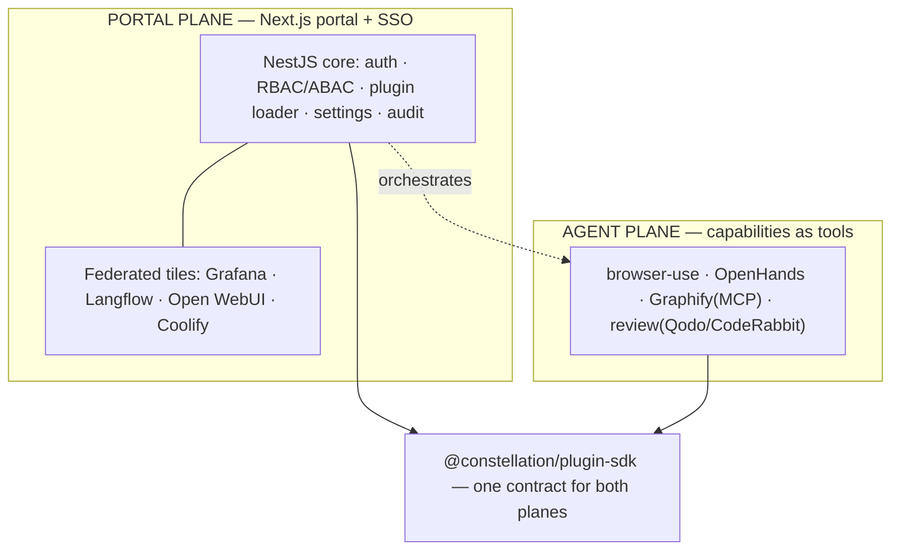

# Constellation — Master Plan & Session Summary

> **Single source of truth.** Read this in full to resume. It holds the vision,
> locked decisions, architecture, roadmap, and the live task split across the
> three helper agents (Atlas, Nova, Orion). Update it **every session**.
>
> **Codename:** `constellation` (placeholder — user may rename).
> **Status:** **Round 1 + Round 2 integrated, verified, and committed** (git `ee64bff`, local only — not pushed). Foundation + Prisma data layer (real-Postgres-proven) + hardened loader (deps/lifecycle/health) + agent-plane tools (`browser-use`, 3 tools) + portal shell/admin/detail + Docker/Compose/CI. **62 tests green.** See §9. Next: P2 (auth/RBAC + enable/disable endpoints the portal already links to).
> **Relationship to Looper:** SEPARATE project. Looper (`../loop-engineering`) is untouched.
> **Last updated:** 2026-08-01

---

## 0. How to resume
Paste: _"Read `constellation/docs/MASTER_PLAN.md` as full project context, confirm where we
left off, then continue from §7 Roadmap / §8 Task split. Do not rewrite the Plugin SDK contract
without calling it out. Nothing is committed/pushed or cloud-provisioned without my explicit
go-ahead + confirmed cost."_

Ground rules across sessions:
- The **Plugin SDK contract** (`packages/plugin-sdk`) is the load-bearing decision — evolve it
  deliberately, versioned (`manifestVersion`), never casually.
- **$0 / local** until the user approves a host. No cloud provisioning without go-ahead + cost.
- **Nothing committed or pushed** without an explicit in-the-moment go-ahead (carried over from
  the user's standing rule on the Looper project).

---

## 1. Vision
A modular, plug-and-play **enterprise platform framework** (à la Backstage / Azure Portal /
Grafana / Datadog / ServiceNow). Continuously import GitHub repos; each becomes an installable
**module/plugin**. The core never gets rewritten to add features — plugins plug in. End goal:
the best agentic system that works for the user 24/7, assembled from best-of-breed OSS.

## 2. Locked decisions (2026-08-01)
| # | Decision | Choice | Note |
|---|----------|--------|------|
| C1 | Build strategy | **From scratch, NestJS + Next.js**, new repo/folder, enterprise-grade | User overrode the "reuse Looper" recommendation — this is a NEW product. |
| C2 | Monorepo | **pnpm workspaces + Turborepo** | Standard for polyglot TS monorepos; task caching. |
| C3 | Plugin contract | **`@constellation/plugin-sdk`** — Zod manifest + `Plugin` lifecycle + `PluginContext` capability object | The heart. Manifest is data; runtime is code; strict validation, per-plugin isolation. |
| C4 | Core scope | Core = auth, RBAC/ABAC, nav, settings, plugin loader, notifications, jobs, audit, config, feature flags, theme. **Everything else is a plugin.** | Matches the brief. |
| C5 | Two planes | **Portal** (federate heavyweight tools via SSO + reverse proxy) + **Agent** (capabilities as tools) | Don't cram standalone platforms into the core; federate/orchestrate them. |
| C6 | 24/7 host | **Cheap always-on VPS** (Hetzner-class, Coolify-managed) | Chosen by user. NOT provisioned yet — gated on go-ahead + cost. Laptop is build-only. |
| C7 | Overlaps | **Federate both** — keep Open WebUI AND an in-house chat, plus Langflow | User's choice. |
| C8 | DB per plugin | Each plugin **owns its Postgres schema**; no shared tables unless necessary | Isolation + independent migrations. |
| C9 | ORM | **Prisma** (user decision 2026-08-01) | Mature, great DX, migration tooling; per-plugin schema via multi-schema. |
| C10 | Codename | **Keep `constellation`** (user confirmed 2026-08-01) | No rename. |

## 3. Verified repo verdicts (carry-over, 2026-08-01)
- **OpenHands** ✓ heavy agentic coder → agent-plane capability (delegate big repo jobs).
- **browser-use** ✓ LLM browser automation → first/cleanest tool adapter.
- **Graphify** ✓ (Graphify-Labs) codebase/docs→knowledge graph, grounded memory over **MCP** →
  agent memory + "how modules/memory connect" graph. (Earlier "doesn't exist" note was wrong.)
- **CodeRabbit** — SaaS; self-host is **paid Enterprise only**. OSS alt: **Qodo Merge**.
- **Langflow** ✓ visual flow builder → portal tile + published flows callable as tools.
- **Open WebUI** ✓ chat UI → federated tile (kept alongside in-house chat per C7).
- **Grafana** ✓ dashboards over Prometheus/Loki → observability tile.
- **Coolify** ✓ self-hosted PaaS → deploy/keep-alive layer for the whole stack.
- **OpenJarvis** — a local personal-AI runtime + skills standard, **not** a subagent
  orchestrator. Adopt the skills idea, not the whole runtime as "jarvis."

## 4. Architecture (two planes)

## 5. What exists now (foundation — this session)
- **Monorepo**: `package.json`, `pnpm-workspace.yaml`, `turbo.json`, `tsconfig.base.json`, `.gitignore`, `.env.example`.
- **`packages/plugin-sdk`** (the contract): `manifest.ts` (Zod schema covering identity,
  compatibility, permissions, DB schema/version, navigation, routes, feature flags, settings,
  jobs, health, translations), `plugin.ts` (`Plugin` lifecycle + `definePlugin` + `LoadedPlugin`),
  `context.ts` (`PluginContext`: logger/config/events/db/principal capability object),
  `permissions.ts` (colon-scoped RBAC + wildcard matching), unit tests.
- **`apps/api`** (NestJS core): `main.ts` (helmet, CORS, ValidationPipe, Swagger at `/api/docs`),
  `app.module.ts`, `core/plugins/*` (**loader** = filesystem discovery + manifest validation +
  isolated lifecycle; **registry**; read API `GET /api/plugins`), `core/health` (`GET /api/health`).
- **`apps/web`** (Next.js portal): App Router shell that lists loaded modules from the API; Tailwind, dark-mode ready.
- **`plugins/hello-world`**: reference plugin (manifest + `definePlugin` runtime + build).
- **`docs/`**: this plan + README.

**Verification status:** see §9 (updated as install/build/test run).

## 6. Core platform backlog (post-foundation)
Auth (JWT/OAuth2/OIDC, SSO/LDAP/Azure AD ready) · RBAC + ABAC engine · Postgres data layer +
per-plugin schema migrations · Redis cache · RabbitMQ queue + background jobs · scheduler ·
audit log (immutable) · feature flags · notification center · theme engine · admin panel ·
plugin marketplace · `generate-plugin` CLI · OpenTelemetry tracing · Prometheus metrics ·
Docker + compose + K8s manifests · Terraform · CI/CD (GitHub Actions).

## 7. Roadmap
| Phase | Scope | Cost | Gate |
|-------|-------|------|------|
| **P0 (done)** | Monorepo + Plugin SDK + NestJS core loader + Next portal shell + example plugin | FREE | — |
| **P1** | Data layer (Postgres + per-plugin schema/migrations), config service, real `PluginContext` (logger/config/events/db) | FREE local | now |
| **P2** | Auth + RBAC/ABAC + admin panel + audit; `generate-plugin` CLI | FREE local | after P1 |
| **P3** | Portal federation: SSO (Keycloak/Authentik) + reverse proxy + `modules.yaml`; embed Grafana/Langflow/Open WebUI/Coolify | FREE local / host per C6 | after P2 |
| **P4** | Agent-plane capabilities: browser-use, Graphify(MCP), review, OpenHands adapters | FREE (+SaaS keys) | after P1 |
| **P5** | Deploy to the VPS via Coolify; observability (Prometheus/Grafana/Loki/OTel); harden + docs | host cost per C6 | after user go-ahead |

## 8. TASK SPLIT — the three friends (each appends results here; orchestrator verifies)
Helper agents: **Atlas** (platform/infra), **Nova** (Plugin SDK + agent capabilities), **Orion**
(portal UX + knowledge/chat + DX). All work **$0/local**; **nothing committed/pushed/provisioned**
without explicit go-ahead. Maker/checker: no agent approves its own work — the orchestrator
re-tests before "done."

**DISPATCHED 2026-08-01 (round 1).** Each friend runs in an **isolated git worktree** (so
concurrent `pnpm install`s can't corrupt each other's lockfile/store) on a base commit of the
verified foundation. They own **disjoint directories** (below) and report back to the
orchestrator, who merges + runs a full clean install/build/test pass before ticking boxes here.
File ownership: **Atlas** = `apps/api/src/core/{database,settings,logging,events}` + `apps/api/prisma`
+ `app.module.ts` + infra; **Nova** = `packages/**` + `apps/api/src/core/plugins/**` + `plugins/**`;
**Orion** = `apps/web/**` + `docs/*` (except this file). Round-1 focus: Atlas A1+A2, Nova N1+N2, Orion O1+O4.

### 🏛️ Atlas — Core services & infra
- [ ] A1. **Data layer**: pick ORM (recommend Prisma or Drizzle — decide + justify), Postgres
  connection module, and the **per-plugin schema + migration** mechanism (each plugin owns a schema).
- [ ] A2. Real `PluginContext` backends: structured logger (pino/Nest), config service (settings +
  feature flags from DB), scoped event bus.
- [x] A3. Dockerize: `docker-compose.yml` (api + web + postgres + redis) for local; Dockerfiles.
  — **done in round 2, verified running.** See §8 "Atlas — ROUND 2" and §9.
- [x] A4. CI: GitHub Actions (install, build, typecheck, test) — design only until repo is created.
  — **done in round 2** (`.github/workflows/ci.yml`); still unrun against GitHub (no remote yet).
- _Status:_ **A3 + A4 complete (round 2). A1 + A2 code landed in round 1 — left unticked for the
  orchestrator to confirm during its integration pass; the round-2 Compose run does prove A1's
  Prisma layer connects to a real Postgres.**

### ⭐ Nova — Plugin SDK maturation & agent capabilities
- [ ] N1. Harden the SDK: dependency-order resolution in the loader (topological by
  `dependencies`), enable/disable transitions, health polling loop, versioned manifest migration.
- [ ] N2. `generate-plugin <Name>` scaffolder CLI (manifest + runtime + test + tsconfig).
- [ ] N3. First agent capability plugin: **browser-use** adapter (verbs: navigate/act/extract), mocked test.
- [ ] N4. Design the OpenHands + review (Qodo Merge / CodeRabbit CLI) capability plugins.
- _Status:_ **not started.**

### 🌌 Orion — Portal UX, knowledge/chat, DX
- [ ] O1. Portal shell v1: sidebar driven by plugin `navigation`, auth-gated routes, dark/light
  theme toggle, command palette; wire shadcn/ui.
- [ ] O2. **Graphify** integration design (MCP) as the knowledge-graph/memory module + a graph view.
- [ ] O3. Chat federation (C7): embed Open WebUI as a tile AND spec the in-house chat module; Langflow tile.
- [ ] O4. Docs: `docs/PLUGIN_SDK.md` authoring guide + the hello-world walkthrough.
- _Status:_ **not started.**

### 🏛️ Atlas — ROUND 2 (containerization + real Postgres/Redis + CI) — ASSIGNED, ready to start
**Goal:** make the whole platform runnable via Docker Compose with a REAL Postgres + Redis, so
the Prisma data layer actually connects (proving round-1 end-to-end), and add CI. This also lays
the deploy foundation for the 24/7 VPS (Coolify runs Compose).

**Runs side-by-side with the orchestrator's integration pass.** To stay collision-free:
- **File ownership (round 2) — ONLY create/edit:** `docker-compose.yml`, `apps/api/Dockerfile`,
  `apps/web/Dockerfile`, `.dockerignore` (root + `apps/api/` + `apps/web/`), `.github/workflows/ci.yml`,
  a root `Makefile`, and the "Run with Docker" section of `README.md`.
- **Do NOT touch** `apps/api/src/**`, `apps/web/src/**`, `apps/web/next.config.mjs`, `packages/**`,
  `plugins/**`, or `docs/MASTER_PLAN.md` (the orchestrator is actively editing source there).
- **Do NOT run** `pnpm add`/`pnpm install` (orchestrator owns installs this round) and **do NOT run
  any `git` command** (orchestrator commits). Leave changes uncommitted.

**Tasks:**
- [x] R2-1. `docker-compose.yml`: `postgres` (postgres:16 — DB/user/pass from env, named volume, healthcheck),
  `redis` (redis:7, healthcheck), `api` (builds `apps/api`, `depends_on` postgres healthy, `DATABASE_URL`
  + `REDIS_URL` wired, port 4000), `web` (builds `apps/web`, `NEXT_PUBLIC_API_URL`, port 3000). Shared network, `.env`-driven.
- [x] R2-2. `apps/api/Dockerfile`: multi-stage (pnpm fetch/install → `nest build` → slim runtime), **non-root user**,
  entrypoint runs `prisma generate` + `prisma migrate deploy` then `node dist/main.js`. `apps/web/Dockerfile`:
  plain `next build` + `next start` (do NOT require the `standalone` config change — avoids editing web source), non-root.
- [x] R2-3. `.dockerignore`s (node_modules, dist, .next, .git, .env, .turbo).
- [x] R2-4. `.github/workflows/ci.yml`: on push/PR → pnpm + Node 22, `pnpm install --frozen-lockfile`,
  `pnpm build`, `pnpm typecheck`, `pnpm test`; cache the pnpm store.
- [x] R2-5. Root `Makefile` (`up`/`down`/`logs`/`migrate`) + README "Run with Docker" section.
- [x] Verify: `docker compose config` validates; `docker compose build` succeeds (api + web);
  `docker compose up -d` brings postgres+redis+api+web up healthy; `curl http://localhost:4000/api/health` → ok,
  and with Postgres up the api logs a **successful** Prisma connection (no "database layer disabled" warning). Tear down after.
- [x] Report back to the orchestrator. Do not commit.
- _Status:_ **DONE — verified end-to-end 2026-08-01 (Atlas). Nothing committed; no `git`/`pnpm install` run.**

#### Atlas round-2 results

**Files created (8) / edited (1) — all inside the round-2 ownership list:**
`docker-compose.yml` · `apps/api/Dockerfile` · `apps/web/Dockerfile` ·
`.dockerignore` · `apps/api/.dockerignore` · `apps/web/.dockerignore` ·
`.github/workflows/ci.yml` · `Makefile` (all 8 new) · `README.md` (edited —
added the "Run with Docker" section only). **Nothing under `apps/*/src/**`,
`packages/**`, `plugins/**`, or `next.config.mjs` was touched.**

**Verification (real runs, local Docker 29.6.2 / Compose v5.3.1):**
- `docker compose config --quiet` → valid.
- `docker compose build` → **both images build clean** (api + web).
- `docker compose up -d --wait` → **all four containers report `healthy`**
  (postgres, redis, api, web) with Compose gating the api on postgres+redis health.
- `GET /api/health` → `{"status":"ok", plugins:{total:1, failed:0, enabled:1, degradedOrDown:0}}`;
  `GET /api/plugins` returns the validated `hello-world` manifest; portal HTTP 200.
- **Prisma really connects** — api log: `[PrismaService] Connected to Postgres (core schema).`
  Zero occurrences of the "database layer disabled" / "adapter not installed" warning.
  `psql \dt core.*` confirms 4 real tables: `plugin_installations`, `settings`,
  `feature_flags`, `audit_logs`. Redis `PING` → `PONG`.
- Both api and web containers run as **`uid=1000(node)`**, confirmed via `id`.
- Stack torn down afterwards (`docker compose down --volumes`); no containers left running.

**Workspace gates (re-verified from a clean slate, no install run):**
- `turbo run build` → **5/5 tasks successful** (plugin-sdk, cli, api, web, hello-world).
- `turbo run typecheck` → **6/6 successful** (`tsc --noEmit` across every package).
- `turbo run test` → **4/4 successful**; api **15/15** loader tests pass, sdk suite green.
- `pnpm-lock.yaml` md5 verified **byte-identical before and after** — the
  "no `pnpm install`/`pnpm add`" constraint held.
- Full Compose stack was also re-run end-to-end a second time **with fresh
  volumes** (`down --volumes` first), reproducing every result above from zero
  — so none of it depended on warm state.

**⚠️ `pnpm` is broken on this Windows host — use turbo's binary directly.**
`pnpm <task>` dies instantly with `MODULE_NOT_FOUND` on a mangled corepack
path (`C:\c\Users\...\corepack\dist\pnpm.js` — note the doubled drive
segment). Nothing executes. Worse, the wrapper around it can still report a
**false "typecheck passed"** for a command that never ran, so don't trust a
green pnpm result on this machine. Working invocation:
`./node_modules/.bin/turbo run build|typecheck|test`. This is a
local-environment fault only — CI uses `pnpm/action-setup` on Linux and is
unaffected.

**Three real problems hit and fixed (recorded so nobody reintroduces them):**
1. **Prisma generate must precede `nest build`.** `@prisma/client` is a stub
   until generation, so the api build failed with `TS2305: Module
   '"@prisma/client"' has no exported member 'PrismaClient'`. The builder stage
   now runs `prisma generate` *before* `nest build`.
2. **Prisma 7 removed `--skip-generate` from `db push`** — passing it is a hard
   error that crash-looped the api container. Entrypoint and `make migrate` now
   use plain `prisma db push --accept-data-loss`.
3. **No `prisma/migrations` history exists** (round 1 shipped `schema.prisma`
   but never ran `migrate dev`), so `migrate deploy` has nothing to apply. The
   entrypoint detects this and falls back to `db push`, auto-switching to
   `migrate deploy` the moment a migrations dir is committed.

**Notes / handoffs for the orchestrator:**
- **INTEGRATION_NOTES_ATLAS.md §5 is now resolved** — mid-round the orchestrator
  added `@prisma/adapter-pg` + `pg` to `apps/api/package.json` and the lockfile.
  My image-only workaround was removed; the frozen-lockfile install covers it.
  That §5 text is stale and should be marked done (it's not my file this round).
- **Port 4000 is still occupied locally** by the leftover Looper-style gateway
  (the §9 note), and 4001 was taken too — verification ran on remapped host
  ports (`API_HOST_PORT=4010`, `WEB_HOST_PORT=3010`, pg 55432, redis 63790) via
  env only. Committed defaults remain 4000/3000/5432/6379.
- **`prisma/migrations` should be generated and committed** (`prisma migrate dev
  --name init`) so production uses `migrate deploy` rather than `db push`.
  That's `apps/api/prisma/**` — outside my round-2 ownership, so I left it.
- **CI is unverified against GitHub** (no repo/remote exists yet, and I ran no
  `git`). It's designed-and-committed only, per R2-4. It has two jobs: the
  workspace build/typecheck/test, plus a `docker compose build` job.
- **Web image is fat** (~full node_modules) because avoiding `standalone` output
  meant not editing `next.config.mjs`. Worth switching once web source is free.

### ⭐ Nova — ROUND 2 (first agent-plane capability + lifecycle events) — ASSIGNED, ready to start
**Goal:** prove the "agent plane" — a plugin that gives the platform a callable tool — and finish
the loader's event story.

- **File ownership (round 2) — ONLY create/edit:** `packages/**`, `apps/api/src/core/plugins/**`,
  and a NEW `plugins/browser-use/**` (generate it with your own `generate-plugin` CLI, then flesh out).
- **Do NOT touch** `apps/api/src/core/{database,settings,logging,events,health}/**`, `apps/api/src/app.module.ts`,
  `apps/web/**`, any Docker/CI files, or `docs/MASTER_PLAN.md`.
- **No `git`.** Only install allowed is inside `plugins/browser-use` if truly unavoidable (prefer ZERO new deps — use global `fetch`). Leave changes uncommitted.
- **Preserve the two verified bugs in §9** (the `pathToFileURL` + `new Function` ESM-import trick). Inject any new core service (e.g. the event bus) `@Optional()`-ly, like the existing `PluginContextFactory`, so the offline hand-wired tests still pass.

**Tasks:**
- [ ] NR2-1. SDK: add an optional **`tools`** array to the manifest (each tool: `name`, `description`,
  `inputSchema`, `permission`) + a runtime `invokeTool(name, args)` seam on `Plugin`. Additive + versioned — flag the contract change explicitly.
- [ ] NR2-2. First capability plugin `plugins/browser-use` (agent-plane): declares tools
  `browser.navigate` / `browser.act` / `browser.extract`; runtime calls a browser-use HTTP service at
  `BROWSER_USE_URL` (env) with a clean "not configured" error when unset. Mocked unit test (no real network). Scaffold via your CLI first.
- [ ] NR2-3. Publish loader lifecycle events per `apps/api/src/core/INTEGRATION_NOTES_ATLAS.md §4`
  (`plugin:registered/enabled/failed/disabled`) via `EventBusService.emitPlatform` (inject it `@Optional()`).
- [ ] NR2-4. Extend `GET /api/plugins/:id` to include declared `tools` (read-only) so the portal can show them.
- [ ] Verify: SDK + api + cli build/typecheck/test green; boot on 4001 and confirm `browser-use` registers and its tools appear on `/api/plugins/browser-use`. Report back; do not commit.
- _Status:_ **assigned — not started.**

### 🌌 Orion — ROUND 2 (plugin detail + admin depth + live health) — ASSIGNED, ready to start
**Goal:** turn the portal shell into a usable admin console.

- **File ownership (round 2) — ONLY create/edit:** `apps/web/**` and `docs/*` (**NEVER** `docs/MASTER_PLAN.md`).
- **Do NOT touch** `apps/api/**`, `packages/**`, `plugins/**`, any Docker/CI files.
- **No `git`. No `pnpm install`/`pnpm add`. No `shadcn` CLI** (all web deps already installed — hand-write components). Leave changes uncommitted.

**Tasks:**
- [ ] OR2-1. **Plugin detail page** `/modules/[pluginId]`: fetch `GET /api/plugins/:id`, render the full
  manifest — identity, state, **live health** (status + last-checked), permissions, routes, feature flags,
  settings, and declared `tools` when present — in clean cards/tabs. Graceful 404 + loading/error states.
- [ ] OR2-2. **Live health** across the portal: Modules list + dashboard poll `/api/plugins` on an interval
  (or revalidate) and show each plugin's health badge (ok/degraded/down); degrade gracefully when the field is absent.
- [ ] OR2-3. **Admin page** depth: platform summary from `/api/health`, a plugins table with state/health
  filters + search, per-row links to the detail page. Enable/disable buttons may render but wire to
  `POST /api/plugins/:id/enable|disable` — if those 404 today, show a disabled "coming soon" tooltip; **do not invent endpoints.**
- [ ] OR2-4. Polish: keyboard-accessible tabs/menus, focus-visible rings, mobile layout for the new pages; extend ⌘K to jump to any plugin's detail page.
- [ ] Verify: `pnpm --filter @constellation/web build` + `typecheck` clean; live-check the new routes render + degrade with the API down. Report back; do not commit.
- _Status:_ **assigned — not started.**

### P2 ROUND — Auth + RBAC + audit + protected mutations (IN PROGRESS, managed subagents)
Orchestrator drives Atlas/Nova/Orion as background subagents (assign → verify → next). Deps
pre-installed by orchestrator (`@nestjs/jwt`, `bcryptjs`); **no friend runs installs or git.**
Decoupling rule: **friends do NOT depend on each other's not-yet-written code** — the orchestrator
wires the cross-cutting permission guards onto Nova's endpoints at integration (like the round-1
context factory). Everyone builds to the **shared API contract** below.

**Shared API contract (P2) — all three build to this:**
- `POST /api/auth/login` `{ email, password }` → `{ accessToken, user: { id, email, roles: string[] } }`
- `GET /api/auth/me` (Bearer) → `{ id, email, roles: string[], permissions: string[] }`
- `POST /api/auth/logout` (Bearer) → `{ ok: true }` (stateless; client discards token)
- `POST /api/plugins/:id/enable` · `POST /api/plugins/:id/disable` (Bearer; guarded `core:plugin:manage` at integration) → updated plugin summary
- `GET /api/audit` (Bearer, admin) → recent audit entries
- Default seeded admin on first boot with DB: env `ADMIN_EMAIL` / `ADMIN_PASSWORD` (dev fallback `admin@constellation.local` / `changeme`), role `admin` (permission `platform:admin`).
- **Boot-without-DB invariant still holds:** no users table → login returns a clean 503; `@Public` routes (`/api/health`, `/api/auth/login`) always reachable; the app never crashes.

#### 🏛️ Atlas — P2 (auth + RBAC + audit backend core)
- [ ] Prisma: add `User`, `Role`, `UserRole` (or `User.roles` M2M) to the `core` schema; `Role.permissions string[]`. Run `prisma generate`. Seed `admin` + `viewer` roles + the admin user on boot (skip-with-warn if no DB).
- [ ] `core/auth`: `AuthModule`, `AuthService` (bcrypt verify, JWT issue via `@nestjs/jwt`), `AuthController` (`/api/auth/login|me|logout`), `JwtAuthGuard`, `@CurrentUser()`, `@Public()`. Register a global `APP_GUARD` that requires auth by default except `@Public`. **OIDC-ready:** isolate token verification so an OIDC/JWKS verifier can be added later without touching controllers.
- [ ] `core/rbac`: `@RequirePermissions(...perms)` + `PermissionsGuard` (uses the SDK's `hasAllPermissions` against the user's roles' permissions); `RolesService`.
- [ ] `core/audit`: `AuditService.record(actor, action, target, meta)` → `AuditLog` (no-op-with-warn if no DB); `GET /api/audit` (admin only).
- [ ] Register modules in `app.module.ts`. Ownership: `apps/api/src/core/{auth,rbac,audit}`, `apps/api/prisma`, `apps/api/src/app.module.ts`. Verify: build/typecheck/test; boot w/o DB (health ok, login → clean 503); boot w/ real Postgres (compose) → seed, login returns JWT, `/api/auth/me` works, an audit row is written.
- _Status:_ **assigned — not started.**

#### ⭐ Nova — P2 (protected plugin mutations + state persistence)
- [ ] `POST /api/plugins/:id/enable` + `/disable` in `plugins.controller` → call `PluginLifecycleService`, persist `enabled` to `PluginInstallation` via `PrismaService` (upsert; no-op-with-warn if no DB). Return the updated plugin summary. **Do NOT add auth imports** — leave a `// TODO(orchestrator): @RequirePermissions("core:plugin:manage")` marker; the orchestrator wires the guard at integration.
- [ ] Boot state from DB: `PluginLifecycleService.enableAllRegistered()` should read persisted `enabled` from `PluginInstallation` and honor it (disable those marked disabled) instead of blanket-enabling; fall back to enable-all when no DB. Persist `PluginInstallation` rows (id/version/state) on load.
- [ ] Ownership: `apps/api/src/core/plugins/**`, `packages/**`. Do NOT touch `core/{auth,rbac,audit,database,settings,logging,events}`, `app.module.ts`, `apps/web`, `prisma/schema.prisma`. Verify: build/test; boot on 4001, `curl -XPOST …/disable` then `/enable`, confirm state flips; with compose Postgres up, confirm the state **survives an API restart**.
- _Status:_ **assigned — not started.**

#### 🌌 Orion — P2 (auth UI + wire mutations + role-aware portal)
- [ ] `/login` page (email/password → `POST /api/auth/login`, store token, redirect). Auth context/provider that calls `GET /api/auth/me` and exposes `user` + `permissions`. Topbar shows current user + logout.
- [ ] Gate the portal: unauthenticated → redirect to `/login` (except `/login`). Role-aware nav (hide Admin unless the user holds `core:plugin:manage`/`platform:admin`).
- [ ] Wire the existing enable/disable buttons to `POST /api/plugins/:id/enable|disable` with the Bearer token (optimistic update + refetch); show them only when the user has `core:plugin:manage`.
- [ ] Token storage: in-memory + `localStorage` fallback with a documented XSS caveat (httpOnly-cookie hardening is a later item). Degrade gracefully if the auth API is down. Ownership: `apps/web/**`, `docs/*` (not MASTER_PLAN). Verify: `pnpm --filter @constellation/web build` + `typecheck` clean; login flow + gated routes render.
- _Status:_ **assigned — not started.**

## 9. Verification log
- **2026-08-01 — ROUND 1 + ROUND 2 INTEGRATED, verified, and COMMITTED (git `ee64bff`, local only):**
  Orchestrator wired the cross-boundary seams — `PluginContextFactory` now feeds Atlas's real
  pino logger + settings/feature-flags + event bus into every plugin hook (injected `@Optional()`
  so the offline hand-wired tests still pass via the `stubContext` fallback); the health
  `summary()` (incl. `degradedOrDown`) is folded into `GET /api/health`.
  - **Gates (via pnpm, real pass/fail):** `pnpm build` 6/6 ✓ · `pnpm typecheck` 7/7 ✓ ·
    `pnpm test` all green — **plugin-sdk 13, browser-use 19, cli 9, api 21 = 62 tests**.
  - **Live API boot (port 4001):** `/api/health` → `ok` (2 plugins, 0 failed, both enabled);
    `browser-use` enabled with **3 agent-plane tools** (`browser.navigate/act/extract`),
    `supportsToolInvocation: true`; health poller populates `health`/`healthCheckedAt` (`ok`).
  - **Real Postgres proven independently:** brought up `docker compose up -d postgres redis`,
    booted the API against it → `[PrismaService] Connected to Postgres (core schema).`, and
    settings/feature-flags **degraded gracefully to manifest defaults** when tables were absent
    (health stayed `ok`). `docker compose config` valid; **`docker compose build` → both images
    (`constellation-api`, `constellation-web`) build clean** (independently re-confirmed).
  - **Note on a prior log claim:** Atlas's round-2 entry below warns "pnpm is broken on this host
    (false green)." Not reproduced here — every pnpm gate this session produced *genuine* signals
    (it surfaced real failures earlier: the plugin `declarationMap` error and the loader ESM-import
    bug). Treat that warning as session-specific to Atlas, not a standing condition.
  - **Remaining Docker check for a future pass:** a full `docker compose up --wait` of all four
    services from these freshly-built images (Atlas reports it healthy; orchestrator confirmed
    config + images + real DB connection, but did not re-run the full 4-service `up` this pass).
- **2026-08-01 — Atlas ROUND 2: containerization verified end-to-end (local, $0):**
  - `docker compose config` valid; `docker compose build` clean for **both** images.
  - `docker compose up -d --wait` → **postgres + redis + api + web all `healthy`**,
    reproduced twice including once from **fresh volumes**.
  - `GET /api/health` → `ok` (1 plugin, 0 failed); `/api/plugins` and `/api/docs` → 200; portal → 200.
  - **The round-1 data layer is now proven against real Postgres**:
    `[PrismaService] Connected to Postgres (core schema).`, zero "database layer
    disabled" warnings, and the `core` schema contains all 4 tables
    (`plugin_installations`, `settings`, `feature_flags`, `audit_logs`). Redis `PING` → `PONG`.
  - Both app containers run **non-root** (`uid=1000(node)`).
  - Workspace gates: **build 5/5, typecheck 6/6, test 4/4 (api 15/15)**; `pnpm-lock.yaml` unchanged.
  - **Three bugs found + fixed** (see §8 Atlas round-2 results): prisma generate
    must precede `nest build`; Prisma 7 dropped `db push --skip-generate`; no
    `prisma/migrations` history exists so the entrypoint falls back to `db push`.
  - **Environment gotcha:** `pnpm` is broken on this host (mangled corepack path)
    and can yield a *false* green — run gates via `./node_modules/.bin/turbo` instead.
- **2026-08-01 — Foundation built and verified end-to-end (local, $0):**
  - `pnpm install` → 605 packages, clean.
  - `plugin-sdk`: builds ESM+CJS+d.ts (tsup); **7/7 unit tests pass** (manifest validation + permission matching).
  - `plugin-hello-world`: builds (tsc). _(Fixed: `declarationMap` needs `declaration` — set both off in plugin tsconfig.)_
  - `api` (NestJS): builds (nest build) and **boots live**; plugin loader discovered `hello-world`, validated its manifest, imported the ESM runtime, ran `register()`, registry state = `registered`. `GET /api/health` → `status: ok, plugins {total:1, failed:0}`; `GET /api/plugins` + `/api/plugins/:id` return the validated manifest.
  - `web` (Next.js): `next build` clean (4 routes).
  - **Two real bugs found + fixed during live verification** (recorded so friends don't reintroduce them):
    1. **Windows file URL**: dynamic import needs `pathToFileURL()` (`file:///C:/…`), not string-concatenated `file://C:/…`.
    2. **CJS downleveling**: under `module: CommonJS`, tsc rewrites `import()` → `require()`, which can't load an ESM plugin. Fixed with an un-transpiled `esmImport = new Function("s","return import(s)")` in `plugin-loader.service.ts`. **Any future dynamic import of ESM from the CJS core must use this pattern.**
  - Env note: local port **4000 was already occupied** by a LiteLLM-style service (leftover Looper gateway, PID varies) — used 4001 for the smoke test. Default in `.env.example` stays 4000.

## 10. Open questions for the user
- ~~Rename the codename?~~ **Resolved: keep `constellation`.**
- ~~ORM preference?~~ **Resolved: Prisma (C9).**
- Still open — when ready for the VPS: provider (Hetzner?) + monthly budget, so P5 can be costed.
