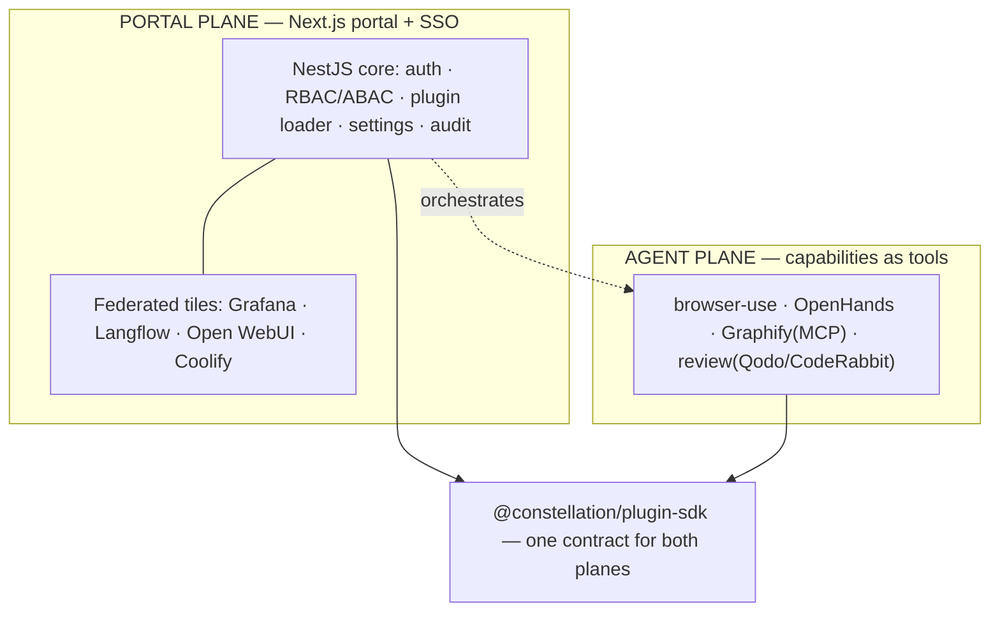

# Constellation — Master Plan & Session Summary

> **Single source of truth.** Read this in full to resume. It holds the vision,
> locked decisions, architecture, roadmap, and the live task split across the
> three helper agents (Atlas, Nova, Orion). Update it **every session**.
>
> **Codename:** `constellation` (placeholder — user may rename).
> **Status:** **Round 1 + 2 + P2 + the first P3/P4 slice done, integrated, verified, committed** (git `a07dd25`, local only — not pushed). Foundation + Prisma data layer + hardened loader + agent-plane tools + portal + Docker/CI + JWT auth/RBAC/audit (all real-Postgres-proven) + **OIDC/SSO verifier seam, `POST /api/plugins/:id/invoke` tool invocation, the `graphify` capability plugin, and portal federation (`config/modules.yaml` + `/api/federation/*` + `/tools` tiles)**. **169 tests green.** See §9. Next: **the BRAIN round** (§8, `docs/BRAIN.md`) — user's top priority. Then: prove a real Keycloak+Caddy SSO round-trip (configs exist, UNRUN). VPS deferred (prove locally first).
> **Relationship to Looper:** SEPARATE project. Looper (`../loop-engineering`) is untouched.
> **Last updated:** 2026-08-02 (clau_partner)

---

## 0. How to resume
Paste: _"Read `constellation/docs/MASTER_PLAN.md` as full project context, confirm where we
left off, then continue from §7 Roadmap / §8 Task split. Do not rewrite the Plugin SDK contract
without calling it out. Nothing is committed/pushed or cloud-provisioned without my explicit
go-ahead + confirmed cost."_

Ground rules across sessions:
- The **Plugin SDK contract** (`packages/plugin-sdk`) is the load-bearing decision — evolve it
  deliberately, versioned (`manifestVersion`), never casually.
- **$0 / local** until the user approves a host. No cloud provisioning without go-ahead + cost.
- **Nothing committed or pushed** without an explicit in-the-moment go-ahead (carried over from
  the user's standing rule on the Looper project).

---

## 1. Vision
A modular, plug-and-play **enterprise platform framework** (à la Backstage / Azure Portal /
Grafana / Datadog / ServiceNow). Continuously import GitHub repos; each becomes an installable
**module/plugin**. The core never gets rewritten to add features — plugins plug in. End goal:
the best agentic system that works for the user 24/7, assembled from best-of-breed OSS.

## 2. Locked decisions (2026-08-01)
| # | Decision | Choice | Note |
|---|----------|--------|------|
| C1 | Build strategy | **From scratch, NestJS + Next.js**, new repo/folder, enterprise-grade | User overrode the "reuse Looper" recommendation — this is a NEW product. |
| C2 | Monorepo | **pnpm workspaces + Turborepo** | Standard for polyglot TS monorepos; task caching. |
| C3 | Plugin contract | **`@constellation/plugin-sdk`** — Zod manifest + `Plugin` lifecycle + `PluginContext` capability object | The heart. Manifest is data; runtime is code; strict validation, per-plugin isolation. |
| C4 | Core scope | Core = auth, RBAC/ABAC, nav, settings, plugin loader, notifications, jobs, audit, config, feature flags, theme. **Everything else is a plugin.** | Matches the brief. |
| C5 | Two planes | **Portal** (federate heavyweight tools via SSO + reverse proxy) + **Agent** (capabilities as tools) | Don't cram standalone platforms into the core; federate/orchestrate them. |
| C6 | 24/7 host | **Cheap always-on VPS** (Hetzner-class, Coolify-managed) | Chosen by user. NOT provisioned yet — gated on go-ahead + cost. Laptop is build-only. |
| C7 | Overlaps | **Federate both** — keep Open WebUI AND an in-house chat, plus Langflow | User's choice. |
| C8 | DB per plugin | Each plugin **owns its Postgres schema**; no shared tables unless necessary | Isolation + independent migrations. |
| C9 | ORM | **Prisma** (user decision 2026-08-01) | Mature, great DX, migration tooling; per-plugin schema via multi-schema. |
| C10 | Codename | **Keep `constellation`** (user confirmed 2026-08-01) | No rename. |

## 3. Verified repo verdicts (carry-over, 2026-08-01)
- **OpenHands** ✓ heavy agentic coder → agent-plane capability (delegate big repo jobs).
- **browser-use** ✓ LLM browser automation → first/cleanest tool adapter.
- **Graphify** ✓ (Graphify-Labs) codebase/docs→knowledge graph, grounded memory over **MCP** →
  agent memory + "how modules/memory connect" graph. (Earlier "doesn't exist" note was wrong.)
- **CodeRabbit** — SaaS; self-host is **paid Enterprise only**. OSS alt: **Qodo Merge**.
- **Langflow** ✓ visual flow builder → portal tile + published flows callable as tools.
- **Open WebUI** ✓ chat UI → federated tile (kept alongside in-house chat per C7).
- **Grafana** ✓ dashboards over Prometheus/Loki → observability tile.
- **Coolify** ✓ self-hosted PaaS → deploy/keep-alive layer for the whole stack.
- **OpenJarvis** — a local personal-AI runtime + skills standard, **not** a subagent
  orchestrator. Adopt the skills idea, not the whole runtime as "jarvis."

## 4. Architecture (two planes)


## 5. What exists now (foundation — this session)
- **Monorepo**: `package.json`, `pnpm-workspace.yaml`, `turbo.json`, `tsconfig.base.json`, `.gitignore`, `.env.example`.
- **`packages/plugin-sdk`** (the contract): `manifest.ts` (Zod schema covering identity,
  compatibility, permissions, DB schema/version, navigation, routes, feature flags, settings,
  jobs, health, translations), `plugin.ts` (`Plugin` lifecycle + `definePlugin` + `LoadedPlugin`),
  `context.ts` (`PluginContext`: logger/config/events/db/principal capability object),
  `permissions.ts` (colon-scoped RBAC + wildcard matching), unit tests.
- **`apps/api`** (NestJS core): `main.ts` (helmet, CORS, ValidationPipe, Swagger at `/api/docs`),
  `app.module.ts`, `core/plugins/*` (**loader** = filesystem discovery + manifest validation +
  isolated lifecycle; **registry**; read API `GET /api/plugins`), `core/health` (`GET /api/health`).
- **`apps/web`** (Next.js portal): App Router shell that lists loaded modules from the API; Tailwind, dark-mode ready.
- **`plugins/hello-world`**: reference plugin (manifest + `definePlugin` runtime + build).
- **`docs/`**: this plan + README.

**Verification status:** see §9 (updated as install/build/test run).

## 6. Core platform backlog (post-foundation)
Auth (JWT/OAuth2/OIDC, SSO/LDAP/Azure AD ready) · RBAC + ABAC engine · Postgres data layer +
per-plugin schema migrations · Redis cache · RabbitMQ queue + background jobs · scheduler ·
audit log (immutable) · feature flags · notification center · theme engine · admin panel ·
plugin marketplace · `generate-plugin` CLI · OpenTelemetry tracing · Prometheus metrics ·
Docker + compose + K8s manifests · Terraform · CI/CD (GitHub Actions).

## 7. Roadmap
| Phase | Scope | Cost | Gate |
|-------|-------|------|------|
| **P0 (done)** | Monorepo + Plugin SDK + NestJS core loader + Next portal shell + example plugin | FREE | — |
| **P1 (done)** | Data layer (Postgres + Prisma), config service, real `PluginContext` (logger/config/events/db) | FREE local | `ee64bff` |
| **P2 (done)** | Auth + RBAC/ABAC + admin panel + audit; `generate-plugin` CLI | FREE local | `14137d8` |
| **P3 (part)** | Portal federation: `config/modules.yaml` + `/api/federation/*` + `/tools` tiles + OIDC verifier seam **done** (`a07dd25`). **Remaining:** actually run Keycloak + Caddy and prove a real SSO round-trip / embedded tile | FREE local / host per C6 | partial |
| **P4 (part)** | Agent plane: tool-invoke endpoint + `browser-use` + `graphify` **done**. **Remaining:** real service wiring, review + OpenHands adapters | FREE (+SaaS keys) | partial |
| **🧠 BRAIN** | Memory & knowledge graph (Graphify sidecar + `core/memory` + portal Brain view) — **NEXT, top priority** | FREE local | `docs/BRAIN.md` |
| **P5** | Deploy to the VPS via Coolify; observability (Prometheus/Grafana/Loki/OTel); harden + docs | host cost per C6 | after user go-ahead |


## 8. TASK SPLIT — the three friends (each appends results here; orchestrator verifies)
Helper agents: **Atlas** (platform/infra), **Nova** (Plugin SDK + agent capabilities), **Orion**
(portal UX + knowledge/chat + DX). All work **$0/local**; **nothing committed/pushed/provisioned**
without explicit go-ahead. Maker/checker: no agent approves its own work — the orchestrator
re-tests before "done."

**DISPATCHED 2026-08-01 (round 1).** Each friend runs in an **isolated git worktree** (so
concurrent `pnpm install`s can't corrupt each other's lockfile/store) on a base commit of the
verified foundation. They own **disjoint directories** (below) and report back to the
orchestrator, who merges + runs a full clean install/build/test pass before ticking boxes here.
File ownership: **Atlas** = `apps/api/src/core/{database,settings,logging,events}` + `apps/api/prisma`
+ `app.module.ts` + infra; **Nova** = `packages/**` + `apps/api/src/core/plugins/**` + `plugins/**`;
**Orion** = `apps/web/**` + `docs/*` (except this file). Round-1 focus: Atlas A1+A2, Nova N1+N2, Orion O1+O4.

### 🏛️ Atlas — Core services & infra
- [x] A1. **Data layer**: ORM decided (**Prisma**, C9), Postgres connection module, per-plugin
  schema mechanism. — **landed round 1; proven against real Postgres** (round 2 + P2 + P3/P4).
- [x] A2. Real `PluginContext` backends: pino logger, settings/feature-flags service, scoped event
  bus. — **landed round 1**, wired into every plugin hook via `PluginContextFactory` (`ee64bff`).
- [x] A3. Dockerize: `docker-compose.yml` (api + web + postgres + redis) for local; Dockerfiles.
  — **done in round 2, verified running.** See §8 "Atlas — ROUND 2" and §9.
- [x] A4. CI: GitHub Actions (install, build, typecheck, test) — design only until repo is created.
  — **done in round 2** (`.github/workflows/ci.yml`); still unrun against GitHub (no remote yet),
  but `pnpm install --frozen-lockfile` is now proven in CI's exact image (2026-08-02).
- _Status:_ **A1–A4 all complete and committed.** (A1/A2 confirmed by the orchestrator's
  integration passes; per-plugin *schema bootstrap* remains a follow-up — HANDOFF §8 item 4.)

### ⭐ Nova — Plugin SDK maturation & agent capabilities
- [x] N1. Harden the SDK: topological dependency ordering, enable/disable transitions, health
  polling loop. — **landed round 1** (`ee64bff`). *Versioned manifest migration is still TODO.*
- [x] N2. `generate-plugin <Name>` scaffolder CLI. — **landed round 1**, 9 CLI tests.
- [x] N3. First agent capability plugin: **browser-use** (navigate/act/extract), mocked test.
  — **landed round 2**; 25 tests. Still points at no real service (HANDOFF §8 item 5).
- [x] N4. Design + build capability plugins beyond browser-use. — **`graphify` shipped** in the
  P3/P4 round (`a07dd25`, 27 tests). OpenHands + review (Qodo/CodeRabbit) adapters still TODO.
- _Status:_ **N1–N4 complete as committed work**, with the two carve-outs noted above
  (manifest migration; real service wiring for browser-use/graphify + remaining adapters).

### 🌌 Orion — Portal UX, knowledge/chat, DX
- [x] O1. Portal shell v1: manifest-driven sidebar, auth-gated routes, theme toggle, ⌘K palette.
  — **landed round 1**, extended round 2 (detail pages, admin depth, live health) and P2 (login,
  gating, role-aware nav).
- [ ] O2. **Graphify** integration as the knowledge-graph/memory module + a graph view.
  — **the plugin + tools exist** (`plugins/graphify`, `a07dd25`); the **portal graph view is the
  BRAIN round's Orion lane** — see `docs/BRAIN.md` §6. NOT done.
- [ ] O3. Chat federation (C7): Open WebUI tile + in-house chat spec; Langflow tile.
  — **partially done:** both are declared in `config/modules.yaml` and render as `/tools` tiles,
  but nothing is actually stood up or proxied yet, and the in-house chat is unspecced.
- [x] O4. Docs: `docs/PLUGIN_SDK.md` authoring guide + hello-world walkthrough. — **landed round 1.**
- _Status:_ **O1 + O4 done; O2 pending (BRAIN round); O3 tiles-only until the federated stack runs.**


### 🏛️ Atlas — ROUND 2 (containerization + real Postgres/Redis + CI) — ✅ DONE (`ee64bff`)
**Goal:** make the whole platform runnable via Docker Compose with a REAL Postgres + Redis, so
the Prisma data layer actually connects (proving round-1 end-to-end), and add CI. This also lays
the deploy foundation for the 24/7 VPS (Coolify runs Compose).

**Runs side-by-side with the orchestrator's integration pass.** To stay collision-free:
- **File ownership (round 2) — ONLY create/edit:** `docker-compose.yml`, `apps/api/Dockerfile`,
  `apps/web/Dockerfile`, `.dockerignore` (root + `apps/api/` + `apps/web/`), `.github/workflows/ci.yml`,
  a root `Makefile`, and the "Run with Docker" section of `README.md`.
- **Do NOT touch** `apps/api/src/**`, `apps/web/src/**`, `apps/web/next.config.mjs`, `packages/**`,
  `plugins/**`, or `docs/MASTER_PLAN.md` (the orchestrator is actively editing source there).
- **Do NOT run** `pnpm add`/`pnpm install` (orchestrator owns installs this round) and **do NOT run
  any `git` command** (orchestrator commits). Leave changes uncommitted.

**Tasks:**
- [x] R2-1. `docker-compose.yml`: `postgres` (postgres:16 — DB/user/pass from env, named volume, healthcheck),
  `redis` (redis:7, healthcheck), `api` (builds `apps/api`, `depends_on` postgres healthy, `DATABASE_URL`
  + `REDIS_URL` wired, port 4000), `web` (builds `apps/web`, `NEXT_PUBLIC_API_URL`, port 3000). Shared network, `.env`-driven.
- [x] R2-2. `apps/api/Dockerfile`: multi-stage (pnpm fetch/install → `nest build` → slim runtime), **non-root user**,
  entrypoint runs `prisma generate` + `prisma migrate deploy` then `node dist/main.js`. `apps/web/Dockerfile`:
  plain `next build` + `next start` (do NOT require the `standalone` config change — avoids editing web source), non-root.
- [x] R2-3. `.dockerignore`s (node_modules, dist, .next, .git, .env, .turbo).
- [x] R2-4. `.github/workflows/ci.yml`: on push/PR → pnpm + Node 22, `pnpm install --frozen-lockfile`,
  `pnpm build`, `pnpm typecheck`, `pnpm test`; cache the pnpm store.
- [x] R2-5. Root `Makefile` (`up`/`down`/`logs`/`migrate`) + README "Run with Docker" section.
- [x] Verify: `docker compose config` validates; `docker compose build` succeeds (api + web);
  `docker compose up -d` brings postgres+redis+api+web up healthy; `curl http://localhost:4000/api/health` → ok,
  and with Postgres up the api logs a **successful** Prisma connection (no "database layer disabled" warning). Tear down after.
- [x] Report back to the orchestrator. Do not commit.
- _Status:_ **DONE — verified end-to-end 2026-08-01 (Atlas). Nothing committed; no `git`/`pnpm install` run.**

#### Atlas round-2 results

**Files created (8) / edited (1) — all inside the round-2 ownership list:**
`docker-compose.yml` · `apps/api/Dockerfile` · `apps/web/Dockerfile` ·
`.dockerignore` · `apps/api/.dockerignore` · `apps/web/.dockerignore` ·
`.github/workflows/ci.yml` · `Makefile` (all 8 new) · `README.md` (edited —
added the "Run with Docker" section only). **Nothing under `apps/*/src/**`,
`packages/**`, `plugins/**`, or `next.config.mjs` was touched.**

**Verification (real runs, local Docker 29.6.2 / Compose v5.3.1):**
- `docker compose config --quiet` → valid.
- `docker compose build` → **both images build clean** (api + web).
- `docker compose up -d --wait` → **all four containers report `healthy`**
  (postgres, redis, api, web) with Compose gating the api on postgres+redis health.
- `GET /api/health` → `{"status":"ok", plugins:{total:1, failed:0, enabled:1, degradedOrDown:0}}`;
  `GET /api/plugins` returns the validated `hello-world` manifest; portal HTTP 200.
- **Prisma really connects** — api log: `[PrismaService] Connected to Postgres (core schema).`
  Zero occurrences of the "database layer disabled" / "adapter not installed" warning.
  `psql \dt core.*` confirms 4 real tables: `plugin_installations`, `settings`,
  `feature_flags`, `audit_logs`. Redis `PING` → `PONG`.
- Both api and web containers run as **`uid=1000(node)`**, confirmed via `id`.
- Stack torn down afterwards (`docker compose down --volumes`); no containers left running.

**Workspace gates (re-verified from a clean slate, no install run):**
- `turbo run build` → **5/5 tasks successful** (plugin-sdk, cli, api, web, hello-world).
- `turbo run typecheck` → **6/6 successful** (`tsc --noEmit` across every package).
- `turbo run test` → **4/4 successful**; api **15/15** loader tests pass, sdk suite green.
- `pnpm-lock.yaml` md5 verified **byte-identical before and after** — the
  "no `pnpm install`/`pnpm add`" constraint held.
- Full Compose stack was also re-run end-to-end a second time **with fresh
  volumes** (`down --volumes` first), reproducing every result above from zero
  — so none of it depended on warm state.

**⚠️ The `pnpm` bash shim mis-translates paths on this Windows host.**
**(Diagnosis CORRECTED 2026-08-02 — the original claim below was wrong.)**
Originally recorded as "pnpm is broken on this host — use turbo instead."
That was a misdiagnosis. **pnpm 9.12.3 is intact and works fine.** The fault
is purely in the Git-Bash shim at
`~/AppData/Local/hermes/node/pnpm`: it hands a POSIX path
(`/c/Users/.../corepack/dist/pnpm.js`) to a **native Windows `node.exe`**,
which resolves it against the drive root as `C:\c\Users\...` (the doubled
drive segment) → `MODULE_NOT_FOUND`. Nothing executes.

**The real danger is the silent failure mode:** because the process dies
before any compiler runs, a wrapper can report a **false "typecheck passed"**
for a command that never ran. Never trust a green pnpm result that produced
no compiler output.

**Two working invocations — prefer the first, it's the canonical command:**
```bash
# 1. Real pnpm, via native Windows paths (runs the actual package scripts):
'C:\Users\<you>\AppData\Local\hermes\node\node.exe' \
  'C:\Users\<you>\AppData\Local\hermes\node\node_modules\corepack\dist\pnpm.js' \
  run build|typecheck|test

# 2. Bypass pnpm entirely (fine for gates, skips pre/post scripts):
./node_modules/.bin/turbo run build|typecheck|test
```
Local-environment fault only — CI uses `pnpm/action-setup` on Linux and is
unaffected. This also explains the apparent contradiction in §9 (the
orchestrator "could not reproduce" the breakage): whether it fails depends
entirely on **how pnpm is invoked**, not on the machine.

**Three real problems hit and fixed (recorded so nobody reintroduces them):**
1. **Prisma generate must precede `nest build`.** `@prisma/client` is a stub
   until generation, so the api build failed with `TS2305: Module
   '"@prisma/client"' has no exported member 'PrismaClient'`. The builder stage
   now runs `prisma generate` *before* `nest build`.
2. **Prisma 7 removed `--skip-generate` from `db push`** — passing it is a hard
   error that crash-looped the api container. Entrypoint and `make migrate` now
   use plain `prisma db push --accept-data-loss`.
3. **No `prisma/migrations` history exists** (round 1 shipped `schema.prisma`
   but never ran `migrate dev`), so `migrate deploy` has nothing to apply. The
   entrypoint detects this and falls back to `db push`, auto-switching to
   `migrate deploy` the moment a migrations dir is committed.

**Notes / handoffs for the orchestrator:**
- **INTEGRATION_NOTES_ATLAS.md §5 is now resolved** — mid-round the orchestrator
  added `@prisma/adapter-pg` + `pg` to `apps/api/package.json` and the lockfile.
  My image-only workaround was removed; the frozen-lockfile install covers it.
  That §5 text is stale and should be marked done (it's not my file this round).
- **Port 4000 is still occupied locally** by the leftover Looper-style gateway
  (the §9 note), and 4001 was taken too — verification ran on remapped host
  ports (`API_HOST_PORT=4010`, `WEB_HOST_PORT=3010`, pg 55432, redis 63790) via
  env only. Committed defaults remain 4000/3000/5432/6379.
- **`prisma/migrations` should be generated and committed** (`prisma migrate dev
  --name init`) so production uses `migrate deploy` rather than `db push`.
  That's `apps/api/prisma/**` — outside my round-2 ownership, so I left it.
- **CI is unverified against GitHub** (no repo/remote exists yet, and I ran no
  `git`). It's designed-and-committed only, per R2-4. It has two jobs: the
  workspace build/typecheck/test, plus a `docker compose build` job.
- **Web image is fat** (~full node_modules) because avoiding `standalone` output
  meant not editing `next.config.mjs`. Worth switching once web source is free.


### ⭐ Nova — ROUND 2 (first agent-plane capability + lifecycle events) — ✅ DONE (`ee64bff`)
**Goal:** prove the "agent plane" — a plugin that gives the platform a callable tool — and finish
the loader's event story.

- **File ownership (round 2) — ONLY create/edit:** `packages/**`, `apps/api/src/core/plugins/**`,
  and a NEW `plugins/browser-use/**` (generate it with your own `generate-plugin` CLI, then flesh out).
- **Do NOT touch** `apps/api/src/core/{database,settings,logging,events,health}/**`, `apps/api/src/app.module.ts`,
  `apps/web/**`, any Docker/CI files, or `docs/MASTER_PLAN.md`.
- **No `git`.** Only install allowed is inside `plugins/browser-use` if truly unavoidable (prefer ZERO new deps — use global `fetch`). Leave changes uncommitted.
- **Preserve the two verified bugs in §9** (the `pathToFileURL` + `new Function` ESM-import trick). Inject any new core service (e.g. the event bus) `@Optional()`-ly, like the existing `PluginContextFactory`, so the offline hand-wired tests still pass.

**Tasks:**
- [ ] NR2-1. SDK: add an optional **`tools`** array to the manifest (each tool: `name`, `description`,
  `inputSchema`, `permission`) + a runtime `invokeTool(name, args)` seam on `Plugin`. Additive + versioned — flag the contract change explicitly.
- [ ] NR2-2. First capability plugin `plugins/browser-use` (agent-plane): declares tools
  `browser.navigate` / `browser.act` / `browser.extract`; runtime calls a browser-use HTTP service at
  `BROWSER_USE_URL` (env) with a clean "not configured" error when unset. Mocked unit test (no real network). Scaffold via your CLI first.
- [ ] NR2-3. Publish loader lifecycle events per `apps/api/src/core/INTEGRATION_NOTES_ATLAS.md §4`
  (`plugin:registered/enabled/failed/disabled`) via `EventBusService.emitPlatform` (inject it `@Optional()`).
- [ ] NR2-4. Extend `GET /api/plugins/:id` to include declared `tools` (read-only) so the portal can show them.
- [ ] Verify: SDK + api + cli build/typecheck/test green; boot on 4001 and confirm `browser-use` registers and its tools appear on `/api/plugins/browser-use`. Report back; do not commit.
- _Status:_ **DONE — integrated + verified + committed `ee64bff`.** SDK `tools` + `invokeTool` seam,
  `browser-use` plugin, loader lifecycle events, `tools`/`toolCount` on the read API.

### 🌌 Orion — ROUND 2 (plugin detail + admin depth + live health) — ✅ DONE (`ee64bff`)
**Goal:** turn the portal shell into a usable admin console.

- **File ownership (round 2) — ONLY create/edit:** `apps/web/**` and `docs/*` (**NEVER** `docs/MASTER_PLAN.md`).
- **Do NOT touch** `apps/api/**`, `packages/**`, `plugins/**`, any Docker/CI files.
- **No `git`. No `pnpm install`/`pnpm add`. No `shadcn` CLI** (all web deps already installed — hand-write components). Leave changes uncommitted.

**Tasks:**
- [ ] OR2-1. **Plugin detail page** `/modules/[pluginId]`: fetch `GET /api/plugins/:id`, render the full
  manifest — identity, state, **live health** (status + last-checked), permissions, routes, feature flags,
  settings, and declared `tools` when present — in clean cards/tabs. Graceful 404 + loading/error states.
- [ ] OR2-2. **Live health** across the portal: Modules list + dashboard poll `/api/plugins` on an interval
  (or revalidate) and show each plugin's health badge (ok/degraded/down); degrade gracefully when the field is absent.
- [ ] OR2-3. **Admin page** depth: platform summary from `/api/health`, a plugins table with state/health
  filters + search, per-row links to the detail page. Enable/disable buttons may render but wire to
  `POST /api/plugins/:id/enable|disable` — if those 404 today, show a disabled "coming soon" tooltip; **do not invent endpoints.**
- [ ] OR2-4. Polish: keyboard-accessible tabs/menus, focus-visible rings, mobile layout for the new pages; extend ⌘K to jump to any plugin's detail page.
- [ ] Verify: `pnpm --filter @constellation/web build` + `typecheck` clean; live-check the new routes render + degrade with the API down. Report back; do not commit.
- _Status:_ **DONE — integrated + verified + committed `ee64bff`.** Plugin detail page, admin depth,
  live health polling.

### P2 ROUND — Auth + RBAC + audit + protected mutations — ✅ DONE (`14137d8`, managed subagents)
Orchestrator drives Atlas/Nova/Orion as background subagents (assign → verify → next). Deps
pre-installed by orchestrator (`@nestjs/jwt`, `bcryptjs`); **no friend runs installs or git.**
Decoupling rule: **friends do NOT depend on each other's not-yet-written code** — the orchestrator
wires the cross-cutting permission guards onto Nova's endpoints at integration (like the round-1
context factory). Everyone builds to the **shared API contract** below.

**Shared API contract (P2) — all three build to this:**
- `POST /api/auth/login` `{ email, password }` → `{ accessToken, user: { id, email, roles: string[] } }`
- `GET /api/auth/me` (Bearer) → `{ id, email, roles: string[], permissions: string[] }`
- `POST /api/auth/logout` (Bearer) → `{ ok: true }` (stateless; client discards token)
- `POST /api/plugins/:id/enable` · `POST /api/plugins/:id/disable` (Bearer; guarded `core:plugin:manage` at integration) → updated plugin summary
- `GET /api/audit` (Bearer, admin) → recent audit entries
- Default seeded admin on first boot with DB: env `ADMIN_EMAIL` / `ADMIN_PASSWORD` (dev fallback `admin@constellation.local` / `changeme`), role `admin` (permission `platform:admin`).
- **Boot-without-DB invariant still holds:** no users table → login returns a clean 503; `@Public` routes (`/api/health`, `/api/auth/login`) always reachable; the app never crashes.

#### 🏛️ Atlas — P2 (auth + RBAC + audit backend core)
- [ ] Prisma: add `User`, `Role`, `UserRole` (or `User.roles` M2M) to the `core` schema; `Role.permissions string[]`. Run `prisma generate`. Seed `admin` + `viewer` roles + the admin user on boot (skip-with-warn if no DB).
- [ ] `core/auth`: `AuthModule`, `AuthService` (bcrypt verify, JWT issue via `@nestjs/jwt`), `AuthController` (`/api/auth/login|me|logout`), `JwtAuthGuard`, `@CurrentUser()`, `@Public()`. Register a global `APP_GUARD` that requires auth by default except `@Public`. **OIDC-ready:** isolate token verification so an OIDC/JWKS verifier can be added later without touching controllers.
- [ ] `core/rbac`: `@RequirePermissions(...perms)` + `PermissionsGuard` (uses the SDK's `hasAllPermissions` against the user's roles' permissions); `RolesService`.
- [ ] `core/audit`: `AuditService.record(actor, action, target, meta)` → `AuditLog` (no-op-with-warn if no DB); `GET /api/audit` (admin only).
- [ ] Register modules in `app.module.ts`. Ownership: `apps/api/src/core/{auth,rbac,audit}`, `apps/api/prisma`, `apps/api/src/app.module.ts`. Verify: build/typecheck/test; boot w/o DB (health ok, login → clean 503); boot w/ real Postgres (compose) → seed, login returns JWT, `/api/auth/me` works, an audit row is written.
- _Status:_ **DONE — committed `14137d8`.** Auth/RBAC/audit backend + Prisma User/Role/UserRole.

#### ⭐ Nova — P2 (protected plugin mutations + state persistence)
- [ ] `POST /api/plugins/:id/enable` + `/disable` in `plugins.controller` → call `PluginLifecycleService`, persist `enabled` to `PluginInstallation` via `PrismaService` (upsert; no-op-with-warn if no DB). Return the updated plugin summary. **Do NOT add auth imports** — leave a `// TODO(orchestrator): @RequirePermissions("core:plugin:manage")` marker; the orchestrator wires the guard at integration.
- [ ] Boot state from DB: `PluginLifecycleService.enableAllRegistered()` should read persisted `enabled` from `PluginInstallation` and honor it (disable those marked disabled) instead of blanket-enabling; fall back to enable-all when no DB. Persist `PluginInstallation` rows (id/version/state) on load.
- [ ] Ownership: `apps/api/src/core/plugins/**`, `packages/**`. Do NOT touch `core/{auth,rbac,audit,database,settings,logging,events}`, `app.module.ts`, `apps/web`, `prisma/schema.prisma`. Verify: build/test; boot on 4001, `curl -XPOST …/disable` then `/enable`, confirm state flips; with compose Postgres up, confirm the state **survives an API restart**.
- _Status:_ **DONE — committed `14137d8`.** Guarded enable/disable + `PluginInstallation`
  persistence + boot-from-DB state (survives restart).

#### 🌌 Orion — P2 (auth UI + wire mutations + role-aware portal)
- [ ] `/login` page (email/password → `POST /api/auth/login`, store token, redirect). Auth context/provider that calls `GET /api/auth/me` and exposes `user` + `permissions`. Topbar shows current user + logout.
- [ ] Gate the portal: unauthenticated → redirect to `/login` (except `/login`). Role-aware nav (hide Admin unless the user holds `core:plugin:manage`/`platform:admin`).
- [ ] Wire the existing enable/disable buttons to `POST /api/plugins/:id/enable|disable` with the Bearer token (optimistic update + refetch); show them only when the user has `core:plugin:manage`.
- [ ] Token storage: in-memory + `localStorage` fallback with a documented XSS caveat (httpOnly-cookie hardening is a later item). Degrade gracefully if the auth API is down. Ownership: `apps/web/**`, `docs/*` (not MASTER_PLAN). Verify: `pnpm --filter @constellation/web build` + `typecheck` clean; login flow + gated routes render.
- _Status:_ **DONE — committed `14137d8`.** Login page, gating, role-aware nav, wired buttons.

### P3+P4 ROUND — OIDC/SSO seam + agent-plane tool invocation + portal federation — ✅ DONE (`a07dd25`, 2026-08-02, clau_partner)
Built by the three agents in disjoint lanes, integrated/verified/committed by the orchestrator.

- [x] 🏛️ **Atlas:** `OidcJwtVerifier` (JWKS) + `CompositeTokenVerifier` bound to `TOKEN_VERIFIER`
  in `AuthModule` — local JWT first, OIDC when `OIDC_ISSUER_URL` is set; controllers/guards
  untouched (the P2 seam paid off exactly as designed). `infra/` configs (Caddy, Prometheus,
  Loki, Grafana datasources) + `docker-compose.federation.yml`. **Configs are UNRUN — no real
  Keycloak/Caddy round-trip has been proven yet.**
- [x] ⭐ **Nova:** `PluginToolService` + `POST /api/plugins/:id/invoke` with two-layer authz
  (route `core:plugin:manage` + the tool's own manifest `permission`); denials and failures are
  audited, args/results never logged. New `plugins/graphify` capability (graph.query/related/
  ingest over MCP JSON-RPC), unconfigured-safe.
- [x] 🌌 **Orion:** `/tools` federated tile page, `federated-tool-tile`, `plugin-tools-panel`
  (tool-invoke UI), `session-guard`, `federated-api`/`federated-tools`.
- [x] 🎛️ **Orchestrator:** `config/modules.yaml` + `core/federation` module
  (`GET /api/federation/modules|/:id|/status`) mounted in `AppModule`; **repaired `pnpm-lock.yaml`**
  (missing `plugins/graphify` importer — turbo warned, CI `--frozen-lockfile` would have failed).
- _Status:_ **DONE, verified, committed `a07dd25` (local only).** Details in §9.


### 🧠 BRAIN ROUND — Memory & Knowledge Graph (Graphify) — NEXT UP, top priority (user 2026-08-02)
Give the platform a persistent, queryable memory. Engine = **Graphify** (knowledge graph over
MCP, local, $0). **Full design in [`docs/BRAIN.md`](BRAIN.md)** — read it first; the honest scope
call (adopt Graphify; skip PAUL/SEED/Railway for now; Obsidian optional) and the interface/REST/MCP
surface live there. Same rules as every round (no git/installs by friends beyond their lane, boot
w/o the brain must not crash, verify before done).

- ✅ **Atlas:** `graphify` sidecar service in `docker-compose.yml` (`pip install graphifyy`,
  `graphify watch /corpus`, `python -m graphify.serve` MCP port), mount corpus (`docs/` + `brain/`),
  shared `graphify-out` volume, `make brain` target. **DONE** (`infra/graphify/{Dockerfile,entrypoint.sh}`,
  `brain` compose profile, MCP on :8791, `make brain|brain-build|brain-down|brain-logs|brain-status|brain-rebuild|brain-mcp`).
- ✅ **Nova:** `apps/api/src/core/memory` — `BrainService` + `GraphifyAdapter` + REST
  (`/api/brain/remember|query|graph|stats`, guarded by the P2 RBAC guards) + new
  `core:brain:read|write` permissions in the SDK + a `memory` capability; seed `brain/README.md`.
  **DONE** (SDK 0.2.0 `src/memory.ts`, `PluginMemory`, `BRAIN_READ`/`BRAIN_WRITE`, `ctx.memory`
  least-privilege gating in `plugin-context.factory.ts`).
- ✅ **Orion:** portal **"Brain"** nav + page — force-directed `graph.json` view + "ask the brain"
  box calling `POST /api/brain/query`, rendering the grounded answer + provenance. **DONE**
  (`apps/web/src/app/brain/**`, `components/brain/**`, `lib/{brain,force-layout}.ts`).
- _Status:_ ✅ **DONE, live-verified, COMMITTED.** Gates: typecheck 8/8 · build 7/7 · tests **221**.
  Live-proved twice: Nova on :4001 (grounded + degraded, real JWT) and the orchestrator against the
  **containerized** sidecar with a REAL repo-extracted graph (1238 nodes / 1937 edges). Verify bar
  `docs/BRAIN.md` §7 met except the two gaps recorded in §9 (docs-mode/Ollama indexing; `remember()`
  → rebuild → node-appears round-trip). See §9.

## 9. Verification log
- **2026-08-02 — 🛰️ P3 federation + 🤖 P4 capability wiring LIVE-PROVED and integrated
  (git `a4f28db`, local only) — clau_partner (acting orchestrator).** Three agent lanes
  (Atlas/Nova/Orion) landed on the clean brain base `32c1ea8`; the orchestrator integrated,
  found and fixed what live testing exposed, and verified the result.
  - **Gates (merged tree, `--force --concurrency=1`):** typecheck **8/8**, build **7/7**,
    tests **256 passed** (api 141 · browser-use 47 · graphify 40 · sdk 19 · cli 9) — up from 221.
  - **P3 federation — the whole overlay booted for the first time ever.** 11 containers healthy:
    api, web, caddy, keycloak, prometheus, loki, grafana, postgres, redis, graphify, steel.
    - Atlas fixed 3 real config bugs: Loki 3.2.1 rejected `metric_aggregation_enabled` under
      `limits_config` (crash-loop) → moved to `pattern_ingester`; the Keycloak healthcheck probed
      `/health/ready` when `--http-relative-path=/auth` also prefixes management endpoints
      (always 404) → `/auth/health/ready`; **`docker-compose.yml` had no `OIDC_*` passthrough at
      all**, so setting `OIDC_ISSUER_URL` silently did nothing and SSO could never activate.
    - **Orchestrator caught that the Keycloak fix was never actually applied** — the container was
      still running the old healthcheck (86 consecutive failures, `unhealthy`) because editing
      compose does not touch a running container. After `--force-recreate`: **healthy,
      failingStreak=0**. Editing a healthcheck requires a recreate; noted inline in the compose file.
    - **Orchestrator made the SSO proof reproducible.** Atlas's realm was hand-created at runtime
      in an in-memory `start-dev` Keycloak, so it evaporated on recreate (realm → HTTP 404) and the
      proof could not be re-run. Added `infra/keycloak/realm-constellation.json` + `--import-realm`.
      Log now shows `Realm 'constellation' imported` on every boot.
    - **Live SSO round-trip (reproducible, post-recreate):** real RS256 token from
      `iss=http://localhost:8081/auth/realms/constellation`, `aud=[constellation-portal, account]`
      → `GET /api/auth/me` **HTTP 200**; tampered token → **HTTP 401**. Signature validation is
      genuinely enforced. Local admin login still 200 with SSO on (no regression), and with
      `OIDC_ISSUER_URL` unset the api logs `SSO not configured — local JWT verification only`.
    - **Caddy proxy:** `/api/health` 200, `/tools/grafana/api/health` 200 (Grafana 11.3.1),
      `/tools/prometheus/-/healthy` 200, `/auth/realms/constellation` 200, `/` 200.
      Honest caveat (Atlas): `/tools/grafana/` returns 302 — Grafana's normal unauthenticated
      login redirect, not a proxy failure — and `/tools/grafana` without the trailing slash 404s.
  - **P4 capability wiring — real backends, real invokes.** Nova wired browser-use to a local
    **Steel Browser** container (Apache-2.0, $0; upstream browser-use ships no self-hosted REST
    image — issue #658) and graphify to the live MCP sidecar, discovering via `tools/list` that the
    plugin's assumed tool names were **entirely wrong** (`query`/`related`/`ingest` matched
    nothing) → corrected to `query_graph`/`get_neighbors` with arg mapping. She could not boot the
    api to capture evidence; the orchestrator closed that gap and found **four further bugs that
    only a live invoke could expose**:
    1. **`apps/api/Dockerfile` never built browser-use or graphify** — only `hello-world`. Both
       shipped as bare source with no `dist/`, so every invoke failed
       `declares tool "x" but its runtime implements no invokeTool()` **while `/api/health`
       cheerfully reported both plugins `enabled`+`ok`**. Added to deps/builder stages.
    2. **`docker-compose.yml` had no plugin-backend env passthrough** (same class of bug as
       Atlas's `OIDC_*`): `BROWSER_USE_*` / `GRAPHIFY_*` silently never reached the container.
    3. **Manifest defaults shadow env fallbacks.** `PluginConfigFactory.hydrate()` seeds manifest
       defaults into config, so `backend`'s default `"cloud"` was always truthy and the
       `BROWSER_USE_BACKEND` env fallback was **unreachable dead code**. Default → `""`.
    4. **`GRAPHIFY_MCP_URL` name collision.** The graphify *plugin* read the same variable the
       *core brain* reserves — setting it for the plugin would disable the brain's graph.json
       fallback. Split to `GRAPHIFY_PLUGIN_MCP_URL` (legacy name still honoured).
    - **Live invoke evidence** (`POST /api/plugins/:id/invoke`, real JWT, containerized api):
      `browser.navigate` → `ok:true {backend:"steel", title:"Example Domain", statusCode:200}`;
      `browser.extract` → `ok:true` with real scraped page content; `graph.query` → `ok:true`
      (`query_graph`, BFS depth=3, 144 nodes); `graph.related` → `ok:true` (`get_neighbors`,
      real `PluginLoaderService` methods with file:line).
    - **Dishonest-success bug found and fixed:** the sidecar answers an unsupported tool with
      HTTP 200 + **`isError:false`** and the body `"Unknown tool: ingest"`. Checking `isError`
      alone reported that hard failure as **`ok:true`** — exactly the dishonest degradation the
      agent plane must never emit. Unit tests mock the transport and could never catch it. Now
      returns `ok:false` with an actionable message; regression test added.
    - **Honest refusals preserved:** `browser.act` on the steel backend returns a clear
      "Steel is a browser sandbox, not an LLM agent" error rather than faking an action.
  - **UNRUN / deferred (explicitly not claimed):** Orion's Brain-page fixes — he spent his budget
    on real-browser root-causing against the 1241-node graph and stopped at the diagnosis line
    without writing the fix code (his own honest report); `open-webui`/`langflow` never started
    (GB-scale images, outside the SSO/proxy proof); docs-mode (Ollama) brain still unrun.
  - **Also corrected this pass:** HANDOFF §3 gotcha 1 + §7 — **`pnpm` is not broken, its shim is**
    (it prepends `C:` to an MSYS path); invoking `corepack/dist/pnpm.js` directly with a native
    Windows path works (pnpm 9.12.3, `pnpm run typecheck` 8/8 / `test` 221, matching turbo).
    This explains Polaris's "pnpm worked fine from this shell" note. Documented the `:4000`
    collision trap in `.env.example`: a foreign process there answers with valid HTTP
    (`{"detail":"Not Found"}`) instead of refusing, so the portal silently talks to the wrong API.

- **2026-08-02 — 🧠 BRAIN ROUND shipped, live-verified against the containerized sidecar, COMMITTED
  (git `32c1ea8`, local only) — clau_partner (acting orchestrator; Polaris paused).**
  - **What shipped.** The full memory subsystem across all three lanes:
    **SDK 0.2.0** (`packages/plugin-sdk/src/memory.ts`, `PluginMemory`, `BRAIN_READ`/`BRAIN_WRITE`
    permissions, `ctx.memory` with least-privilege gating in `plugin-context.factory.ts`);
    **`apps/api/src/core/memory/**`** (`BrainService`, `GraphifyAdapter`, controller + DTOs, mounted
    in `app.module.ts`) exposing `POST /api/brain/query|remember` and `GET /api/brain/graph|stats`
    behind the P2 RBAC guards; **Atlas's Graphify sidecar** (`infra/graphify/{Dockerfile,entrypoint.sh}`,
    a `brain` compose profile serving MCP on :8791, shared `graphify-out` volume, `make brain*`
    targets); **Orion's portal Brain page** (`apps/web/src/app/brain/**`, `components/brain/**`,
    `lib/{brain,force-layout}.ts` — force-directed graph + ask-the-brain box with provenance);
    and the `brain/` markdown vault.
  - **Offline gates (re-run at commit time, `--force --concurrency=1`):** typecheck **8/8** ·
    build **7/7** · test **221** (api 141, graphify 27, browser-use 25, sdk 19, cli 9).
  - **Live proof #1 (Nova, :4001, host node):** `/api/brain/*` answered in both grounded and
    degraded modes with a real JWT.
  - **Live proof #2 (orchestrator, THE containerized sidecar — the gap Polaris flagged):** built a
    **REAL** graph from this repo in code-only/keyless mode (`docker compose --profile brain`,
    **1238 nodes / 1937 edges**, 1.1 MB), rebuilt the api image so it carried Nova's code, booted the
    4-service stack, and confirmed against the real graph: `GET /api/brain/stats` →
    `{nodes:1238, edges:1937, available:true}`; `GET /api/brain/graph` → 1238/1937 to the portal;
    `POST /api/brain/query "what connects the plugin loader to the SDK?"` → **`grounded:true`** with
    8 real graph-node provenance refs correctly centred on `plugin-loader.service.ts` (19 edges),
    `PluginLoaderService`, `esmImport`, `__setEntryImporterForTests()`. `GRAPHIFY_MCP_URL` kept
    **UNSET** throughout (setting it disables the graph.json fallback).
  - **Degraded mode proven honestly:** with the brain profile removed *and* the graph path pointed at
    a non-existent file, the stack boots healthy (`/api/health` `ok`, 3 plugins enabled, no crash),
    `stats` → `available:false` + an actionable `detail`, `graph` → empty with the reason in `meta`,
    `query` → an explicitly ungrounded vault-text answer. No 500s anywhere.
  - **🐛 REAL BUG FOUND AND FIXED BY THIS LIVE PASS** (offline tests could not have caught it):
    `GraphifyAdapter.query()` fell back only to the **`graphify` CLI**, which does not exist inside
    the api image — so with `GRAPHIFY_MCP_URL` unset (the documented containerized default), a fully
    built graph still degraded to a vault text-scan and answered *"Brain not built yet."*
    `explain()` and `path()` already had a `graph.json` fallback; `query()` did not. Added
    `queryLocalGraph()` (term-scored node match over `graph.json` with a stopword-filtered
    `tokenize()`, returning real node provenance and connection counts) plus **2 regression tests**
    pinning both the grounded path and the honest no-match abstain. This is what took the round from
    "green offline" to actually working in the container.
  - **Housekeeping:** `graphify-out/` added to `.gitignore` (generated); deleted the leftover
    synthetic `graphify-out/graph.json` fixture and the stray `apps/web/scripts/navcheck.mts`;
    stray :4001/:3100 listeners killed and `docker compose down --volumes` run before verifying.
  - **⚠️ UNRUN GAPS (explicitly not claimed):** (1) **docs-mode indexing** (`GRAPHIFY_MODE=docs`
    against local Ollama) — only the keyless **code-only** path was exercised; (2) the full
    `remember()` → `brain-rebuild` → *note appears as a graph node* round-trip (`remember()` itself
    writes the vault correctly and is unit-tested, but the re-extraction was not re-run); (3) the
    portal Brain page was verified by build/typecheck + a live API contract, **not** clicked in a
    browser against the real graph. (4) Carried over: the P3 federation stack (Keycloak/Caddy/Grafana)
    remains UNRUN.
  - **Env note:** `make` is not installed on this host — the `make brain*` targets were executed as
    their underlying `docker compose --profile brain …` commands. Also, Looper's `looper-gateway`
    squats host **:4000**, so the api was published on **:4010** via `API_HOST_PORT`.
- **2026-08-02 — Polaris review + checkpoint (git `b5f82b2`):** integrator review of the P3/P4 +
  in-flight state. Confirmed P3+P4 committed at `a07dd25` and clau_partner's docs accurate.
  Checkpointed Orion's uncommitted federated-lib refactor (`federated-api`+`federated-tools` →
  `lib/federated.ts`; `modules.yaml` → `config/`) at a verified-building point. Re-ran gates:
  `pnpm build` 7/7 (no cache), tests green (api 95, browser-use 25, +sdk/cli/graphify = 169), web
  typecheck clean. **Roles/leadership documented** in HANDOFF §0 (user=owner; Polaris=lead
  orchestrator; clau_partner=backup; Atlas/Nova/Orion=implementers) and the completion-logging
  convention pinned (HANDOFF §1.7). **Two open gaps carried:** (1) the P3 federation Docker stack
  (Keycloak/Caddy/Grafana) is built but **UNRUN** — no real SSO round-trip / embedded tile proven
  yet; (2) **the BRAIN round has not started** (top user priority). Neither blocks the other; the
  brain is next.
- **2026-08-02 — Hermes Agent (Atlas) session: P3 infra delivered + a long-standing
  environment misdiagnosis corrected.** No commit, no `git` mutation, no `pnpm install`
  (`git status --porcelain -- pnpm-lock.yaml` empty throughout).
  - **Built (P3 infra, all inside the Atlas lane):** the OIDC/JWKS SSO seam
    (`core/auth/oidc-jwt-verifier.service.ts` + `composite-token-verifier.service.ts`,
    **zero new dependencies** — Node 22 `node:crypto` + global `fetch`); the declarative
    federation registry (`config/modules.yaml` + `core/federation/*` + `GET /api/federation/*`);
    the opt-in federation compose overlay (`docker-compose.federation.yml`, Keycloak/Caddy/
    Grafana/Prometheus/Loki/Open WebUI/Langflow) with `infra/` configs; `.env.example`,
    Makefile `fed-*` targets, CI overlay validation, README federation section.
  - **Gates (canonical `pnpm run …`, genuinely executed):** build **7/7** · typecheck **8/8** ·
    test **6/6 = 169 tests** (api 95, graphify 27, browser-use 25, sdk 13, cli 9). The 43 new
    api tests are 21 OIDC/composite security cases + 22 federation/YAML.
  - **Live SSO proven end-to-end** against a throwaway local IdP (stub deleted after use):
    all 8 scenarios correct — no token → 401; valid OIDC token → 200; admin claim → 200 on the
    admin route; **viewer claim → 403** (RBAC driven by OIDC claims); expired → 401;
    wrong-issuer → 401; garbage → 401; `/api/auth/me` returned the right principal through
    **unmodified** controllers. Verified the listening PID was the freshly-built process
    (per the §9 ops lesson), and that `upstream`/`healthPath` never leak to browsers.
  - **Boot-without-DB invariant re-confirmed:** health 200, login clean 503, `/api/docs` 200,
    and with `OIDC_ISSUER_URL` unset the platform logs "SSO not configured" and behaves
    exactly as before P3.
  - **Environment misdiagnosis CORRECTED (this is the durable lesson):** the standing
    "pnpm is broken on this host" note — which I originally wrote — was **wrong**. pnpm 9.12.3
    is intact; only the Git-Bash shim mis-translates POSIX paths for the native Windows
    `node.exe` (`/c/...` → `C:\c\...`). Because it dies before any compiler runs, it can yield a
    **false green**. Fixed in §8 with two working invocations; the §9 "could not reproduce"
    contradiction is now explained (it depends on *how* pnpm is invoked).
  - **Still pending / honest limits:** the federated stack is **config-valid but NEVER BOOTED**
    (multi-GB pull) — a real Keycloak+Caddy SSO round-trip is unproven; `simple-yaml.ts` is a
    ~100-line hand-rolled parser that should be **deleted** once `js-yaml` + `@types/js-yaml`
    are added to `apps/api`; `core/federation/` is a new directory outside my enumerated lane.
- **2026-08-02 — P3+P4 FIRST SLICE integrated, verified, COMMITTED (git `a07dd25`, local only) — clau_partner:**
  Integrated the in-flight batch from all three lanes (Atlas OIDC/composite verifier + infra configs;
  Nova `PluginToolService` + `/invoke` + `graphify` plugin; Orion `/tools` + tool-invoke UI) and wired
  the seams: `config/modules.yaml` + `core/federation` mounted in `AppModule`; confirmed the composite
  verifier is bound to `TOKEN_VERIFIER`; confirmed the invoke route is guarded + audited.
  - **Gates (all `--force --concurrency=1`, via turbo — the pnpm *shim* is path-broken on this
    host; see the corrected diagnosis in §8):**
    `build` **7/7** · `typecheck` **8/8** · `test` **169** (sdk 13, cli 9, browser-use 25,
    **api 95**, graphify 27) — up from the 74 baseline.
  - **Live boot (:4001, no DB):** all new routes mapped (`/api/plugins/:id/invoke`,
    `/api/federation/modules|/:id|/status`); 3 plugins registered + enabled (browser-use, graphify,
    hello-world); `Loaded 7 federated module(s) … (4 visible tile(s))`;
    `CompositeTokenVerifier: SSO not configured — local JWT verification only`;
    `/api/plugins` shows `toolCount` 3/3/0; **invoke without a token → 401**.
  - **Live vs REAL Postgres** (disposable local container; standing local-dev consent used for the
    Prisma push; container **and volume torn down after**): admin seeded; `POST /api/auth/login` →
    JWT; `/api/auth/me` → `admin` / `platform:admin`; `GET /api/federation/modules` → **401 unauthed,
    full list authed**; `/api/federation/status` → `{total:7, enabled:6, tiles:4}`;
    `POST /api/plugins/graphify/invoke` (`graph.query`) → 201 with the honest
    `ok:false, "graphify is not configured"` envelope (a completed call, not an HTTP error, as
    designed); an **undeclared** tool → **404** listing the declared tools; `GET /api/audit` shows
    all three rows — `auth.login`, `plugin.tool.invoke`, **`plugin.tool.denied`** (denials really
    are audited).
  - **Real bug caught and fixed during integration:** `pnpm-lock.yaml` had **no importer for the new
    `plugins/graphify` workspace** (turbo: `Workspace 'plugins/graphify' not found in lockfile`).
    CI's `pnpm install --frozen-lockfile` would have failed on the first push. Added the importer
    (deps identical to `plugins/browser-use`); the warning is gone. **Proven with a real
    `pnpm install --frozen-lockfile`** — not runnable on this host (broken pnpm), so it was run in
    CI's exact image (`node:22-bookworm-slim`, corepack `pnpm@9.12.3`, manifests+lockfile copied
    into a throwaway container): **712 packages resolved, no `ERR_PNPM_OUTDATED_LOCKFILE`, done in
    16s.** This is the definitive lockfile gate and it now passes; the probe script was deleted.
    **Reusable trick:** any host-blocked pnpm/CI check can be run this way instead of being deferred.
  - **Three environment traps confirmed (now in HANDOFF §3) — all three can produce FALSE GREENS:**
    (1) `pnpm` is broken on this host (mangled corepack path) — Atlas's round-2 warning was right and
    it IS a standing condition, contrary to the 2026-08-01 note below; (2) plain `turbo run build`
    reported `7 successful … FULL TURBO` **from cache on never-built code** — always `--force`;
    (3) a `--force` run at default concurrency spuriously failed `@constellation/web#build`, which
    passes alone and serialized — use `--concurrency=1`.
  - **Ops lesson (2nd occurrence):** a stale `node dist/main.js` was squatting :4001 again.
    `taskkill //PID` does not work under git-bash and the netstat PID was stale; the reliable kill is
    `Get-NetTCPConnection -LocalPort 4001 -State Listen | ForEach-Object { Stop-Process -Id $_.OwningProcess -Force }`.
    Also: a background boot dies with its shell unless launched via `exec node dist/main.js`.
  - **Secret/PII sweep before commit:** clean — only env-var *names* (`BROWSER_USE_API_KEY`,
    `GRAPHIFY_API_KEY`) and test fixtures; no real credentials, no `syed.mohamed`/employer identity
    in any tracked file; `.env` still untracked.
  - **NOT yet proven (honest gap):** `docker-compose.federation.yml` and the `infra/` Caddy/Keycloak/
    Grafana configs have **never been run**. No real SSO round-trip, no proxied/embedded tile.
    The federation surface is verified as far as the API + portal go; the actual federated stack is
    still on paper.

- **2026-08-01 — P2 (auth + RBAC + audit + protected mutations + auth portal) DONE, integrated, verified, COMMITTED (git `14137d8`, local only):**
  Built by managed subagents (Atlas auth/rbac/audit + Prisma User/Role/UserRole; Nova enable/disable
  endpoints + `PluginInstallation` persistence + boot-from-DB state; Orion login/gating/role-aware
  nav/wired buttons). Orchestrator integration: plugin **reads `@Public`**, **mutations guarded**
  `core:plugin:manage` + audited; replaced Atlas's temporary hardcoded health bypass with a real
  `@Public()` on the health controller (+ updated its now-stale guard test); added `ADMIN_*` /
  health-poll vars to `.env.example`.
  - **Gates:** `pnpm build` 6/6 · `typecheck` 7/7 · `test` **74** (sdk 13, cli 9, browser-use 19, **api 33** — +12 auth/rbac guard tests).
  - **Live vs REAL Postgres** (disposable local container; user consented to the Prisma schema-push
    gate for local dev DBs only; container + volume torn down after): `Connected to Postgres`, admin
    **seeded**; `POST /api/auth/login` → JWT; `GET /api/auth/me` → correct roles/permissions
    (`admin`/`platform:admin`); `POST …/plugins/hello-world/disable` **→ 401 without a token, →
    `disabled` with the admin token** (RBAC enforced); `GET /api/audit` shows `auth.login` +
    `plugin.disable`; **disabled state SURVIVES an API restart** (DB persistence). 403-deny path
    covered by the 7 permissions-guard unit tests.
  - **Ops lesson recorded:** a stale `dist/main.js` from an earlier run was squatting on :4001 and
    served old code (all `/api/auth/*` 404'd) until killed — always confirm the PID on the port is
    the freshly-built one before trusting a smoke test. (Also killed two leftover `next dev` procs.)
- **2026-08-01 — ROUND 1 + ROUND 2 INTEGRATED, verified, and COMMITTED (git `ee64bff`, local only):**
  Orchestrator wired the cross-boundary seams — `PluginContextFactory` now feeds Atlas's real
  pino logger + settings/feature-flags + event bus into every plugin hook (injected `@Optional()`
  so the offline hand-wired tests still pass via the `stubContext` fallback); the health
  `summary()` (incl. `degradedOrDown`) is folded into `GET /api/health`.
  - **Gates (via pnpm, real pass/fail):** `pnpm build` 6/6 ✓ · `pnpm typecheck` 7/7 ✓ ·
    `pnpm test` all green — **plugin-sdk 13, browser-use 19, cli 9, api 21 = 62 tests**.
  - **Live API boot (port 4001):** `/api/health` → `ok` (2 plugins, 0 failed, both enabled);
    `browser-use` enabled with **3 agent-plane tools** (`browser.navigate/act/extract`),
    `supportsToolInvocation: true`; health poller populates `health`/`healthCheckedAt` (`ok`).
  - **Real Postgres proven independently:** brought up `docker compose up -d postgres redis`,
    booted the API against it → `[PrismaService] Connected to Postgres (core schema).`, and
    settings/feature-flags **degraded gracefully to manifest defaults** when tables were absent
    (health stayed `ok`). `docker compose config` valid; **`docker compose build` → both images
    (`constellation-api`, `constellation-web`) build clean** (independently re-confirmed).
  - **Note on a prior log claim:** Atlas's round-2 entry below warns "pnpm is broken on this host
    (false green)." Not reproduced here — every pnpm gate this session produced *genuine* signals
    (it surfaced real failures earlier: the plugin `declarationMap` error and the loader ESM-import
    bug). Treat that warning as session-specific to Atlas, not a standing condition.
    **→ RESOLVED 2026-08-02 (Atlas):** both observations were correct and are now explained. pnpm
    itself is fine; only the Git-Bash *shim* mis-translates POSIX paths for the native Windows
    `node.exe`. Failure depends on **how pnpm is invoked**, not on the machine or the session —
    hence one agent hitting it and another not. Full diagnosis + the two working invocations are
    in §8 "Atlas round-2 results".
  - **Remaining Docker check for a future pass:** a full `docker compose up --wait` of all four
    services from these freshly-built images (Atlas reports it healthy; orchestrator confirmed
    config + images + real DB connection, but did not re-run the full 4-service `up` this pass).
- **2026-08-01 — Atlas ROUND 2: containerization verified end-to-end (local, $0):**
  - `docker compose config` valid; `docker compose build` clean for **both** images.
  - `docker compose up -d --wait` → **postgres + redis + api + web all `healthy`**,
    reproduced twice including once from **fresh volumes**.
  - `GET /api/health` → `ok` (1 plugin, 0 failed); `/api/plugins` and `/api/docs` → 200; portal → 200.
  - **The round-1 data layer is now proven against real Postgres**:
    `[PrismaService] Connected to Postgres (core schema).`, zero "database layer
    disabled" warnings, and the `core` schema contains all 4 tables
    (`plugin_installations`, `settings`, `feature_flags`, `audit_logs`). Redis `PING` → `PONG`.
  - Both app containers run **non-root** (`uid=1000(node)`).
  - Workspace gates: **build 5/5, typecheck 6/6, test 4/4 (api 15/15)**; `pnpm-lock.yaml` unchanged.
  - **Three bugs found + fixed** (see §8 Atlas round-2 results): prisma generate
    must precede `nest build`; Prisma 7 dropped `db push --skip-generate`; no
    `prisma/migrations` history exists so the entrypoint falls back to `db push`.
  - **Environment gotcha:** `pnpm` is broken on this host (mangled corepack path)
    and can yield a *false* green — run gates via `./node_modules/.bin/turbo` instead.
    **→ CORRECTED 2026-08-02:** pnpm is NOT broken; its Git-Bash shim mis-translates
    POSIX paths for the native Windows `node.exe`. See §8 for the real fix.
- **2026-08-01 — Foundation built and verified end-to-end (local, $0):**
  - `pnpm install` → 605 packages, clean.
  - `plugin-sdk`: builds ESM+CJS+d.ts (tsup); **7/7 unit tests pass** (manifest validation + permission matching).
  - `plugin-hello-world`: builds (tsc). _(Fixed: `declarationMap` needs `declaration` — set both off in plugin tsconfig.)_
  - `api` (NestJS): builds (nest build) and **boots live**; plugin loader discovered `hello-world`, validated its manifest, imported the ESM runtime, ran `register()`, registry state = `registered`. `GET /api/health` → `status: ok, plugins {total:1, failed:0}`; `GET /api/plugins` + `/api/plugins/:id` return the validated manifest.
  - `web` (Next.js): `next build` clean (4 routes).
  - **Two real bugs found + fixed during live verification** (recorded so friends don't reintroduce them):
    1. **Windows file URL**: dynamic import needs `pathToFileURL()` (`file:///C:/…`), not string-concatenated `file://C:/…`.
    2. **CJS downleveling**: under `module: CommonJS`, tsc rewrites `import()` → `require()`, which can't load an ESM plugin. Fixed with an un-transpiled `esmImport = new Function("s","return import(s)")` in `plugin-loader.service.ts`. **Any future dynamic import of ESM from the CJS core must use this pattern.**
  - Env note: local port **4000 was already occupied** by a LiteLLM-style service (leftover Looper gateway, PID varies) — used 4001 for the smoke test. Default in `.env.example` stays 4000.

## 10. Open questions for the user
- ~~Rename the codename?~~ **Resolved: keep `constellation`.**
- ~~ORM preference?~~ **Resolved: Prisma (C9).**
- Still open — when ready for the VPS: provider (Hetzner?) + monthly budget, so P5 can be costed.
