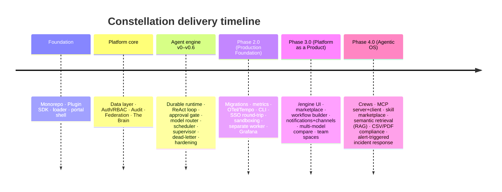

# Constellation — Roadmap, Future Enhancements & Known Limitations

> This document states plainly what's built, what's next, and — importantly — what is **not**
> done and where the honest limits are. The project's ethos is transparency over marketing; this
> page reflects that. The exhaustive, round-by-round history lives in the development journal
> ([MASTER_PLAN.md](MASTER_PLAN.md) §9).

## Where we are

Constellation has shipped, live-proven, and documented an unusually complete foundation:

**Status:** Phases 2.0 and 3.0 are complete; Phase 4.0 is largely shipped. All of it is
live-proven on real local infrastructure, at **728 tests / 20-of-20 green gates**, with the
evidence recorded under [`artifacts/`](../artifacts/).

---

## Roadmap — what's next

### Near term (remaining Phase 4.0 backlog)

| Item | Description |
|---|---|
| **Federated agent mesh (4.6)** | Multiple Constellation instances (dev/staging/prod/edge) form a mesh; the orchestrator delegates tasks to the right instance by locality, capability, and load. A `MeshPeer` registry + health prober + topology view first; cross-instance task routing after. |
| **Portal-wide delegation view** | A dedicated `/delegations` view of agent crews (parents → children) beyond the current per-task dialog. |
| **Scheduled report delivery** | A skill-style cron that exports the audit/compliance PDF and delivers it via the notification channels. |
| **Team-scoped schedules & workflows** | Extend team spaces so schedules, workflows, and plugins can be scoped to a team. |
| **Per-user / per-task notification targeting** | Route notifications to specific users and let a task configure its own notification policy. |
| **Quality scoring on `/compare`** | Add an output-quality dimension to the multi-model A/B comparison (latency/tokens/cost already persisted). |

### Medium term (Production readiness & scale)

- **Enterprise hardening** — append-only audit with a hash chain; a secrets manager + rotation;
  CSRF for cookie mutations; dependency/SBOM/container scanning in CI.
- **Reliability at scale** — per-day (not just per-task) budget/kill-switch; a shared alert store
  for multi-worker deployments; circuit breakers per external dependency.
- **Deployment** — a one-command `constellation up`; Coolify/VPS deploy runbook;
  rehearsed backup/restore; staged path to HA (only if real usage demands it).
- **Plugin ecosystem** — signed manifests; install/upgrade/rollback flows; a remote plugin
  registry beyond the local catalog.
- **Testing depth** — Playwright E2E suite; load/soak baselines; chaos/outage simulations.

### Longer term (the vision)

The north star (from the project's architecture review) is a controlled, observable, recoverable,
model-independent platform where you state an objective; the orchestrator plans it, routes each
step to the most suitable model (local for private data, frontier for hard reasoning), executes
through sandboxed capabilities, checkpoints continuously, escalates to a human at defined gates,
records every action in an append-only audit, remembers what it learned, and keeps working
overnight — with hard caps on cost, time, and blast radius, and a kill-switch you can always reach.

The full strategic roadmap, market analysis, and competitive scorecard live in
[MASTER_PLAN.md §7-BIS](MASTER_PLAN.md).

---

## Known limitations

Stated plainly. None of these are hidden; several are deliberate trade-offs for the current
local-first phase.

- **A single Docker Compose host is not high availability.** There is no multi-node replication
  or failover yet. Do not describe or run a single host as HA.
- **The federation overlay ships with development defaults.** Keycloak runs in `start-dev`
  (in-memory H2 — realm config does not survive a restart), with no TLS and `changeme`
  passwords. It must be hardened before any non-local exposure. See [SECURITY.md](../SECURITY.md).
- **Plugin sandboxing is opt-in, and network isolation isn't enforced on all hosts.** Plugins run
  in-process by default; enable `PLUGIN_SANDBOX_MODE=process` for untrusted plugins. Windows has
  no per-process network namespaces, so network isolation there is not enforced.
- **The mid-invoke crash window is at-least-once by design.** If the API is killed *during* a
  tool call (between the pre-invoke checkpoint and the result write), the tool may be re-issued on
  resume. For read tools this is harmless; for write tools, the approval gate + `requiresApproval`
  is the guardrail. A dedicated exactly-once pass is future work, relevant once write-tool
  idempotency matters.
- **Checkpoints rewrite the full message history each step** (O(n²) write volume over a task's
  life). Bounded by `maxSteps` (default 20) so it's not a problem at current scale; a raw-SQL
  append is the noted future optimization.
- **The audit table is immutable by convention, not by storage.** Append-only + hash-chain
  tamper-evidence is on the hardening list.
- **CI has a pipeline defined but limited execution history** as a public project — it becomes a
  first-class gate now that the repo is public.
- **Small local models are variable.** The engine's JSON-action loop works with 7B-class local
  models, but terse prompts can cause a small model to ramble into a max-steps failure. Cloud
  models or larger local models are more reliable for complex tasks; this is model variance, not
  a wiring issue.
- **Backup/restore and load/soak testing are not yet rehearsed.** Do them before production.

---

## Design decisions we deliberately deferred

To keep the load-bearing work (the engine and its guardrails) from being starved by breadth, the
following are intentionally **deferred** (not abandoned): OpenSearch, RabbitMQ, Kubernetes
manifests, Terraform, internationalization, and a full public plugin marketplace. They're
valuable, but the project's discipline is to prove the core value first. See
[MASTER_PLAN.md §7-BIS](MASTER_PLAN.md) for the reasoning.

---

*Have a use case or a feature you'd like to see? Open an issue — see [CONTRIBUTING.md](../CONTRIBUTING.md).*
