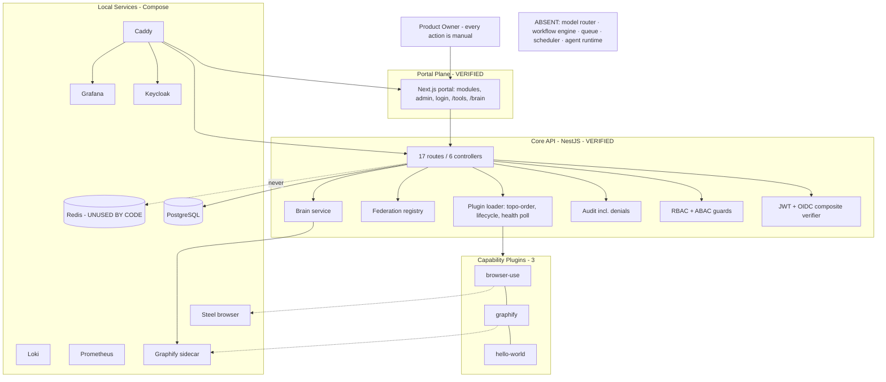
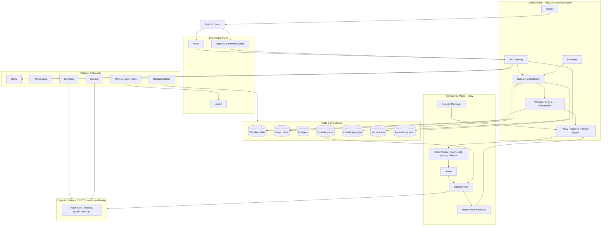
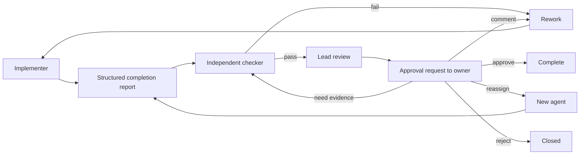
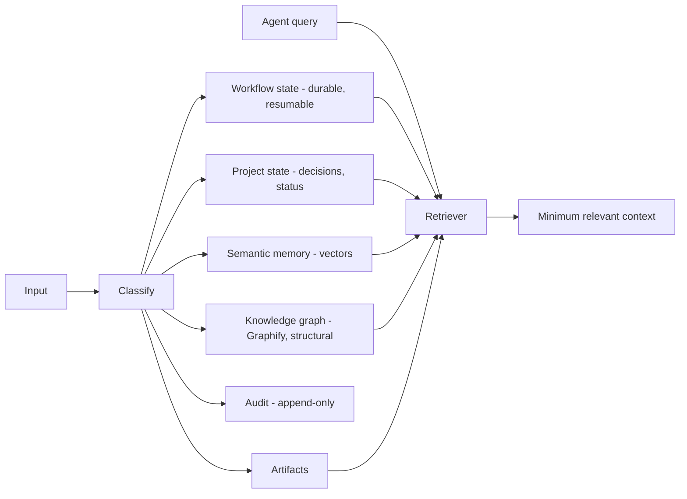
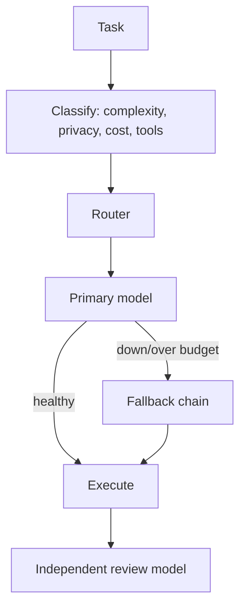

# Constellation — SUPER SESSION SUMMARY
### Independent enterprise architecture review, improvement register, and 24/7 target design

> **Author:** Polaris (lead orchestrator, independent review pass) · **Date:** 2026-08-02
> **Reviewed at commit:** `73f6253` · working tree **clean** · **no git remote — nothing has ever been pushed**
> **Status of this document:** ADDITIVE. It does not replace, correct, or rewrite any existing file.
> `HANDOFF.md`, `MASTER_PLAN.md`, `BRAIN.md`, `PLUGIN_SDK.md` and all history remain untouched and authoritative for their own scopes.
> **Method:** every claim below is backed by a command I ran against this repo. Where I could not verify, it says **Not verified.**

---

## 1. Executive summary

**Verdict: Yes, but significant architecture and operational work remains.**

Constellation is a genuinely well-built **enterprise plugin platform**. The plugin contract, loader, auth/RBAC/audit stack, federation layer and knowledge-graph subsystem are real, tested (256 tests), and in several cases live-proved against real infrastructure. The engineering discipline — maker/checker verification, honest UNRUN gap-flagging, disjoint agent lanes, evidence-based logging — is better than most commercial teams achieve.

**But the product goal is "an agentic system that works for me 24/7", and that system does not exist yet.** Verified by code search at `73f6253`:

- **No model/LLM client anywhere in the API** — no Anthropic/OpenAI/Gemini/Ollama/LiteLLM integration. The only matches are the string `"model"` in unrelated files.
- **No workflow engine** — 0 files match `workflow`/`checkpoint`/`saga`.
- **No durable queue** — 0 files match `bullmq`; Redis is in Compose but **not referenced by a single line of API code**.
- **No scheduler** — 0 files match `cron`/`scheduler`.
- **No autonomous loop** — the *only* recurring timer in the entire codebase is `plugin-health.service.ts`'s health poller. Every capability call is a human-initiated `POST /api/plugins/:id/invoke`.

So today Constellation is a **remote-control panel for tools**, not an autonomous agent platform. It is an excellent *chassis*; the *engine* has not been built.

**The most important strategic fact in this review:** the engine already exists — in the sibling project **Looper** (`../loop-engineering`): a proven, security-audited Discover→Dispatch→Verify→Secure→Review→Publish loop with a provider-agnostic model gateway, human approval gates, per-project memory, and restart-safe paused states. Constellation was deliberately started from scratch as a separate product, and that was a legitimate call — but the 24/7 brain-stem it needs is a solved problem sitting one directory away. **Do not rebuild it blind; port the proven design.** See §28.

---

## 2. Original project idea

From the opening brief: an **enterprise platform framework** — not a web app — able to absorb 100+ GitHub repositories as installable modules, where the core is never rewritten to add functionality. Inspirations named: Azure Portal, GitHub Enterprise, Backstage, Grafana, Datadog, ServiceNow, Kubernetes Dashboard. Hard requirements: modular, plug-and-play, secure, 10-year horizon, microservice-ready, every module independently versioned/permissioned/migrated.

A later, equally important requirement: **"I need the best agentic system that can work for me 24/7"**, seeded with 9 named repos (OpenHands, browser-use, Graphify, CodeRabbit, Grafana, Coolify, Open WebUI, Langflow, OpenJarvis), and later **"I need a brain for this system"** (Obsidian + Graphify + PAUL/SEED + Railway article).

## 3. Current project purpose

Two cooperating planes (locked decision C5):
- **Portal plane** — one SSO login, one nav; heavyweight tools federated as tiles rather than reimplemented.
- **Agent plane** — capabilities as callable, permission-checked tools.

Plus **the Brain** — a Graphify knowledge graph giving the platform persistent, queryable memory.

## 4. Original vs current vs recommended vision

| Area | Original idea | Current implementation (verified) | Recommended target |
|---|---|---|---|
| Product purpose | Enterprise plugin platform + 24/7 agentic system | Plugin platform ✅ + manual tool console ⚠️ | Platform + autonomous agent runtime |
| Portal | Single pane of glass | Next.js portal: modules, detail, admin, login, /tools tiles, /brain graph | + approval centre, workspace, live workflow view |
| Plugins | Hundreds of repos as modules | 3 plugins (hello-world, browser-use, graphify); SDK 0.2.0 with manifest/lifecycle/tools/memory | Signed manifests, sandboxed runtime, marketplace, install/upgrade/rollback |
| AI agents | Multi-agent 24/7 workforce | **None in-product.** Agents are external Claude Code sessions editing the repo | In-product agent runtime: planner/implementer/reviewer with durable state |
| Model support | Any model, swappable | **None wired.** No LLM client in the API | Provider-agnostic router: Claude/GPT/Gemini/Ollama, health + fallback + cost/privacy routing |
| Memory | Persistent brain | Graphify graph + `brain/` vault + `ctx.memory` capability (least-privilege) | + workflow state, project state, vector index, provenance, expiry |
| Automation | Runs while I sleep | **Manual HTTP invocation only** | Queue + scheduler + durable workflows + resume |
| Human approval | Implied | RBAC gate on mutations; **no approval workflow** | Approval/rework/reassign centre with full task history |
| Security | Enterprise-grade | JWT+OIDC verified, RBAC/ABAC, audit incl. denials, non-root containers | + secrets manager, sandboxing, signed plugins, SBOM, threat-model coverage |
| Deployment | 24/7 hosted | Local Docker Compose only; **never pushed, never deployed** | Staged: prod-like local → single-node → HA (only if usage justifies) |
| 24/7 operation | Core goal | **Not achievable today** — no supervision, queue, retry, or recovery | Supervised services, durable jobs, DLQ, backups, alerting, escalation |

---

## 5. Locked architectural decisions
Unchanged; see `MASTER_PLAN.md` §2 (C1–C10). Summary only: from-scratch NestJS+Next.js (C1), pnpm+Turborepo (C2), the Plugin SDK as the load-bearing contract (C3), small core / everything-else-a-plugin (C4), two planes (C5), cheap always-on VPS deferred (C6), federate both chats (C7), per-plugin Postgres schema (C8), Prisma (C9), name `constellation` (C10).
**My review does not reopen any of these.** All remain sound. See §9 for the one I would *extend* (C4 — the core needs an agent runtime).

## 6. Current repository structure (verified)
```
apps/api    62 .ts   core/{plugins,auth,rbac,audit,database,logging,settings,events,federation,memory,health}
apps/web    53 .ts(x) App Router portal
packages/   plugin-sdk (13 .ts, v0.2.0) · cli (generate-plugin)
plugins/    hello-world · browser-use · graphify
infra/      caddy · keycloak · grafana · prometheus · loki · graphify
config/modules.yaml · docker-compose.yml + .federation.yml · .github/workflows/ci.yml
docs/       MASTER_PLAN · HANDOFF · BRAIN · PLUGIN_SDK · ORION_ROUND2 · (this file)
```
21 commits · 6 controllers · 17 HTTP routes · 14 test files · **no `prisma/migrations/`**.

## 7. Current architecture (what actually exists)


**Read this diagram literally:** there is no box between USER and the platform that acts on its own. `MISSING` is the whole 24/7 story.

---

## 8–10. Capability status (Implemented / Verified / Unverified)

Using the mandated status vocabulary.

| Capability | Status | Evidence |
|---|---|---|
| Plugin SDK contract (manifest/lifecycle/context/permissions/tools/memory) | **Live-tested** | v0.2.0, 19 tests; drives the running loader |
| Plugin loader (topological deps, cycle detect, failure isolation, enable/disable, health poll) | **Live-tested** | 141 api tests incl. loader suite; live boot proven repeatedly |
| Plugin state persistence across restart | **Live-tested** | `MASTER_PLAN` §9 P2 entry; I independently re-proved restart persistence earlier |
| Auth — local JWT | **Live-tested** | login→JWT→`/me` with real Postgres |
| Auth — OIDC/SSO | **Live-tested** | Real RS256 Keycloak token → 200; **tampered token → 401** (`a4f28db`) |
| RBAC/ABAC | **Integration-tested** | Guard unit tests + live 401/deny; **403 UI path not live-clicked** (no viewer user seeded) |
| Audit (incl. denials) | **Live-tested** | rows observed: `auth.login`, `plugin.disable`, `plugin.tool.*` |
| Federation registry + Caddy proxy + tiles | **Live-tested** | 11 containers healthy; proxied endpoints reachable |
| Brain / Graphify | **Live-tested** | `32c1ea8` live-verified; graph built, MCP served, grounded query returned |
| `ctx.memory` least-privilege capability | **Unit-tested** | `plugin-memory-capability.test.ts`; not exercised by a real plugin in production flow |
| browser-use → Steel | **Partially implemented / Not verified end-to-end here** | Real `fetch` executor exists; I did not re-run a live browser call this pass |
| CI pipeline | **Documented + configured; Not verified** | `.github/workflows/ci.yml` exists; **no remote ⇒ it has never executed** |
| Database migrations | **Absent** | No `prisma/migrations/`; `db push` only |
| Queue / jobs / scheduler / workflows | **Absent** | 0 code matches |
| Model routing | **Absent** | 0 LLM clients |
| Autonomous operation | **Absent** | only timer = health poller |
| Backup / restore / DR | **Planned only** | no scripts, no rehearsal |
| Load / stress / soak testing | **Absent** | none found |
| Secrets management | **Partial** | `.env` git-ignored; no vault, dev creds `changeme` in federation |

**Gate reality at `73f6253` (I ran all four, `--force --concurrency=1`):**
`lint` 2/2 (0 errors, 17 warnings) · `typecheck` 8/8 · `build` 7/7 · `tests` **256** (api 141 · browser-use 47 · graphify 40 · sdk 19 · cli 9).

## 11. Contradictions found

| # | Sources | Claim A | Claim B | Current truth | Status |
|---|---|---|---|---|---|
| C-1 | `HANDOFF` §3 gotcha 1 vs my runs | "`pnpm` is broken on this host — use turbo directly" | I ran `pnpm build/test` successfully in multiple sessions | Shell-specific, not host-wide. Turbo-direct is a safe fallback, not a necessity | **Contradictory (benign)** |
| C-2 | `README` "Tech" vs implementation | "PostgreSQL / Redis / OpenSearch / RabbitMQ … arrive in later phases" | Redis ships in Compose today but no code uses it | Redis is provisioned-but-unused; OpenSearch/RabbitMQ absent | **Verified — doc is aspirational** |
| C-3 | Original brief vs build | "Never build a monolithic application… everything plug-and-play" | Core now contains federation + memory + auth + audit modules | Correct and necessary — these are platform services, not features. Note it as scope drift to watch | **Partially verified** |
| C-4 | Brief "AI Ready … LLMs, Agents, RAG, Vector DB" vs code | Implied AI capability | Zero LLM/vector integration | The AI layer is genuinely unbuilt | **Verified gap** |
| C-5 | Agent reports (earlier rounds) | Nova: "web build fails"; Orion: "api blocked" | Both green on my run | Transient concurrent-edit artifacts; resolved | **Resolved** |

## 12. Known defects (confirmed)
- **D-1** No `prisma/migrations/` → schema is applied with `db push`. Destructive/irreversible in any shared or future prod DB; no rollback path. **P1.**
- **D-2** Portal API base default is `http://localhost:4000/api`, a port permanently held by Looper's LiteLLM gateway on this machine, which returns valid JSON (`{"detail":"Not Found"}`). Silent wrong-product data instead of a hard failure. clau_partner identified it; **fix must include an identity assertion, not just a port change.** **P0 (correctness/UX trap).**
- **D-3** Federation dev defaults: Keycloak `start-dev`, in-memory H2, `changeme` passwords, no TLS. Fine locally, fatal if exposed. **P1 before any exposure.**
- **D-4** 17 lint warnings (unused imports/vars, stale eslint-disable) — cosmetic, non-blocking. **P3.**
- **D-5** No non-admin (viewer) user seeded ⇒ the 403 denial UX is unit-tested only. **P2.**

## 13. Known environment issues (confirmed, keep)
Turbo cache reports false greens (`--force` mandatory) · parallel gate runs collide (`--concurrency=1`) · stale `dist/main.js` squats :4001 and serves old code (kill by port before trusting a smoke test) · background boots die with their shell (`exec`) · single-file Docker `-v` mounts misbehave on this Windows host · the two verified bugs in `HANDOFF` §5 (`pathToFileURL`; `new Function` ESM-from-CJS) must never regress.

---

## 14. Architecture maturity scorecard (0–5, evidence-based)

| Area | Score | Evidence | Main gap | Next step |
|---|--:|---|---|---|
| Product clarity | 4 | Locked C1–C10, consistent docs | "Agentic" vs "platform" conflated | Split the two goals explicitly |
| Core architecture | 4 | Two planes, clean module seams | No intelligence plane | Add agent runtime |
| Monorepo structure | 4 | pnpm+turbo, 7 packages build | — | — |
| Plugin SDK maturity | 4 | v0.2.0, versioned, additive, 19 tests | No signing, no compat matrix | Signed manifests |
| Plugin isolation | 2 | Least-privilege ctx + permission gating | **Same process, same privileges** — a plugin can do anything Node can | Sandbox (worker/VM/container) |
| API design | 4 | 17 routes, OpenAPI, DTO validation | No versioning (`/api/v1`) | Version the API |
| Portal UX | 3 | Shell, admin, tiles, brain, ⌘K, themes | No approval centre / workflow views | Approval UI |
| Agent orchestration | 1 | Exists only as external Claude sessions + docs | No in-product orchestrator | Build it |
| Multi-model support | 0 | No LLM client | Everything | Model registry + router |
| Model routing | 0 | — | Everything | Fallback/cost/privacy policy |
| Workflow engine | 0 | 0 matches | Everything | Durable workflows |
| Memory & knowledge | 3 | Graphify live-proved, vault, capability | No workflow/project state, no vectors, no expiry | Split memory tiers |
| Authentication | 4 | JWT + OIDC live, tampered→401 | No refresh/rotation, no MFA | Session hardening |
| SSO / OIDC | 4 | Reproducible realm import, live round-trip | Dev-mode IdP | Prod-mode Keycloak |
| RBAC / ABAC | 3 | Guards + SDK matcher + live deny | ABAC is coarse; no viewer live test | Attribute policies |
| Human approval controls | 1 | RBAC gate only | No approval workflow at all | Approval/rework engine |
| Auditability | 3 | Audit incl. denials, no payload leakage | Mutable table, no hash chain | Append-only + integrity |
| Secrets management | 2 | `.env` ignored, no leaks found | Plaintext, dev creds, no rotation | Vault/SOPS |
| Database architecture | 3 | Per-plugin schema design, `core` schema | Plugin schema bootstrap unimplemented | `CREATE SCHEMA` on install |
| Database migrations | 1 | **None** | `db push` only | Baseline migration |
| Queue & jobs | 0 | Redis unused | Everything | Durable queue |
| Plugin lifecycle | 3 | install/enable/disable/health + persistence | No upgrade/rollback/uninstall flow | Full lifecycle |
| Security | 3 | Real controls, honest posture | No threat model, no sandbox, no scanning | §20 controls |
| Prompt-injection defence | 0 | No LLM ⇒ no defence needed *yet* | Will be critical the moment models land | Design before wiring |
| Supply-chain security | 1 | Lockfile + frozen-install proof | No SBOM/scanning/signing | Add scanning to CI |
| Reliability | 1 | Graceful degradation everywhere (genuinely good) | No retry/DLQ/supervision | Durable execution |
| Failure recovery | 1 | Restart-safe plugin state | No workflow recovery | Checkpoints |
| Observability | 2 | Prom/Loki/Grafana containers + pino | No app metrics/traces wired | OTel + `/metrics` |
| Testing | 3 | 256 tests, real live proofs | No load/soak/chaos/contract | Expand |
| Browser testing | 2 | Agent used vision to verify pages | No automated E2E suite | Playwright |
| Load testing | 0 | None | Everything | k6 baseline |
| CI/CD | 1 | Workflow file exists | **Never executed** (no remote) | Run locally via act/container |
| Backup & restore | 0 | None | Everything | pg_dump + restore rehearsal |
| Disaster recovery | 0 | None | Everything | Documented RTO/RPO |
| Token efficiency | 2 | Good docs discipline; huge MD files | Agents re-read everything | Machine-readable state |
| Cost control | 5 | $0 maintained; nothing provisioned | — | Keep |
| Documentation | 4 | Excellent, honest, evidence-linked | Growing very large | Split + index |
| Deployment readiness | 1 | Compose works | Never deployed/pushed | Stage B |
| 24/7 operational readiness | **1** | Nothing runs unattended | Everything | §19 |

**Weighted read:** platform ≈ **3.4/5**; agentic system ≈ **0.7/5**.

---

## 15. Direct verdict — answers to the hard questions

- **Strong and worth keeping:** the Plugin SDK contract; the loader's isolation discipline; the "degrade, never crash" invariant applied consistently (no-DB, no-brain, no-sidecar); auth/OIDC; the two-plane federation model; the verification culture.
- **Fragile:** plugin isolation (in-process), migrations, secrets, no queue/supervision, CI never executed, portal token in `localStorage`.
- **Keep locked:** C1–C10, all sound.
- **Reconsider/extend:** C4 — "core = auth/nav/settings/loader" is too small. A 24/7 product needs **orchestrator, workflow, queue, model-router** as *core platform services*. They are not plugins; plugins depend on them.
- **Future bottlenecks:** in-process plugins (one bad plugin can hang/OOM the core); Postgres as the only durable store; a single Compose host.
- **Is scope too broad?** Yes, mildly. The original brief lists ~30 enterprise deliverables (OpenSearch, RabbitMQ, K8s, Terraform, i18n, marketplace, DR). Chasing breadth now would starve the one thing that makes the product valuable: the agent runtime. **Recommend explicitly deferring breadth.**
- **Genuinely modular?** Yes at the contract level; **no at the runtime level** (shared process/privileges).
- **Is the Brain suitable long-term?** As *structural* knowledge, yes — Graphify is a strong choice (deterministic, local, no vector store, provenance). But it is **one tier of memory**, not memory. Workflow/project state and semantic recall are missing (§18).
- **Real workflow engine?** No. **Real agent orchestrator?** No — orchestration is humans + external Claude sessions. **Autonomous work?** No.
- **Can it run unsupervised?** **No.** No supervision, retry, DLQ, budget caps, or kill-switch.
- **Can the owner complete this?** Yes — demonstrably. The evidence is the multi-agent workflow already producing verified, honestly-reported enterprise code. The binding constraint is not skill; it is **sequencing discipline** (finish the engine before the breadth).
- **Owner should retain control over:** cost/provisioning, production exposure, anything irreversible, security posture, scope.
- **Delegate to agents:** implementation within lanes, tests, docs drafts, verification runs.
- **Always human-approved:** cloud spend, git push, public exposure, destructive DB ops, credential handling, autonomy expansion (letting agents act unattended).

---

## 16. Recommended enterprise target architecture


**Why each new piece:** *Orchestrator* owns "what happens next" so work survives restarts. *Workflow+checkpoints* make long tasks resumable (the difference between a script and a platform). *Policy engine* enforces approval, budget and blast-radius before any tool runs. *Model router* delivers the original "any model, swappable" requirement. *Independent reviewer* preserves maker/checker in-product. *Sandbox* converts declared plugin permissions into enforced ones. *Durable queue + scheduler* are what "24/7" literally means.

## 17. Agent operating model (formalised)

| Role | Responsibility | Allowed | Forbidden | Required output | Approval |
|---|---|---|---|---|---|
| Product Owner (user) | Direction, cost, risk | Approve/reject all | — | Decisions | — |
| Polaris (lead orchestrator) | Architecture, split, integration, git, docs | Commit, edit MASTER_PLAN/HANDOFF, wire cross-boundary | Push, provision, self-approve risk | Verified commit + §1.7 log | Owner for cost/irreversible |
| clau_partner (backup) | Identical when Polaris idle | Same | Same + never concurrent | Same | Same |
| Atlas | Infra/data/auth/security services | Its lane | git, installs, doc edits | Evidence report | Orchestrator |
| Nova | SDK, core-plugins, capabilities | Its lane | git, cross-lane edits | Evidence report | Orchestrator |
| Orion | Portal/UX/DX | Its lane | git, MASTER_PLAN/HANDOFF | Evidence report | Orchestrator |
| **Vega (deferred)** | Independent QA on a committed SHA in an isolated checkout | Read-only verify | Commit, edit, run on live tree | Pass/fail + evidence | Orchestrator-triggered |
| Future in-product roles | planner / implementer / reviewer / security / tester / memory curator / release / incident / cost controller | Per policy engine | Beyond capability grant | Structured result | Policy + owner gates |

**Invariants (already working, keep):** one orchestrator at a time; explicit, recorded leadership transfer; disjoint file ownership; agents never run git or claim commit/build state; no self-approval; evidence over confidence; stop at scope end; orchestrator integrates; owner approves cost/irreversible.

## 18. Approval / rework / reassignment workflow (to build)


Every approval request must carry: task, objective, what changed, files, tests run, evidence, gaps, risks, recommendation, cost impact, security impact, rollback. Comments become **new acceptance criteria** appended to the task; history is never rewritten.

## 19. Memory architecture (separate the tiers)


**Remember:** decisions + rationale, verified outcomes, user preferences, failure lessons. **Expire:** transient reasoning, stale build output, superseded plans. **Never store:** secrets, tokens, raw credentials, third-party PII. **Correction:** provenance-tagged supersede records, never silent edits (mirrors the "don't rewrite history" rule already in force). **Survival:** graph rebuilt from the vault + repo; vault and DB in backups.

## 20. Model routing (to build)


Registry fields: provider, model, context limit, cost/1k, local|cloud, privacy class, tool-calling, coding/planning/review strength, speed, health, allowed data class, fallback order. Policies: never hard-code a permanent leader; private data → local-only models; hard token + cost ceilings per task and per day; retry with backoff then fall back; record which model did what (auditable).

## 21. 24/7 reliability requirements

Required before the phrase "24/7" is honest: process supervision + auto-restart · liveness/readiness separation · **durable queue** with retries, exponential backoff and a **dead-letter queue** · idempotent jobs + duplicate suppression · **workflow checkpoints and resume** · circuit breakers per external dependency (model, browser, graph) · rate limiting + concurrency caps · distributed lock (single orchestrator) · agent timeouts and hard kill · **budget kill-switch** · graceful shutdown/drain · scheduled backups + **rehearsed restore** · metrics/traces/alerts · human escalation path.

| Objective | Local target | Future prod target |
|---|---|---|
| API availability | best-effort | 99.5% single node |
| Workflow durability | **100% (no task lost on restart)** | 100% |
| Max task loss | 0 | 0 |
| RTO / RPO | 30 min / 24 h | 15 min / 1 h |
| Job completion reliability | ≥99% w/ retries | ≥99.9% |
| Audit completeness | 100% | 100% |
| Max uncontrolled agent runtime | 15 min hard kill | 15 min |
| Max workflow cost | hard cap, refuse beyond | hard cap |

**A single local Docker Compose host is not high availability** and must never be described as such.

## 22. Security review — top production blockers

| Threat | Current protection | Gap | Sev | Required control |
|---|---|---|---|---|
| Malicious/buggy plugin | Manifest permissions, ctx least-privilege, isolated failures | **Runs in-process with full Node privileges** | **Critical** | Sandbox: worker thread/VM/container + syscall+network limits |
| Prompt injection (once models land) | None (no models yet) | Total | **Critical (future)** | Untrusted-content tagging, tool allow-lists per task, no raw tool exec from model output, human gate on irreversible actions |
| Secret exposure | `.env` git-ignored; no leaks found | Plaintext, no rotation, dev `changeme` | High | Vault/SOPS, rotation, no secrets in logs/prompts |
| Supply chain | Lockfile + frozen-install proof | No SBOM/scan/signing | High | CI: `npm audit`/osv, SBOM, pinned digests, signed plugin manifests |
| Audit tampering | Audit table | Mutable, no integrity | High | Append-only + hash chain |
| Token theft (XSS) | Documented caveat | `localStorage` token | High | httpOnly SameSite cookies + CSRF |
| Agent privilege escalation | RBAC + per-tool permission | No per-task capability scoping | High | Short-lived capability tokens per task |
| SSRF / arbitrary fetch via browser tool | Timeouts | No allow-list | High | Egress allow-list + network policy |
| Cost/token exhaustion | None | Total | High (once models land) | Hard budget caps + kill-switch |
| Container escape | Non-root images | No seccomp/AppArmor, no scanning | Medium | Trivy scans, read-only FS, dropped caps |
| Untrusted MCP server | Graphify local only | No verification | Medium | Pin + verify MCP endpoints |
| Weak dev credentials | Documented | `changeme`, no TLS, H2 | High **if exposed** | Prod-mode IdP + TLS before any exposure |

## 23. Token-efficiency architecture

Today agents re-read very large Markdown files each session — `MASTER_PLAN.md` and `HANDOFF.md` have grown into the primary context cost. Recommended layering:

```
L0 governance rules (tiny, always) → L1 locked decisions → L2 verified state (machine-readable)
→ L3 active task state → L4 retrieved code excerpts → L5 evidence → L6 scratch (expires)
```
Concrete moves: (1) add a compact `state.yaml` (phase, last verified SHA, gate results, active/blocked tasks, open risks, required approvals) as the canonical machine-readable state; (2) move verification logs out of `MASTER_PLAN` into dated `docs/evidence/` files referenced by ID; (3) ADRs for decisions instead of prose accretion; (4) agents receive a **task brief + file allow-list**, not the whole doc set; (5) use the Brain (graph) for retrieval instead of full-file reads; (6) prompt templates per role; (7) stale-doc detection by comparing `last_verified_commit` to `HEAD`. **Do not implement without approval** (§27).

## 24. Local completion plan (before any production talk)

**Must pass, in order:** fresh-clone install (frozen lockfile) → all four gates → **baseline Prisma migration + rollback rehearsal** → viewer-user RBAC denial (live) → workflow resume test (once the engine exists) → queue persistence + duplicate suppression → plugin install/upgrade/rollback → secret scan + dependency scan + SBOM → **backup + restore into a clean environment** → simulated outages (DB, Redis, model, browser, sidecar) → malicious-plugin and prompt-injection simulations → approval/rework/reassign flow → full audit reconstruction → Playwright E2E → 24h soak → safe shutdown/restart recovery. Retain evidence per test (command, output, date, SHA).

## 25. Production evolution (nothing provisioned)

| Stage | Entry | Work | Exit | Cost | Approval |
|---|---|---|---|---|---|
| **A. Local proof (now)** | — | Engine + §24 checklist | All gates + resume + restore proven | $0 | — |
| **B. Prod-like local** | A done | TLS, prod-mode IdP, secrets mgr, queue, OTel, backups, chaos | Survives injected failures unattended 24h | $0 | — |
| **C. Single-node prod** | B done | VPS, DNS, TLS, firewall, restricted SSH, rollback, alerts | Live + monitored + restorable | ~$5–20/mo | **Owner** |
| **D. Reliable prod** | C stable | Offsite backups, independent monitoring, release automation | Tested recovery | +$ | Owner |
| **E. HA** | Real usage demands it | Multi-node, LB, replication, failover | Zero-downtime deploys | $$$ | Owner |

## 26. Improvement register (prioritised)

| ID | Pri | Category | Improvement | Evidence | Acceptance |
|---|---|---|---|---|---|
| I-01 | **P0** | Correctness | API-identity assertion in portal client + fix default ports | D-2 | Foreign API ⇒ explicit error, never rendered as data |
| I-02 | **P0** | Architecture | **Build the agent runtime** (orchestrator + durable workflow + checkpoints) | §1 code search | A task survives an API restart and resumes |
| I-03 | **P0** | Architecture | **Model router + registry** (Claude/GPT/Gemini/Ollama, health, fallback, cost/privacy) | no LLM client | Swap leader model by config; fallback proven by killing primary |
| I-04 | **P0** | Reliability | Durable queue (BullMQ on the existing Redis) + retries + DLQ + idempotency | Redis unused | Killed worker mid-job ⇒ job completes exactly once |
| I-05 | **P1** | Security | Plugin sandboxing (worker/VM/container) + egress allow-list | in-process | Malicious test plugin cannot read env/FS/network beyond grant |
| I-06 | **P1** | Data | Baseline Prisma migration + rollback rehearsal; retire `db push` | no migrations dir | `migrate deploy` on clean DB + documented down path |
| I-07 | **P1** | Security | Secrets manager + rotation; remove `changeme`; TLS before exposure | D-3 | No plaintext secret in repo/env of a running prod-like stack |
| I-08 | **P1** | Governance | Approval/rework/reassign engine + Approval Centre UI | none exists | Owner can approve/comment/reassign; history retained |
| I-09 | **P1** | Security | httpOnly cookie sessions + CSRF (replace localStorage token) | code comment | Token unreadable from JS |
| I-10 | **P1** | Security | Append-only audit + hash chain | mutable table | Tamper detectable |
| I-11 | **P1** | CI | Execute CI locally (act/container) until a remote exists | never run | Green run recorded with evidence |
| I-12 | **P2** | Reliability | Budget/kill-switch: max tokens, cost, runtime per task+day | none | Exceeding cap aborts and alerts |
| I-13 | **P2** | Ops | Backup + restore into clean env, rehearsed | none | Restored stack passes health + data spot-check |
| I-14 | **P2** | Observability | App metrics (`/metrics`) + OTel traces into existing Prom/Grafana/Loki | containers only | Task latency + failure dashboards live |
| I-15 | **P2** | Testing | Playwright E2E (login, RBAC deny, tool invoke, brain query) | manual only | Suite green in CI |
| I-16 | **P2** | Memory | Split memory tiers (workflow/project/semantic/graph) + provenance + expiry | graph only | Retriever returns minimal scoped context |
| I-17 | **P2** | RBAC | Seed viewer user; live-prove 403 UX | D-5 | Screenshot + test |
| I-18 | **P2** | Token | `state.yaml` + evidence split + task briefs | §23 | Agent boots on <25% of today's context |
| I-19 | **P3** | Plugins | Signed manifests + install/upgrade/rollback + per-plugin schema bootstrap | partial | Unsigned plugin refused |
| I-20 | **P3** | API | Version the API (`/api/v1`) | unversioned | v1 frozen, v2 additive |
| I-21 | **P3** | Supply chain | SBOM + dependency + container scanning in CI | none | Scans gate the build |
| I-22 | **P3** | Perf | k6 load baseline + 24h soak | none | Documented baseline |
| I-23 | **P4** | Breadth | OpenSearch, RabbitMQ, K8s, Terraform, marketplace, i18n | brief only | **Deliberately deferred** |
| I-24 | **P4** | QA | Activate Vega reviewer if the verify queue becomes the bottleneck | `HANDOFF` §11 | Isolated-SHA review pipeline |

## 27. Recommended immediate next package

**Package: "Engine v0 — Durable Task Runtime + Model Router" (I-02 + I-03 + I-04, thin vertical slice).**

*Objective:* one task, submitted via API, is queued, executed by a model-backed agent through the existing tool layer, checkpointed, and **survives an API restart mid-flight** — with a hard budget cap and full audit.

*Why this first:* it is the only package that converts Constellation from a control panel into the product the owner actually asked for; everything else (approval UI, sandboxing, observability) has value only once work runs autonomously. It also reuses what already exists (tools, RBAC, audit, brain) rather than adding breadth.

*Scope:* `Task` + `TaskCheckpoint` Prisma models · BullMQ queue on existing Redis · worker with retry/backoff/DLQ · model registry + router with one local (Ollama) and one API provider behind a single interface · agent loop: plan → invoke tool → record → checkpoint → review gate · budget/timeout kill-switch · `POST /api/tasks`, `GET /api/tasks/:id` (RBAC + audited).
*Out of scope:* multi-agent hierarchies, approval UI, sandboxing, autoscaling, cloud.
*Lanes:* Atlas = Prisma models, queue infra, Ollama service, budget config. Nova = router, agent loop, checkpointing, task API. Orion = minimal task list/detail view.
*Acceptance:* task submitted → queued → executed → completed with audit trail; **kill the API mid-task, restart, task resumes and completes**; primary model down ⇒ fallback used and recorded; budget exceeded ⇒ aborted + alerted; all four gates green.
*Rollback:* additive modules + new tables; disable by feature flag; no existing contract changed.
*Approvals needed:* none (all local/$0, Ollama is free) — except confirming the strategy in §28.

## 28. Strategic recommendation — reuse Looper's proven engine

The engine specified in §27 **already exists, working and security-audited**, in `../loop-engineering` (Looper): provider-agnostic gateway, leader/worker/security agents, retries, human approval gate, restart-safe paused states, per-project memory, milestone notifications. It is Python; Constellation is TypeScript.

Three options, honestly compared:

| Option | Effort | Risk | Verdict |
|---|---|---|---|
| **A. Port the design (not the code) into TS** | Medium | Low — proven design, one language, one deploy | **Recommended.** Keeps the monorepo coherent; reuses hard-won lessons (approval gate, restart safety, gateway abstraction) |
| B. Run Looper as a federated service behind the tool layer | Low initially | Medium — two runtimes, two deploys, split state/auth | Reasonable interim if speed matters most |
| C. Build fresh with no reference to Looper | High | High — repeats solved mistakes | Not recommended |

Whichever you pick, **read Looper's `ENTERPRISE_PLAN_AUTONOMOUS_AI.md` §13 implementation log first** — it documents real failures (weak verify gates letting incoherent code through, `|| true` masking failures, stale verify commands, small-model limits) that this project would otherwise rediscover the hard way.

## 29. Resume instructions (for the next lead agent)
Read `HANDOFF.md` (rules §1, roles §0, lanes §6, gotchas §3, verify §7), then `MASTER_PLAN.md` §2/§8/§9, then this file §26–§28. Verify `git log -1` and `git status`. Run all four gates `--force --concurrency=1`. Do not push, provision, or spend. One orchestrator at a time. Log every completion per `HANDOFF` §1.7.

## 30. Rules that must never be violated
$0/local until the owner approves cost · never `git push` or provision cloud without explicit in-the-moment go-ahead · never commit secrets · one orchestrator commits · agents never run git or claim unverified state · no self-approval · never rewrite history or protected docs · Plugin SDK evolves additively and versioned · the two verified bugs (`HANDOFF` §5) must never regress · Prisma schema pushes only against disposable local DBs with explicit consent · **never describe a single local host as high availability**.

## 31. Evidence references
`git log` (21 commits, no remote) · gate runs at `73f6253` (lint 2/2, typecheck 8/8, build 7/7, tests 256) · code searches for model/workflow/queue/scheduler/cron (all zero) · `apps/api/src/core/*` module inventory · `prisma/schema.prisma` (7 models, no migrations dir) · `MASTER_PLAN.md` §9 entries for `32c1ea8`, `a4f28db`, `db0826f` · `HANDOFF.md` §3/§5/§6/§11.

## 32. Definition of done
**Local phase:** §24 checklist fully evidenced; a task survives restart and completes; budget caps enforced; backup restored into a clean environment; malicious-plugin and prompt-injection simulations pass; all gates green from a fresh clone.
**Production phase:** Stage C entry criteria met, secrets managed, TLS, monitoring + alerting live, rollback rehearsed, incident path documented, owner has approved cost and risk.

## 33. Final target vision
A controlled, observable, recoverable, model-independent platform where the owner states an objective; the orchestrator plans it, routes each step to the most suitable model (local for private data, frontier for hard reasoning), executes through sandboxed capabilities, checkpoints continuously, escalates to a human at defined gates, records every action in an append-only audit, remembers what it learned, and keeps working overnight — with hard caps on cost, time and blast radius, and a kill-switch the owner can always reach.

---
*End of SUPER_SESSION_SUMMARY.md — additive review document. No existing file was modified.*
